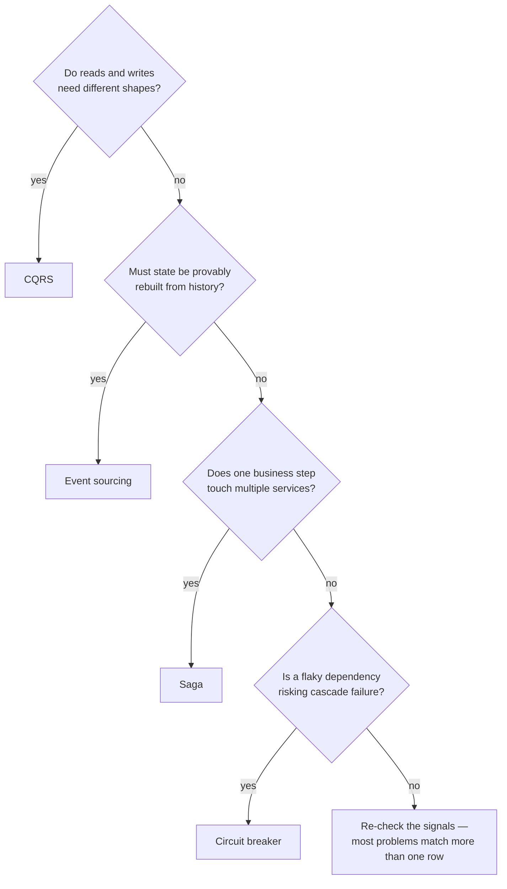

import Scenario from "../../../components/Scenario.astro";
import LevelIntro from "../../../components/LevelIntro.astro";
import Checkpoint from "../../../components/Checkpoint.astro";

<Scenario label="Two proposals, one compliance system">
  <Fragment slot="facts">
    
The requirement

    

      
🕰️ Reconstruct any account's full history at any past date

      
📜 Regulator can ask "what did this record look like on March 3rd"

    

    
Two proposals

    

      
🅰️ Add a "history" table, copy the row on every update

      
🅱️ "This is event sourcing — store the changes, not just the current state"

    

  </Fragment>

A compliance team asks for the ability to answer "what did this account
look like on March 3rd" for any account, at any past date, for a
regulator. One engineer proposes bolting on a `history` table that copies
the row on every update. Another says "this is just event sourcing —
store what happened, not just where things ended up, and the current
state is a side effect you can always recompute."

**Both proposals could technically work. But only one of them is naming
the actual shape of the problem — how do you tell which reference
architecture a problem shape actually calls for, instead of picking the
one an engineer happens to know the name of?**

</Scenario>

<LevelIntro
  items={[
    "The signals that point to a specific pattern",
    "Where documented catalogs actually live",
    "Why adapting a pattern is not optional",
  ]}
/>

## The signals, not the buzzword

**What tells you "the current state is a side effect of history" rather
than "just add a history table"?** The `history`-table proposal treats the
past as a byproduct of the present — you keep a copy in case someone asks.
The event-sourcing proposal treats the past as the primary fact and the
present as something you derive from it. The signal that decides between
them isn't which engineer suggested it — it's whether the requirement is
"sometimes look backward" (history table is fine) or "the current state
must always be reconstructable and provably correct from the full history"
(that's the actual shape event sourcing solves).

That's the real skill: reading a handful of signals off the problem and
letting them point at a catalog entry, instead of pattern-matching on
which name sounds most sophisticated.

| Signal in the problem                                                                    | Points toward        |
| ---------------------------------------------------------------------------------------- | -------------------- |
| Reads vastly outnumber writes, and the read shape differs from the write shape           | CQRS                 |
| The current state must be provably reconstructable from a full history                   | Event sourcing       |
| A state change must reach other systems without being lost, even if they're briefly down | Transactional outbox |
| One business transaction touches several services with no shared database                | Saga                 |
| Data passes through several independent transformation steps                             | Pipe-and-filter      |
| A downstream dependency is occasionally slow or down, and it must not cascade            | Circuit breaker      |
| A legacy system must be replaced gradually, not in one cutover                           | Strangler fig        |

<Checkpoint question="A team says 'we need CQRS' because reporting queries are slow. Per the signals table, is a slow report by itself enough of a signal to reach for CQRS?">

Not by itself. "Reads are slow" is a performance symptom, not the signal
CQRS actually answers — CQRS earns its cost when reads and writes need
**structurally different shapes** (e.g. writes are a handful of narrow
transactional updates, but reads need a wide denormalized view across many
entities). A slow report caused by a missing index or an unindexed join is
a query-tuning problem, not a reference-architecture problem — reaching for
CQRS here adds a second data model and a synchronization mechanism to fix
something a database index would have fixed for free.

</Checkpoint>

## Where the catalogs actually live

The table above is a starting sketch, not the real catalog — real ones are
maintained publicly and updated as failure modes get better understood:

| Catalog                                                                              | Best for                                                                                                                        |
| ------------------------------------------------------------------------------------ | ------------------------------------------------------------------------------------------------------------------------------- |
| Martin Fowler's _Patterns of Enterprise Application Architecture_ (PoEAA)            | Data-access and domain-logic shapes (Repository, Unit of Work, Active Record)                                                   |
| _Enterprise Integration Patterns_ (Hohpe & Woolf)                                    | Messaging shapes (outbox, dead-letter queue, content-based router)                                                              |
| Cloud provider "well-architected" / reference architecture centers (AWS, Azure, GCP) | End-to-end deployable blueprints for a whole system shape, with concrete managed-service names                                  |
| microservices.io (Chris Richardson's pattern catalog)                                | Service-decomposition and distributed-system patterns (Saga, CQRS, circuit breaker, strangler fig)                              |
| Gang of Four _Design Patterns_                                                       | Finer-grained, code-level object shapes (not architecture-scale, but often the vocabulary architecture patterns are built from) |

None of these require buying anything — they're free, and the value isn't
the name, it's that someone already wrote down the failure modes so you
don't rediscover them in production.

## Adapting, not copying

**If the catalog already has the answer, why doesn't picking the pattern
finish the job?** Because a catalog entry describes the shape of a
_class_ of problems, not your exact constraints. The compliance
scenario above still has real decisions left even after "event sourcing"
is the right answer: how long is history retained, is every field
event-sourced or just the regulated ones, does the read model rebuild
on every query or get cached. A reference architecture hands you a
starting structure and a list of known trade-offs — it does not hand you
the finished design.

Treating the pattern name as the finish line, rather than the start of
the real design conversation, is the single most common way teams misuse
a catalog — L3 works through exactly that failure mode with a concrete
example.

<Checkpoint question="A team adopts the Saga pattern for a checkout flow because 'the catalog says this is the pattern for multi-service transactions,' then ships it with no compensating actions defined for a failed step. What did they actually adopt?">

The name, not the pattern. A saga's entire value is the compensating
action for each step — without it, a saga is just "call several services
in a row and hope none of them fail," which is what it was supposed to
replace. Adopting a catalog entry means adopting its actual mechanism
(here: every forward step has a matching undo step), not just borrowing
its label to justify a design that still doesn't handle partial failure.

</Checkpoint>
