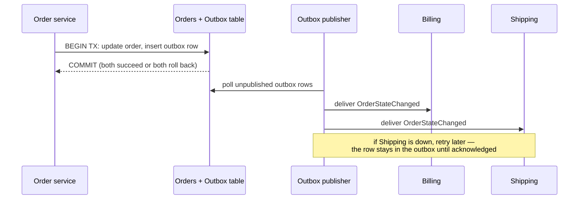
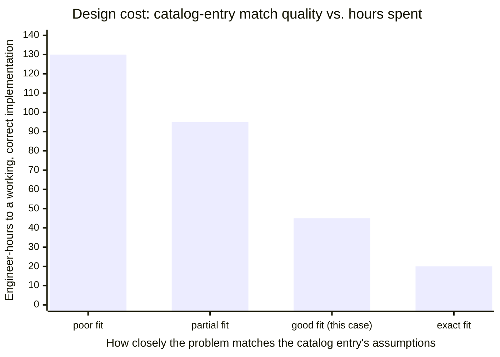

import Scenario from "../../../components/Scenario.astro";
import LevelIntro from "../../../components/LevelIntro.astro";
import Checkpoint from "../../../components/Checkpoint.astro";

<Scenario label="The order-notification system, in numbers">
  <Fragment slot="facts">
    <p class="not-prose mb-1 text-xs font-semibold tracking-wide text-slate-400 uppercase">Requirement</p>
    <div class="not-prose flex flex-col gap-1 text-sm text-slate-700 dark:text-slate-300">
      <div class="flex items-center gap-1.5"><span>📦</span> Notify billing, shipping, analytics on every order-state change</div>
      <div class="flex items-center gap-1.5"><span>⏳</span> Any downstream may be offline for hours — no notification may be lost</div>
      <div class="flex items-center gap-1.5"><span>🧾</span> Auditor must be able to replay 6 months of history</div>
    </div>

    <p class="not-prose mt-3 mb-1 text-xs font-semibold tracking-wide text-slate-400 uppercase">Estimate</p>
    <div class="not-prose flex flex-col gap-1 text-sm text-slate-700 dark:text-slate-300">
      <div class="flex items-center gap-1.5"><span>⏱️</span> ~120 engineer-hours to design retry/ordering/replay from scratch</div>
      <div class="flex items-center gap-1.5"><span>📚</span> A catalogued pattern already matches this shape</div>
    </div>

  </Fragment>

Return to L1's team: notify billing, shipping, and analytics whenever an
order changes state, survive any of them being down for hours, and stay
replayable for a six-month audit. L1 named the shape (reliable, replayable
state-change notification) and pointed at "transactional outbox + event
log" as the catalog entry. This level does the part L1 and L2 stopped
short of: actually building the thing, seeing where the pattern needed
adapting to this team's real constraints, and naming the failure mode that
shows up when a team adopts the pattern's name without its mechanism.

**Recognizing the right catalog entry got the team out of three sprints of
rediscovery. What's still left to decide once the pattern is picked?**

</Scenario>

<LevelIntro
  items={[
    "Mapping this system's constraints to the pattern's assumptions",
    "A worked outbox + read-model implementation",
    "Where the catalog entry still needed adapting, and the cargo-cult failure mode to avoid",
  ]}
/>

## Mapping constraints to the pattern's assumptions

A reference architecture is only a good fit if the assumptions it was
designed around actually hold for this system. Checking that match is the
step a rushed adoption skips.

| This system's constraint                               | Transactional outbox + event log assumption                          | Match?                                                   |
| ------------------------------------------------------ | -------------------------------------------------------------------- | -------------------------------------------------------- |
| Notification must never be lost, even mid-crash        | Event write happens in the same DB transaction as the state change   | ✅ direct fit                                            |
| Downstream may be offline for hours                    | Consumers pull from a durable log at their own pace, not a live push | ✅ direct fit                                            |
| 6-month replay for an audit                            | Log retention is a config choice, not a redesign                     | ✅ direct fit, needs a retention policy decision         |
| Only 3 known consumers today, unlikely to grow past ~5 | Pattern scales to many consumers without change                      | ✅ fit, but over-provisioned — not a reason to reject it |

Every row holds, which is what makes this a genuinely good match — not
just a name that sounded plausible. **Compare this to L2's CQRS
counter-example: a slow report was a performance symptom, not a shape
match. Here, all four constraints line up with the pattern's actual
assumptions, which is the bar for adopting a catalog entry rather than
just reaching for a familiar name.**



## A worked implementation: write path and read path stay separate

The core discipline of the outbox pattern is that the event write can
never happen outside the transaction that changed the state — otherwise a
crash between the two leaves them inconsistent, which is exactly the bug
the pattern exists to remove. Here's the write path:

```typescript
// order-service.ts — the write path: state change and event
// are written in one atomic transaction, never two separate calls.
interface OrderStateChanged {
  orderId: string;
  fromState: string;
  toState: string;
  occurredAt: string;
}

async function transitionOrder(
  db: Transactional,
  orderId: string,
  toState: string,
): Promise<void> {
  await db.transaction(async (tx) => {
    const order = await tx.orders.findById(orderId);
    const fromState = order.state;

    await tx.orders.update(orderId, { state: toState });

    // Same transaction, same commit — this is the whole pattern.
    const event: OrderStateChanged = {
      orderId,
      fromState,
      toState,
      occurredAt: new Date().toISOString(),
    };
    await tx.outbox.insert({
      eventType: "OrderStateChanged",
      payload: JSON.stringify(event),
      publishedAt: null,
    });
  });
}
```

A separate, independent publisher polls the outbox table and delivers
unpublished rows — it never talks to the order service directly, and a
downstream outage just means rows accumulate until it recovers:

```typescript
// outbox-publisher.ts — the delivery path: runs independently,
// retries indefinitely, never touches order-service internals.
async function publishPendingEvents(
  db: Transactional,
  subscribers: EventSubscriber[],
): Promise<void> {
  const pending = await db.outbox.findUnpublished({ limit: 100 });

  for (const row of pending) {
    const results = await Promise.allSettled(
      subscribers.map((s) => s.deliver(row.eventType, row.payload)),
    );
    const allDelivered = results.every((r) => r.status === "fulfilled");

    if (allDelivered) {
      await db.outbox.markPublished(row.id);
    }
    // If a subscriber failed, the row stays unpublished — the next
    // poll retries it. No event is ever dropped on a partial failure.
  }
}
```

Notice what's absent: there's no direct call from `transitionOrder` to
billing or shipping. That absence is the point — it's what lets any
downstream be offline for hours without blocking an order update or
losing the notification.

<Checkpoint question="If `publishPendingEvents` called `subscribers` directly inside the same transaction as `transitionOrder`, instead of polling the outbox separately, what property of the pattern would be lost?">

The ability to survive a downstream outage without blocking the write.
Calling subscribers synchronously inside the order-update transaction
means a slow or down billing service now blocks — or fails — the order
state change itself, which was one of the two hard requirements. The
whole reason the outbox exists as a separate table with a separate poller
is to decouple "the state change is durable" from "every consumer has
acknowledged it," so a flaky consumer degrades to "notifications are
delayed," never to "orders can't be updated."

</Checkpoint>

## Where the pattern still needed adapting

The catalog entry doesn't answer everything. This team still had to
decide, on their own constraints:

- **Retention: 6 months, not indefinite.** The audit requirement is
  bounded — an indefinite log (which a naive "full event sourcing" read of
  the pattern might default to) is unneeded cost. A scheduled job archives
  and prunes rows older than 6 months.
- **No full event-sourced read model.** Only three consumers exist, and
  none needs to reconstruct arbitrary past state — just to see the current
  one plus the specific `OrderStateChanged` fact. Building a full
  CQRS read-model layer on top of the outbox would be solving a problem
  ("reads and writes need different shapes") this system doesn't actually
  have — see L2's CQRS signal check.
- **Polling interval, not push.** A 2-second poll was cheap enough and
  simple enough to operate; a push-based delivery mechanism (e.g. a
  message broker) was rejected as unneeded operational surface for 3
  known consumers.

None of these were in the catalog entry's diagram — they came from
checking the pattern's assumptions against this system's actual numbers,
same as the fit table above.

## The failure mode: adopting the name, not the mechanism

**What actually goes wrong when a team says "we're doing the outbox
pattern" but skips this adaptation step?** The most common version isn't
over-adaptation — it's under-adaptation: copying the pattern's name and
its diagram shape, but skipping the one property that makes it work.

| Symptom                                                                                               | What was actually skipped                                                        |
| ----------------------------------------------------------------------------------------------------- | -------------------------------------------------------------------------------- |
| "We have an outbox table" but the event insert happens in a separate DB call after the update commits | The atomicity guarantee — a crash between the two calls loses the event silently |
| "We use CQRS" but the read model is just a cached copy of the write model, updated synchronously      | The actual separation of concerns — this is caching with extra steps, not CQRS   |
| "We implemented a saga" with no compensating action for a failed step                                 | The undo mechanism — partial failure still leaves the system inconsistent        |



Each of these is cheaper to fix than to have shipped — but only if the
mismatch is caught by checking the fit table above, rather than assumed
away because the name was right.

<Checkpoint question="A different team adopts the transactional outbox pattern for a system where downstream consumers need updates within 50ms and can never tolerate a missed one silently. What should they check before assuming the fit here transfers to theirs?">

Whether their latency and delivery-guarantee requirements match the ones
this system actually had. The outbox pattern's poll-based delivery is a
fit for "eventually, tolerating hours of downstream downtime, replayable"
— it is not built for sub-100ms delivery, and its retry-until-acknowledged
model still needs an explicit answer for "what happens if a consumer never
comes back" (dead-letter handling), which this walkthrough didn't need
because none of its three consumers had that requirement. A different
latency or failure-tolerance profile is exactly the kind of mismatch the
fit table above exists to catch before implementation starts — the
pattern's name transferring doesn't mean its assumptions do.

</Checkpoint>
