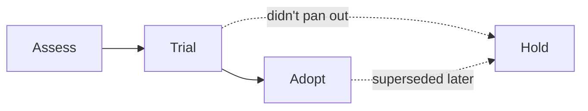

import Scenario from "../../../components/Scenario.astro";
import LevelIntro from "../../../components/LevelIntro.astro";

<Scenario label="The framework nobody voted on">
  <Fragment slot="facts">
    

      
🎤 <strong>Trigger</strong> — one engineer saw a framework at a conference two weeks ago

      
📦 <strong>Result</strong> — 3 of 11 services now use it, the rest don't

      
🤷 <strong>Nobody can answer</strong> — "is this an experiment, or the new default?"

    

  </Fragment>

Two weeks after a conference talk, one engineer rewrites their service's
queue layer on a framework nobody else on the team has heard of. It works,
they demo it, and within a month two more services quietly follow — not
because anyone decided this was the standard, but because it's what the
last person to touch that code happened to know. Six months later, a
production incident needs someone who understands this framework, and the
one engineer who does is on vacation. **Nobody ever decided to adopt this
technology — it just accumulated. Who was supposed to stop this, and with
what?**

</Scenario>

The honest answer is: nobody was supposed to stop it, because there was no
shared, visible place to write "we're trying this" versus "we're standing
behind this" versus "we already tried this and it's not for us." A
**technology radar** is that place — a lightweight, shared map of every
technology the team is knowingly using, with an explicit level of
commitment attached to each one.

<LevelIntro
  items={[
    "The four rings: Adopt, Trial, Assess, Hold",
    "The four quadrants a radar organizes by",
    "Why hype and adoption are different questions",
  ]}
/>

## The shape of the problem

- Technology choices happen constantly, at every level of a codebase — a
  new library, a new database, a new deployment tool — and most of them
  happen **locally**, by whoever is writing the code that day, without ever
  reaching a team-wide decision.
- Left ungoverned, this produces exactly the scenario above: quiet,
  uncoordinated technology sprawl, where nobody can say with confidence
  what the team is actually standing behind versus what one person tried
  once.
- A **technology radar** (popularized by ThoughtWorks, and adaptable to a
  team of any size) fixes this without a heavyweight approval committee —
  it's a shared, living document, not a gate that blocks anyone from
  trying something new.
- The radar has two axes: a **ring** (how much commitment the team has to
  a technology) and a **quadrant** (what kind of technology it is), so
  every entry answers both "how sure are we?" and "what category is this?"
  at a glance.

## The four rings, at a glance

| Ring       | Meaning                                                          | Who should use it                                                           |
| ---------- | ---------------------------------------------------------------- | --------------------------------------------------------------------------- |
| **Adopt**  | The team has real production experience and stands behind it     | Default choice for new work in this category                                |
| **Trial**  | Worth pursuing — someone is using it on a real, bounded project  | New projects, with the caveat that it's not proven yet                      |
| **Assess** | Worth exploring to build understanding, not yet worth committing | A spike or prototype, kept away from anything critical                      |
| **Hold**   | Proceed with caution — known problems, or a deliberate step back | Don't start anything new with it; existing use is tolerated, not encouraged |

The rings aren't a one-way ladder every technology is expected to climb —
most things assessed never make it to trial, and something can be pulled
back to Hold from any ring the moment it stops earning its place.

## The four quadrants

A radar also sorts entries by **what kind of thing** they are, so a
"Techniques" pick (like trunk-based development) doesn't get compared
apples-to-oranges against a "Platforms" pick (like a cloud provider):

- **Techniques** — practices and ways of working (e.g. contract testing,
  feature flags)
- **Tools** — things that support building and running software (e.g. a
  CI system, a linter)
- **Platforms** — things you build and run on top of (e.g. a cloud
  provider, a database)
- **Languages & Frameworks** — the actual code-level building blocks

Key terms: technology radar, ring, quadrant, adopt, trial, assess, hold,
technology sprawl.
