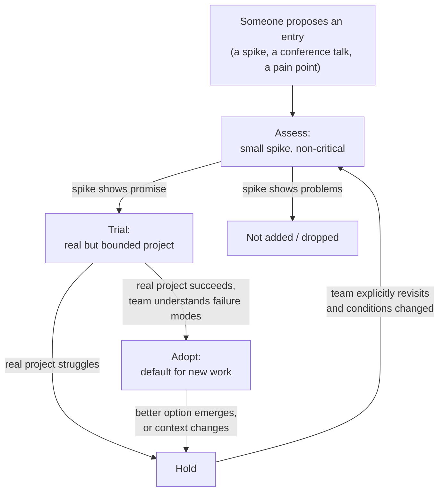
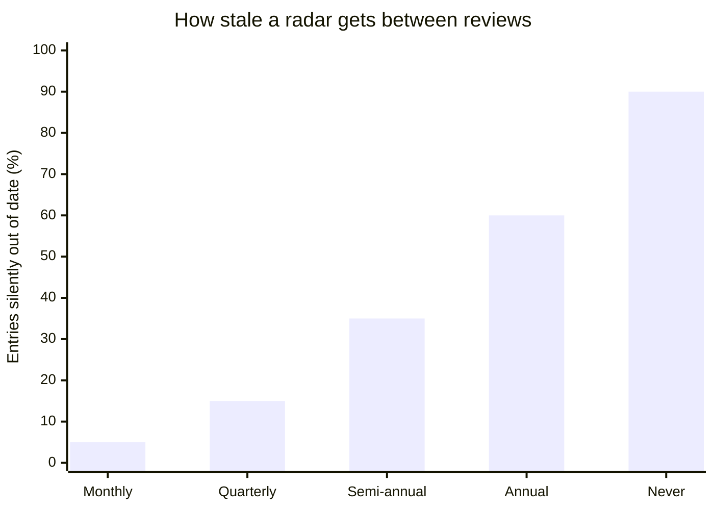

import LevelIntro from "../../../components/LevelIntro.astro";
import Checkpoint from "../../../components/Checkpoint.astro";

L1 named the four rings and four quadrants as a shared vocabulary. That
vocabulary is only useful if something actually moves entries between
rings on a real cadence — otherwise the radar itself goes stale and
becomes exactly the kind of unmaintained document nobody trusts. L2 works
out that process: who proposes an entry, what evidence moves it, and how
often the whole radar gets revisited.

<LevelIntro
  items={[
    "The lifecycle of one radar entry, end to end",
    "What evidence actually justifies moving rings",
    "Why review cadence matters as much as the rings themselves",
  ]}
/>

## The lifecycle of one entry

**Before deciding a review cadence or an evidence bar — what actually
happens to a single technology from the moment someone first tries it to
the moment the team either commits or drops it?** Tracing one entry
through its full lifecycle makes the rest of the process obvious, because
each ring transition has a natural trigger.

An entry earns its way from Assess to Trial to Adopt on **evidence from
using it**, not on how convincing the pitch was. It's just as valid, and
just as common, for an entry to stop at any ring — most things assessed
never become trials, and most trials never become the default.

<Checkpoint question="A team ran a 2-day spike on a new observability tool and liked what they saw. Per the lifecycle above, does that spike alone justify moving the tool straight to Adopt?">

No. A 2-day spike is exactly what Assess is for — it builds understanding
and surfaces obvious dealbreakers, but it hasn't touched a real, bounded
project yet, which is what Trial requires before a technology has earned
enough evidence to become the default. Skipping Trial means adopting on
enthusiasm rather than on operational experience — the same failure mode
as the ungoverned framework in L1's scenario, just with an extra rubber
stamp on it.

</Checkpoint>

## What evidence moves an entry, per transition

**If "it worked" isn't specific enough to justify a ring change, what
actually is?** Each transition should point at a concrete, falsifiable
question the previous ring was meant to answer:

| Transition            | The question that ring exists to answer                                                                                                    |
| --------------------- | ------------------------------------------------------------------------------------------------------------------------------------------ |
| Assess → Trial        | Did the spike surface any dealbreaker (licensing, missing feature, unacceptable performance)?                                              |
| Trial → Adopt         | Did a real project run it in production and survive an actual failure mode (an outage, a bad deploy, an on-call page)?                     |
| Adopt → Hold          | Has something changed — a better option, an unmaintained upstream, a security issue — that makes continuing to recommend it irresponsible? |
| Hold → Assess (again) | Did the condition that caused the Hold actually change, or is someone just hoping it did?                                                  |

Without an explicit question per transition, ring changes drift into "the
loudest advocate wins," which reproduces the exact hype-driven adoption
the radar exists to prevent.

## Why cadence matters as much as the rings

**A radar with perfect rings and quadrants but reviewed once, two years
ago — is that radar actually doing its job today?** No: every entry on it
is a snapshot of a moment that's now stale. A "Hold" from two Node.js
major versions ago might no longer apply; an "Adopt" from before a
security disclosure might now be actively dangerous to keep recommending.
The radar's value decays with time exactly like any other cached
decision.

Most teams settle on a **quarterly** review as the practical middle
ground: frequent enough that an entry doesn't sit stale for a whole
release cycle, infrequent enough that it's a real, scheduled conversation
rather than noise competing with daily work. The interactive demo at the
end of this unit lets you explore that trade-off directly — cadence
against team size against how fast the team's stack is actually changing.

<Checkpoint question="A team reviews its radar once a year. A library on 'Adopt' had a critical CVE disclosed 8 months ago. What does the yearly cadence mean for that entry in practice, and what's the fix — reviewing more, or something else?">

For 8 of those 12 months, the radar is actively lying — it still tells
anyone reading it "this is the safe default" when it isn't. The direct
fix is a faster scheduled cadence, but the real fix is recognizing that
**security disclosures shouldn't wait for the next scheduled review at
all** — a radar needs both a routine cadence for ordinary drift and an
out-of-band trigger (a CVE, an upstream project going unmaintained) that
forces an immediate, unscheduled ring change regardless of where the
calendar sits.

</Checkpoint>
