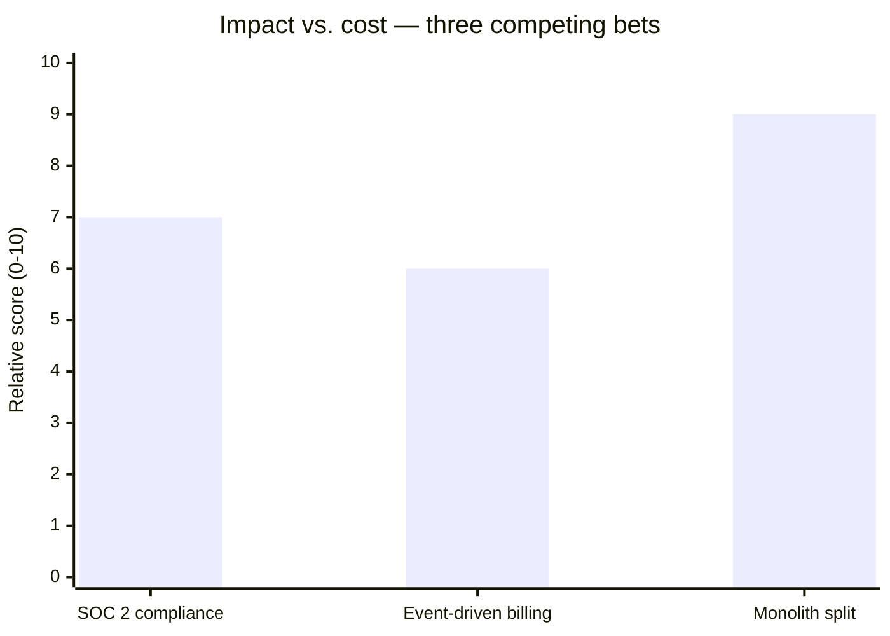

import Scenario from "../../../components/Scenario.astro";
import LevelIntro from "../../../components/LevelIntro.astro";

<Scenario label="The problem">
  <Fragment slot="facts">
    

      
🏗️ <strong>Platform director</strong> — wants the legacy monolith split into services, ~4 quarters

      
💳 <strong>Payments director</strong> — wants event-driven billing to stop double-charges, ~3 quarters

      
🔒 <strong>Sales director</strong> — wants SOC 2 compliance to close a $2M enterprise deal, ~2 quarters

    

    

      
Team capacity vs. what's being asked

      

        

      

      
Capacity for ~1.5 initiatives in parallel — 3 are being pitched as "top priority" at once

    

  </Fragment>

Three directors, three "must-do-now" initiatives, one engineering org that can
realistically sustain about one and a half of them running in parallel. Each
pitch sounds urgent in isolation. Nobody has said, out loud, which one
actually has to happen first, or why — and the VP just asked for "a two-year
plan" by Friday.

| Initiative           | Pitched as                                 | Quarters | Depends on                    |
| -------------------- | ------------------------------------------ | -------- | ----------------------------- |
| Split the monolith   | "Everything is blocked on this eventually" | ~4       | Nothing                       |
| Event-driven billing | "We're losing money to double-charges"     | ~3       | Partially, the monolith split |
| SOC 2 compliance     | "The deal closes or it doesn't"            | ~2       | Nothing                       |

**Picking whichever pitch is loudest this quarter isn't a strategy — it's
reacting to whoever presented most recently. What would it take to actually
put these three in a defensible order?**

</Scenario>

That's the job **technical strategy and roadmapping** exists to do: turn a
pile of competing "this is the most important thing" pitches into a
sequenced, multi-year plan that a whole org can actually execute against —
and defend when someone asks "why this order?"

<LevelIntro
  items={[
    "Strategy vs. roadmap vs. backlog — three different altitudes",
    "What a technical 'bet' is and how it's scored",
    "Why sequencing order matters as much as the list itself",
  ]}
/>

## What is technical strategy, actually?

"Strategy" gets used loosely. At the scale this unit is about, three related
but distinct things are easy to blur together:

- **Technical strategy** — the small number of multi-quarter/multi-year
  commitments (the "bets") that will most change what the org is capable of,
  and the order to make them in. Answers "what are we betting on, and why
  this one first?"
- **Roadmap** — the strategy laid out on a timeline: which bet happens in
  which quarter, what depends on what, what "done" looks like for each
  stage. Answers "when?"
- **Backlog** — the concrete, near-term work items that implement whichever
  bet is currently active. Answers "what does someone code this sprint?"

A backlog with no roadmap behind it is directionless busywork. A roadmap
with no strategy behind it is just a calendar — dates attached to whatever
was pitched loudest, exactly the failure mode in the scenario above.

## Core vocabulary

- **Bet** — a significant, multi-quarter technical commitment (a migration,
  a new platform capability, a compliance program) chosen over other
  plausible uses of the same engineering time. Calling it a "bet" instead of
  a "project" is deliberate: it can fail to pay off, and choosing it means
  _not_ choosing something else.
- **Sequencing** — the order bets happen in. Two bets can both be worth
  doing and still have exactly one correct order, if one reduces the risk or
  cost of the other.
- **Dependency** — one bet that makes another cheaper, safer, or possible.
  Splitting the monolith doesn't just stand alone — it changes how hard
  event-driven billing is to build afterward.
- **Horizon** — how far out a bet sits: commonly staged as **Now** (this
  quarter, committed), **Next** (next 1–2 quarters, planned but not locked),
  and **Later** (this year+, directional only — expected to change).
- **Capacity** — how many bets the org can actually sustain moving forward
  at once, which is almost always fewer than how many feel urgent.

## Bets, scored side by side

Every bet gets sized the same way before it's placed on a timeline —
otherwise "urgent" always wins over "high-leverage":

SOC 2 has the shortest path to revenue. The monolith split scores highest
overall not because it's the most exciting, but because it's a
**dependency** for the billing work — doing it first makes the second bet
cheaper, not just "also good."

## Sequencing isn't just picking the list

Given the same three bets, two different orders are both defensible — and
produce very different two-year outcomes:

| Order                      | Logic                                            | Risk                                                      |
| -------------------------- | ------------------------------------------------ | --------------------------------------------------------- |
| SOC 2 → Billing → Monolith | Revenue and urgency first                        | Billing gets built twice — once now, once after the split |
| Monolith → Billing → SOC 2 | Reduce dependency cost first, most durable value | The $2M deal's timeline is a real, external risk          |

Neither order is "correct" in the abstract — the right one depends on how
real the deal's deadline is, how expensive rework on billing would be, and
how much risk the org can tolerate. That judgment call, made explicit and
defensible, is the actual output of technical strategy.

- **Strategy, roadmap, and backlog are different altitudes** — strategy
  picks the bets and their order, roadmap puts them on a timeline, backlog
  implements whichever is active now.
- **A bet is a choice against other options**, not just "a project" —
  naming it that way keeps the trade-off visible.
- **Order matters as much as the list** — the same three bets sequenced
  differently produce different costs and different risk, because bets can
  depend on each other.
