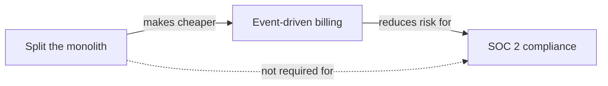

import Scenario from "../../../components/Scenario.astro";
import LevelIntro from "../../../components/LevelIntro.astro";
import Checkpoint from "../../../components/Checkpoint.astro";

<Scenario label="The problem">
  <Fragment slot="facts">
    <div class="not-prose grid grid-cols-2 gap-2 text-xs">
      <div class="rounded border border-sky-300 bg-sky-50 p-2 dark:border-sky-800 dark:bg-sky-950">
        <p class="font-semibold text-sky-700 dark:text-sky-400">Proposal A — revenue first</p>
        SOC 2 → Billing → Monolith split. Deal closes in ~2 quarters if compliance lands on time.
      </div>
      <div class="rounded border border-emerald-300 bg-emerald-50 p-2 dark:border-emerald-800 dark:bg-emerald-950">
        <p class="font-semibold text-emerald-700 dark:text-emerald-400">Proposal B — foundation first</p>
        Monolith split → Billing → SOC 2. Billing gets built once, not rebuilt after the split.
      </div>
    </div>
    <div class="not-prose mt-2 text-xs text-slate-500 dark:text-slate-400">
      Same three bets from L1, same team, two directors, two spreadsheets, two "obviously correct" orders.
    </div>

  </Fragment>

Two senior engineers each spent a week building a proposal for the same
three bets from L1 — same list, same team, same budget. One leads with
revenue urgency, the other leads with dependency cost. Both documents are
internally consistent. Both can't be the roadmap.

**When two well-reasoned proposals disagree on order, what's actually being
compared isn't "who's right" — it's which inputs each proposal weighted, and
which one it left out. What has to be on the table before an order can be
called defensible?**

</Scenario>

Resolving a disagreement like this — not picking a winner by seniority or
volume — is the actual mechanics of building a technical strategy.

<LevelIntro
  items={[
    "Four inputs every roadmap decision needs",
    "How dependency reduction changes a bet's real cost",
    "Staging bets into Now / Next / Later and revisiting them",
  ]}
/>

## What inputs does a sequencing decision actually need?

Neither proposal above is _wrong_ — each is optimizing for a real input
while under-weighting another:

| Input            | Question it answers                                             | Proposal A weighted it  | Proposal B weighted it |
| ---------------- | --------------------------------------------------------------- | :---------------------: | :--------------------: |
| Business context | What's the org betting the company on this year?                |     High (the deal)     |          Low           |
| Current pain     | What's actively costing money or trust right now?               | Medium (double-charges) |         Medium         |
| Org capacity     | How many bets can run in parallel without stalling all of them? |      Not addressed      |     Not addressed      |
| Dependency graph | Which bets make other bets cheaper or safer?                    |           Low           |    High (the split)    |

Both proposals skip **org capacity** entirely — neither says how many bets
the team can actually run at once, which is the input that turns "here's an
order" into "here's what happens in quarter one versus quarter three."

<Checkpoint question="Proposal A sequences SOC 2 first because the deal is worth $2M. Proposal B sequences the monolith split first because it's a dependency for billing. Is one of these inputs simply more important than the other, in general?">

No — neither input outranks the other as a rule. Business context (the deal)
and the dependency graph (the split making billing cheaper) are both real
costs, just denominated differently: one in lost revenue if the deal slips,
the other in duplicated engineering work if billing gets built twice. A
defensible sequencing decision has to put both on the same table and make
the trade-off explicit — "we're accepting X risk of the deal slipping to
avoid Y cost of rebuilding billing" — not silently favor whichever input the
proposal's author happened to weight more instinctively.

</Checkpoint>

## Dependency reduction changes a bet's real cost

The reason order isn't arbitrary, even when every bet is independently
worth doing, is that some bets change the cost of the ones after them:



The monolith split isn't on the roadmap because it's the most urgent bet —
it's on the roadmap **first** because skipping it means billing gets built
against the tangled monolith now, then rebuilt against the split services
later. That rebuild cost is the real price of sequencing billing before the
split, even though billing itself doesn't strictly require the split to
start.

## Staging bets: Now, Next, Later

Once bets are scored and their dependencies mapped, they get staged onto a
horizon — not committed with equal confidence, since the further out a bet
sits, the less certain its timing should be:

```mermaid
gantt
    title Two-year technical roadmap — sequencing draft
    dateFormat  YYYY-Q[Q]
    axisFormat  %Y Q%q
    section Now
    Monolith split (phase 1)      :active, a1, 2026-Q1, 2q
    section Next
    Event-driven billing          :a2, after a1, 3q
    SOC 2 controls + audit prep   :a3, 2026-Q3, 2q
    section Later
    Monolith split (phase 2)      :a4, after a2, 2q
```

- **Now** is committed — a team is staffed on it this quarter.
- **Next** is planned but not locked — order and scope can still shift based
  on how "Now" lands.
- **Later** is directional, not a promise — it exists so stakeholders can
  see the shape of the plan without an org planning two years of ticket
  detail nobody can actually predict that far out.

Note that SOC 2 controls start in **Next**, not after the whole monolith
split — dependency reduction determined which bet goes first, not that every
other bet has to wait for the first one to fully finish.

<Checkpoint question="A stakeholder asks why SOC 2 compliance work starts in 'Next' instead of waiting until the monolith split (in 'Now') is completely done. What's the answer?">

Because "Now" and "Next" aren't a strict queue where nothing starts until
the prior stage is 100% finished — they're a confidence horizon. The
monolith split was sequenced first because it reduces the cost of the
billing rework, not because every other bet structurally depends on it.
SOC 2 compliance has no such dependency on the split, so there's no reason
to block it — it can run in parallel once there's spare capacity, staged in
"Next" because its own timeline and scope are still firming up, not because
it's waiting in a single-file line behind bet one.

</Checkpoint>

- **Four inputs feed every sequencing decision**: business context, current
  pain, org capacity, and the dependency graph — a proposal that only
  weights one or two of them isn't wrong, it's incomplete.
- **Dependency reduction is why order matters even between independently
  "good" bets** — a bet that lowers the cost of a later one earns its place
  first on that basis alone.
- **Now/Next/Later stages commitment by confidence, not a rigid queue** —
  bets with no dependency on each other can run in parallel once capacity
  allows, regardless of which horizon they're labeled.
