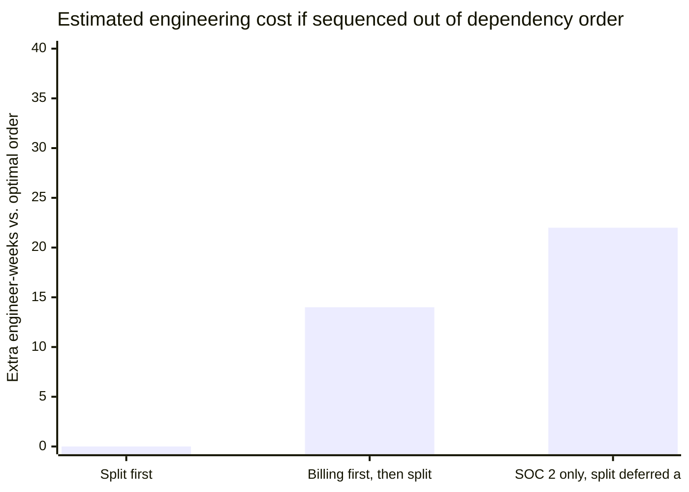
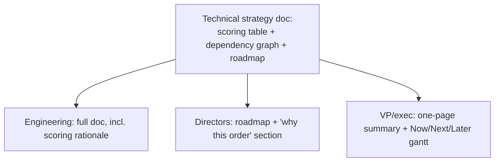

import Scenario from "../../../components/Scenario.astro";
import LevelIntro from "../../../components/LevelIntro.astro";
import Checkpoint from "../../../components/Checkpoint.astro";

<Scenario label="The problem">
  <Fragment slot="facts">
    <div class="not-prose flex flex-col gap-2 text-sm text-slate-700 dark:text-slate-300">
      <div class="flex items-center gap-1.5"><span>📅</span> <strong>Q1 2026</strong> — roadmap published: monolith split → billing → SOC 2</div>
      <div class="flex items-center gap-1.5"><span>🚨</span> <strong>Q2 2026</strong> — a credential-stuffing incident exposes a real gap in access controls</div>
      <div class="flex items-center gap-1.5"><span>❓</span> <strong>Now</strong> — does the incident change the plan, or is it noise the plan should absorb?</div>
    </div>
    <div class="not-prose mt-3 rounded border border-amber-300 bg-amber-50 p-2 text-xs dark:border-amber-800 dark:bg-amber-950">
      The published roadmap survived exactly one quarter before reality disagreed with it.
    </div>

  </Fragment>

The roadmap from L2 shipped — socialized, staffed, in motion. One quarter
in, an incident response postmortem surfaces a real gap: no anomaly
detection on failed login attempts, discovered because it was actively
exploited, not found in a review. SOC 2 was staged for "Next," months away.

**A strategy that never changes when reality disagrees with it isn't
principled — it's just stale. A strategy that changes every time something
alarming happens isn't a strategy at all. Where's the actual line between
"this changes the plan" and "this is exactly the kind of noise the plan was
built to absorb"?**

</Scenario>

That question — when to hold the sequencing and when to re-sequence — is
where a technical strategy earns its keep, and it's what the rest of this
unit works through end to end: how the original roadmap got built, how it
got re-sequenced under real pressure, and how its impact actually got
measured afterward.

<LevelIntro
  items={[
    "Scoring a real bet: impact, cost, risk, dependency",
    "Re-sequencing under pressure without abandoning the strategy",
    "Measuring a roadmap's impact with leading indicators, not just 'done'",
  ]}
/>

## Scoring the bets, with real numbers

Aperture Health's staff engineer didn't start from directors' pitches — she
built a scoring table from data each director could contest but not simply
override with volume:

| Bet                    | Quarters | Revenue/cost impact                    | Risk if delayed                           | Dependency value                             | Score (0–10) |
| ---------------------- | :------: | -------------------------------------- | ----------------------------------------- | -------------------------------------------- | :----------: |
| Monolith split (ph. 1) |    2     | Indirect — unblocks two other bets     | Low — no external deadline                | High — halves billing's estimated cost       |      8       |
| Event-driven billing   |    3     | ~$40k/mo lost to double-charge refunds | Medium — ongoing, slow-bleeding cost      | Medium — feeds cleaner audit trail for SOC 2 |      7       |
| SOC 2 compliance       |    2     | $2M deal contingent on it              | High but bounded — one deal, one deadline | Low — doesn't unblock the other two          |      7       |

The scores land close together on purpose — none of these bets is a clear
throwaway, which is exactly why sequencing logic (not just "pick the
biggest number") is what settles the order, not the table alone.



Building billing before the split doesn't just delay the split — it adds an
estimated 14 engineer-weeks of rework once the split eventually happens,
because billing's data access patterns have to be rebuilt against the new
service boundaries. That number, not intuition, is what justified sequencing
the split first even though SOC 2 scored the same 7.

<Checkpoint question="The scoring table shows SOC 2 and event-driven billing tied at 7, with the monolith split ahead at 8. If a new bet came in scoring 9, would it automatically jump to the front of the roadmap?">

Not automatically — a higher score alone doesn't override the dependency
graph. If the new bet doesn't depend on, or get depended on by, the three
already staged, a 9 just means it's a strong candidate for the next open
capacity slot, not that it bumps a lower-scored bet whose position was
justified by unlocking cost, not raw score. Score ranks bets against each
other in isolation; dependency and capacity are what actually place them on
a timeline. Treating the table as a strict priority queue is the same
mistake as Proposal A and B in L2 each making — optimizing one input while
dropping the others.

</Checkpoint>

## Re-sequencing under real pressure

The credential-stuffing incident from the scenario forced an actual
decision, not a hypothetical one. The staff engineer's re-sequencing
process, in order:

1. **Separate the incident's fix from the incident's narrative.** The
   specific gap (no anomaly detection on failed logins) was a two-week fix,
   independent of the full SOC 2 program. That fix got pulled forward
   immediately — it didn't need to wait on a roadmap conversation.
2. **Ask what the incident actually changes about the scoring table**, not
   just how alarming it felt. SOC 2's "risk if delayed" moved from
   "bounded, one deal" to "bounded, plus a second real security gap already
   proven exploitable" — a genuine change to an input, not a mood shift.
3. **Re-run the sequencing question with the updated input**, the same four
   inputs from L2 — business context, current pain, capacity, dependency —
   not a fresh ad hoc decision made under incident-adrenaline.

The result: the two-week anomaly-detection fix got pulled into the current
quarter as an addition, not a replacement, and the full SOC 2 program moved
from "Next" to overlapping the tail end of the monolith split instead of
waiting for it to fully finish — using the spare capacity the split's
dependency reduction was expected to free up a quarter early.

```mermaid
gantt
    title Revised roadmap after the Q2 incident
    dateFormat  YYYY-Q[Q]
    axisFormat  %Y Q%q
    section Now
    Anomaly detection fix (pulled forward) :crit, f1, 2026-Q2, 1q
    Monolith split (phase 1)               :active, a1, 2026-Q1, 2q
    section Next
    SOC 2 program (moved earlier)          :a3, 2026-Q2, 3q
    Event-driven billing                   :a2, after a1, 3q
    section Later
    Monolith split (phase 2)               :a4, after a2, 2q
```

Notice what didn't change: the monolith split still runs first, because the
incident didn't touch the dependency math that put it there. What changed
was SOC 2's position relative to billing, because the incident was new
evidence about SOC 2's real cost of delay specifically.

<Checkpoint question="A director argues the incident proves 'security should always come first' and wants every future roadmap to lead with security work by default. Is that the right lesson to take from this re-sequencing?">

No — that overcorrects the actual lesson. What justified moving SOC 2 up
was a specific, evidenced change to one input (risk if delayed) for one
bet, re-run through the same four-input process that built the original
roadmap — not a new blanket rule that overrides scoring and dependency
analysis going forward. A standing "security always first" policy would be
exactly the failure mode from the opening scenario in reverse: reacting to
whichever pressure was most recent and loudest, just with security instead
of a director's pitch as the trigger. The discipline is re-running the
process with better inputs, not replacing the process with a fixed
priority order.

</Checkpoint>

## Measuring whether the roadmap actually worked

"Done" isn't the same as "worked." Aperture Health tracked leading
indicators during execution, not just completion at the end — waiting until
a bet finished to find out whether it was worth it means finding out too
late to adjust:

| Bet                    | Leading indicator tracked during execution         | What it would have flagged early                 |
| ---------------------- | -------------------------------------------------- | ------------------------------------------------ |
| Monolith split (ph. 1) | Services extracted per quarter, on/behind pace     | A stalled split before it blew the whole roadmap |
| Event-driven billing   | Double-charge rate, weekly, not just at ship       | Whether the fix actually worked, mid-rollout     |
| SOC 2 program          | Controls implemented vs. audit checklist, biweekly | An audit failure risk before the audit itself    |

None of these wait for a bet's final quarter to produce a signal — a
roadmap that only reports "on track / at risk" per-bet at the end of each
quarter is reporting a lagging indicator dressed up as a status update.

**This particular roadmap was for one org sequencing three bets under one
incident. What would change about the scoring table, the four inputs, or
the leading indicators if this were a twelve-person startup instead of an
org with several teams — or if the "incident" had been a competitor
shipping the same billing fix first, instead of a security breach?**

## Socializing the strategy so it survives contact with pushback

A roadmap that only lives in one staff engineer's head doesn't survive the
first disagreement. What actually got published, and to whom:



The same underlying decision, at three depths — engineering gets the
scoring table and dependency reasoning so they can contest it with the same
inputs the staff engineer used; directors get the order and the "why," not
a fight over the raw scores; the VP gets the two-year shape without needing
the scoring mechanics. Skipping the deepest layer for engineering is the
single most common way a roadmap quietly loses buy-in — a team asked to
execute a sequencing decision it can't inspect treats it as a mandate, not
a shared plan, and re-litigates it informally sprint by sprint instead of
once, up front.

- **A scoring table settles "which bets," a dependency graph settles
  "which order"** — neither alone is enough; a high score with no
  dependency relationship to the rest of the roadmap doesn't earn a bet the
  front of the line.
- **Re-sequencing is re-running the same four inputs with new evidence**,
  not replacing the process with a reactive rule — the discipline is what
  keeps a strategy from becoming either stale or panicky.
- **Track leading indicators during execution, not just completion at the
  end** — and publish the reasoning at a depth each audience can actually
  inspect and contest, or the roadmap survives only until the first
  disagreement.
