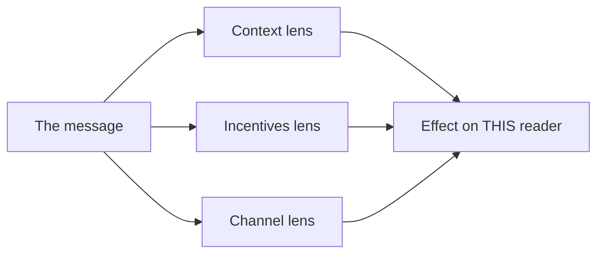

import Scenario from "../../../components/Scenario.astro";

<Scenario>
  <Fragment slot="facts">
    

      

        $340
        of $500 goal
      

      

        

      

    

    

      
🌧️ Rain forced the move inside, cut selling time in half

      
🔁 Fix: make-up sale <strong>Saturday</strong>

    

    
Readers

    

      
🙋 Groupmate — was there

      
🧑‍🏫 Teacher — accountable for the $500

      
🏫 Principal — only cares if the trip is on

    

  </Fragment>

Your class ran a bake sale to raise $500 for a field trip. Rain forced
everyone to move the tables inside at the last minute, and you only raised
$340 — but you already have a plan: a make-up sale Saturday that should
close the gap. You have to tell three people the same news today.

| Reader                                    | Reaction                                                                      |
| ----------------------------------------- | ----------------------------------------------------------------------------- |
| Your groupmate who ran the table          | Calm: "Okay — what do we do differently Saturday?"                            |
| Your teacher, who's counting on the money | Concerned, but focused on the plan: "Are we still going to hit $500 in time?" |
| The principal, hearing it secondhand      | Alarmed: "Wait — is the trip cancelled?!"                                     |

**Before reading on: all three hear the same $340 and the same reason (rain) — so why does only the principal panic, while the other two stay calm?**

</Scenario>

It wasn't the facts. It was everything _around_ them — what got explained, what got cut, and what question the message answered first.

- The **facts** in a message and the **effect** of a message are two different things — the same true statement can build trust with one audience and destroy it with another.
- Every audience filters what you say through three lenses at once:
  - **Context** — how much background do they already have? (your groupmate watched the rain happen; your teacher is only checking in now)
  - **Incentives** — what do they personally care about? (your teacher is on the hook for the $500 goal; your groupmate just wants Saturday to go better)
  - **Channel expectations** — what does the way you tell them train them to expect? (a text to your groupmate reads casual; an announcement to the whole school reads official)
- **Audience awareness is not spin.** You're not changing what's true — you're changing what's foregrounded, how much detail is load-bearing, and what decision you're asking the reader to make.

In plain words:

| Term                 | Simple meaning                                                        |
| -------------------- | --------------------------------------------------------------------- |
| Context              | What the reader already knows before your message arrives             |
| Incentives           | What the reader cares about, is responsible for, or will be judged on |
| Channel expectations | What the format makes them expect: text, email, announcement, meeting |
| Foregrounded         | What you put first, because it should shape the reader's reaction     |
| Load-bearing detail  | A detail that would change what the reader decides or does            |
| Spin                 | Twisting the story to create an impression the facts do not support   |

- A message written with no audience in mind defaults to the writer's own frame — which is usually the most detailed, least decision-oriented version possible.
- Three questions to ask before writing anything that matters:
  1. What does this person already know, and what do they need to know to act?
  2. What decision or reaction am I actually trying to produce?
  3. What will they misread if I don't address it directly?
- Getting this wrong doesn't just cost clarity — it costs **credibility**. Someone who explains things the exact same way to a five-year-old and to a room of adults comes across as not really understanding the room, no matter how correct the explanation is.

That last example is not about intelligence or respect. It is about
matching the real question. A child, a teacher, a principal, and an
expert can all need different versions because they are trying to
decide different things.

The three lenses aren't checked one at a time — they apply to the same message simultaneously, and all three feed into a single effect on that reader:

| #   | Question                                               | What it decides                                   |
| --- | ------------------------------------------------------ | ------------------------------------------------- |
| 1   | What do they already know, and need to know to act?    | What's redundant to explain vs. genuinely missing |
| 2   | What decision or reaction am I trying to produce?      | The actual ask, explicit or implicit              |
| 3   | What will they misread if I don't address it directly? | What has to be stated, not just implied           |
