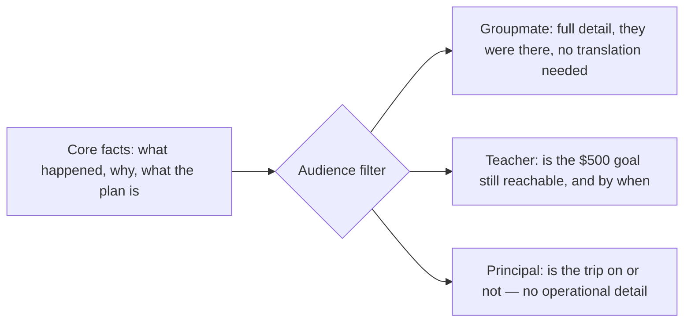
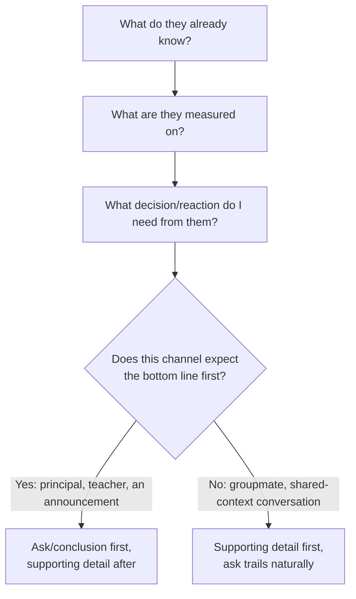

## One message, three audience-specific transformations

Take the bake-sale update from L1. Before looking at the diagram below: if you had to cut this message down to one sentence for each of the three readers, what's the one thing you'd keep for your groupmate that you'd cut for the principal — and vice versa?

The underlying facts don't change between audiences. What changes is which facts are **load-bearing** for that reader's decision, and how much unexplained context you can assume.

A detail is **load-bearing** if removing it would change what the
reader decides, feels, or does next. "Rain cut selling time in half"
is load-bearing for the groupmate planning Saturday; "the trip is on
track" is load-bearing for the principal.

The facts flowing into the filter are identical in all three branches. What differs is which subset gets surfaced, and what unit of measurement the reader actually cares about (what happened at the table vs. dollars vs. trip status). If your one-sentence answer above kept the rain-and-tables detail for your groupmate and dropped it for the principal, that's this filter working correctly — not two different stories, one filter applied twice.

## The three lenses, concretely

Two messages can state the exact same fact and still fail differently — one by over-explaining, one by leaving out the one thing the reader actually needed. What's the underlying variable that predicts which failure you'll get?

| Lens       | Question to answer before writing                                                        | Groupmate                             | Teacher                                    | Principal                                    |
| ---------- | ---------------------------------------------------------------------------------------- | ------------------------------------- | ------------------------------------------ | -------------------------------------------- |
| Context    | What do they already know?                                                               | Was there, saw the rain and the crowd | Knows the $500 goal, not the table details | Knows nothing about how the sale ran         |
| Incentives | What outcome are they measured on? Or, simply: what do they need this message to settle? | Wants Saturday to go better           | Is accountable for hitting $500 in time    | Cares whether the trip happens, nothing else |
| Channel    | What does this medium train them to expect?                                              | A text or a quick word, informal      | A short note to the person in charge       | A one-line update, no detail expected        |

The higher up the audience sits from the actual event, the more the message needs to lead with the conclusion: a principal who has to read three sentences to find out whether the trip is still happening has already started worrying before reaching the answer.

That hierarchy is only a shortcut, not a title-based rule. A senior
person asking a narrow technical question still needs detail; a peer
who only needs a yes/no may need the short version. The real signal is
the reader's question and stake, not their title.

## What each failure actually costs

Guessing wrong on these three lenses doesn't fail silently — it produces a specific, recognizable reaction from the reader. Before the table: if you give the principal the same level of detail you'd give your groupmate, what do you think they do with it?

| Mismatch                                        | What the reader experiences                                     | What it costs you                                     |
| ----------------------------------------------- | --------------------------------------------------------------- | ----------------------------------------------------- |
| Groupmate-level detail given to the principal   | Can't find the point; starts worrying whether something's wrong | They escalate to ask "wait, is everything okay?"      |
| Principal-level brevity given to your groupmate | Missing the detail they need to help plan Saturday              | They have to ask you back, adding a round-trip        |
| No clear next step, given to your teacher       | Unsure whether to worry, wait, or step in                       | Reads as you not having a plan, not just unclear news |
| Leaving out the actual number for the principal | Vague reassurance with nothing to check                         | Erodes trust before the real update lands             |

## The decision procedure

Given the four questions below, one produces the entire structure of the message — which one, and why would you guess that's the one that matters most?

This is the mental checklist behind every rewrite in L3 — not a formula, but the same four questions applied consistently instead of improvised fresh each time:

1. **What does this audience already know?** Anything already known doesn't need re-explaining — including it is padding, not clarity.
2. **What are they actually measured on?** Filter the facts down to the ones that bear on that stake — a true fact that's irrelevant to their stake is noise, not detail, no matter how interesting it is.
3. **What decision or reaction do I actually need from them?** This is the ask — even an informational message has an implicit one ("just be aware," "don't worry about this").
4. **Does this channel expect the bottom line first?** If so, lead with the ask and follow with supporting detail; if not (a conversation with shared context), the supporting detail can come first and the ask can trail it.

For the principal, the filled checklist is short:

| Question        | Answer for the principal                                        |
| --------------- | --------------------------------------------------------------- |
| Already knows?  | Almost nothing about the sale itself                            |
| Stake?          | Whether the field trip is still safe                            |
| Needed reaction | Stay informed, do not panic, no decision needed yet             |
| Channel?        | Bottom line first: "The trip is on track; final total Saturday" |

The same four questions, asked in the same order, are what actually changed between the three versions in L3 — not a different process per audience, the same process applied to different answers.
