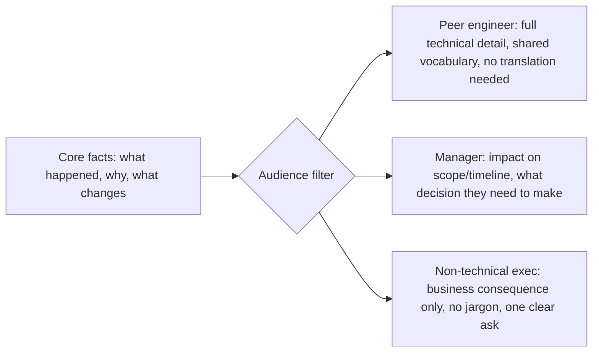

## One message, three audience-specific transformations

The underlying facts don't change between audiences. What changes is which facts are **load-bearing** for that reader's decision, and how much unexplained context you can assume.

The facts flowing into the filter are identical in all three branches. What differs is which subset gets surfaced, and what unit of measurement the reader actually cares about (story points vs. ship date vs. revenue risk).

## The three lenses, concretely

| Lens       | Question to answer before writing           | Peer engineer                            | Manager                                  | Non-technical exec                      |
| ---------- | ------------------------------------------- | ---------------------------------------- | ---------------------------------------- | --------------------------------------- |
| Context    | What do they already know?                  | The codebase, the tools, the jargon      | The project's goals, not the internals   | The business goal, nothing technical    |
| Incentives | What outcome are they measured on?          | Getting it right / not breaking things   | Hitting the roadmap commitment they made | Revenue, risk, customer impact          |
| Channel    | What does this medium train them to expect? | Terse, code-adjacent (PR comment, Slack) | Structured update (status doc, standup)  | Executive summary (one paragraph, BLUF) |

BLUF = **B**ottom **L**ine **U**p **F**ront — state the conclusion or ask in the first sentence, then justify it, not the reverse. The higher up the audience sits from the technical work, the more this matters: an exec who has to read three paragraphs to find out whether they need to act has already lost interest before reaching the point.

## The decision procedure

This is the mental checklist behind every rewrite in L3 — not a formula, but the same four questions applied consistently instead of improvised fresh each time:

1. **What does this audience already know?** Anything already known doesn't need re-explaining — including it is padding, not clarity.
2. **What are they actually measured on?** Filter the facts down to the ones that bear on that stake — a true fact that's irrelevant to their stake is noise, not detail, no matter how technically interesting it is.
3. **What decision or reaction do I actually need from them?** This is the ask — even an informational message has an implicit one ("just be aware," "don't worry about this").
4. **Does this channel expect the bottom line first?** If so, lead with the ask and follow with supporting detail; if not (a peer conversation with shared context), the supporting detail can come first and the ask can trail it.

The same four questions, asked in the same order, are what actually changed between the three versions in L3 — not a different process per audience, the same process applied to different answers.
