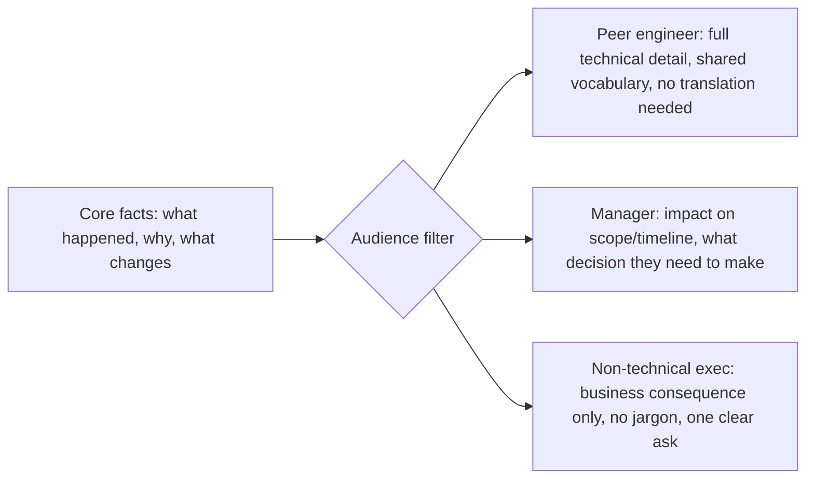

## One message, three audience-specific transformations

The underlying facts don't change between audiences. What changes is which facts are **load-bearing** for that reader's decision, and how much unexplained context you can assume.



The facts flowing into the filter are identical in all three branches. What differs is which subset gets surfaced, and what unit of measurement the reader actually cares about (story points vs. ship date vs. revenue risk).

## The three lenses, concretely

| Lens       | Question to answer before writing           | Peer engineer                            | Manager                                  | Non-technical exec                      |
| ---------- | ------------------------------------------- | ---------------------------------------- | ---------------------------------------- | --------------------------------------- |
| Context    | What do they already know?                  | The codebase, the tools, the jargon      | The project's goals, not the internals   | The business goal, nothing technical    |
| Incentives | What outcome are they measured on?          | Getting it right / not breaking things   | Hitting the roadmap commitment they made | Revenue, risk, customer impact          |
| Channel    | What does this medium train them to expect? | Terse, code-adjacent (PR comment, Slack) | Structured update (status doc, standup)  | Executive summary (one paragraph, BLUF) |

BLUF = **B**ottom **L**ine **U**p **F**ront — state the conclusion or ask in the first sentence, then justify it, not the reverse. The higher up the audience sits from the technical work, the more this matters: an exec who has to read three paragraphs to find out whether they need to act has already lost interest before reaching the point.

## The decision procedure

This is the mental checklist behind every rewrite in L3 — not literal code, but the same shape every time:

```python
function compose_message(facts, audience):
    known = what_audience_already_knows(audience)
    stake = what_audience_is_measured_on(audience)

    relevant_facts = filter(facts, keep_if=lambda f: affects(f, stake))
    # Anything the audience already knows doesn't need re-explaining;
    # anything irrelevant to their stake is noise, not detail.
    surfaced = remove(relevant_facts, already_known=known)

    ask = what_decision_or_reaction_do_i_need(audience)

    if audience.channel_expects_bluf:
        return lead_with(ask) + supporting(surfaced)
    else:
        return surfaced + trailing(ask)
```

Note this is pseudocode illustrating a decision procedure, not a claim that message-writing is literally computable — the point is that the same three questions (what do they know, what do they need, what's the ask) get applied consistently, not improvised fresh each time.
