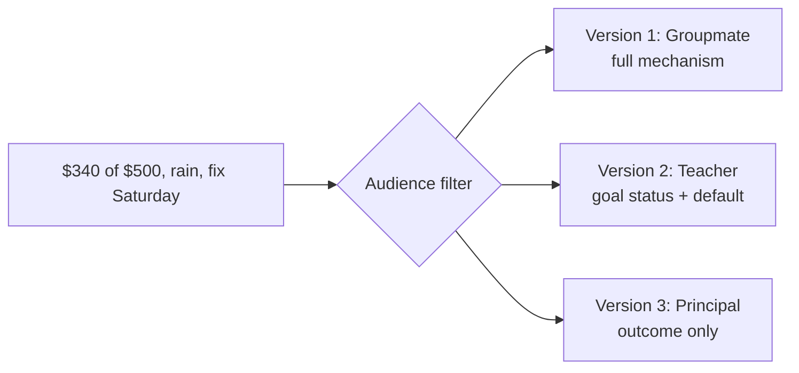
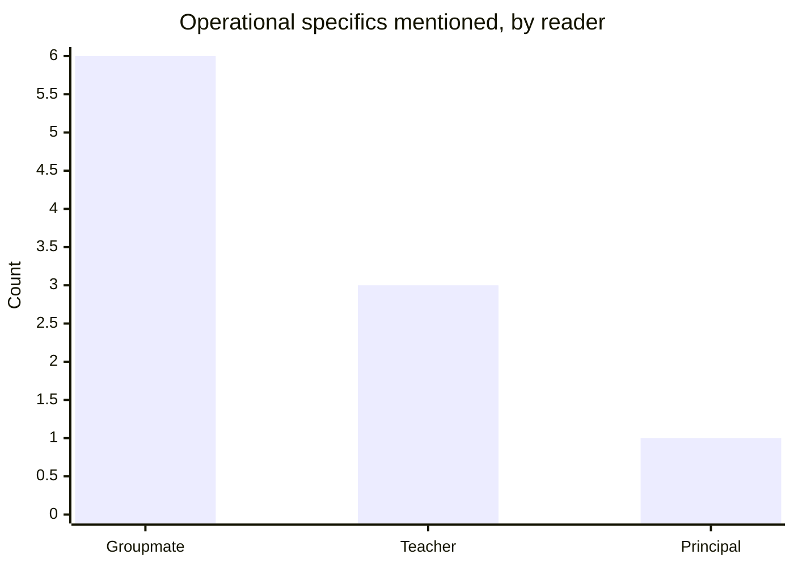

import Scenario from "../../../components/Scenario.astro";

<Scenario label="The scenario">
  <Fragment slot="facts">
    

      

        $340
        of $500 goal
      

      

        

      

    

    

      
🌧️ Rain forced the move inside, cut selling time in half

      
🔁 Fix: make-up sale <strong>Saturday</strong>

    

    
Readers

    

      
🙋 Groupmate — was there

      
🧑‍🏫 Teacher — accountable for the $500

      
🏫 Principal — only cares if the trip is on

    

  </Fragment>

You helped run your class's bake sale to raise money for a field trip. The
goal was $500. Sudden rain forced everyone to move the tables inside at the
last minute, cutting selling time roughly in half — you ended the day at $340.
You already have a plan: a make-up sale this Saturday, which should close the
gap. You need to tell three people about this today.

</Scenario>

The facts are fixed. Watch what changes — and, just as importantly, what _doesn't_ — across the three versions below.

This isn't a vague impression — it's countable directly from the three quotes below. Counting only concrete operational specifics (the cause named precisely, the mechanism, a magnitude, a named contact, a time-of-day — not word count, which doesn't track this at all: the teacher version is actually the _longest_ of the three, at 72 words to the groupmate version's 62, because it spends words on the trade-off and default instead of on mechanism):

An **operational specific** is a practical detail about what happened
or how the fix works: who is involved, when it happens, what caused
the shortfall, or what exact plan changes next.

Groupmate (6): rain, moved inside, half the tables, way less traffic, Ms. Alvarez, Saturday _morning_. Teacher (3): rain, moved inside, Saturday morning — no magnitude, no name. Principal (1): "weather" only — no mechanism, no name, no time-of-day, just "Saturday."

## At a glance, before the full versions

| &nbsp;            | Groupmate                                                           | Teacher                                                                           | Principal                                          |
| ----------------- | ------------------------------------------------------------------- | --------------------------------------------------------------------------------- | -------------------------------------------------- |
| **Message gist**  | Exact reason: rain forced the move inside, cut selling time in half | $340 of $500 so far, Saturday's make-up sale should close it, no risk to the trip | Fundraiser is on track, final total comes Saturday |
| **Assumed known** | What happened at the table, what the rain did to foot traffic       | The $500 goal and the trip deadline                                               | Nothing about how the sale ran                     |
| **Foregrounded**  | The mechanism, so they can help plan Saturday better                | Whether the goal is still reachable in time                                       | Whether the trip is happening — nothing else       |
| **The ask**       | Implicit — only something to do if Saturday needs their help        | Explicit default: "running it Saturday unless you'd rather do something else"     | None — purely closing the loop                     |

The three full versions below are what that table looks like written out — same four questions from L2, different answers depending on who's reading.

Before the good versions, here is the bad generic version that tries
to serve everyone and ends up serving nobody:

> We had some issues at the bake sale because of the weather and are
> working on a plan to make up the difference. More details soon.

That message is not false, but it is weak for every reader. The
groupmate cannot help plan, the teacher cannot judge whether the
money goal is still safe, and the principal cannot tell whether the
trip is at risk.

## Version 1: your groupmate who ran the table with you

  🔍 Full detail

> Hey — we ended up at $340 instead of $500 because the rain forced us inside with half the tables and way less traffic than we planned for. I already talked to Ms. Alvarez about a make-up sale Saturday morning — that should close the gap easily. I've got Saturday covered, just wanted you to know why we came up short today.

**What's assumed:** they already know what the bake sale was, that it was supposed to be outside, that it started raining — no need to re-explain any of that.
**What's foregrounded:** the actual mechanism (fewer tables, less foot traffic) because a groupmate can use that detail to help plan Saturday better, and might have ideas of their own.
**The ask:** implicit — nothing needed unless they want to help Saturday; groupmates don't need to be asked to "note" something, only told what to do if there's something to do.

## Version 2: your teacher, who's accountable for the $500 going to the school

  ⚙️ Status + default

> We ended today's sale at $340 of our $500 goal — rain forced us to move inside partway through, which cut our selling window in half. I've already set up a make-up sale for Saturday morning that should close the rest of the gap without pushing back the trip deadline. Let me know if you'd rather we try something different — otherwise I'll run it as planned and update you Saturday evening.

**What's assumed:** they know the $500 goal and the trip deadline, but not the table logistics or exactly how the rain played out — those details are cut entirely, not simplified, because they're not load-bearing for the one thing the teacher actually needs to know.
**What's foregrounded:** whether the goal is still reachable in time — answered directly, in the first sentence.
**The ask:** an explicit, easy default ("I'll run it as planned unless you say otherwise") rather than an open-ended "what do you think" — this respects that a teacher juggling a dozen things needs a fast yes/no, not a discussion prompt.

## Version 3: the principal, who cares whether the trip happens

  🎯 Outcome only

> Today's bake sale raised $340 toward our $500 field-trip goal — a bit short due to weather, but a make-up sale this Saturday is already planned to close the gap. The trip is on track.

**What's assumed:** nothing about how the sale ran. The rain, the tables, the foot traffic — all cut, not because the principal couldn't understand them, but because understanding them wouldn't change anything they'd do. Their only real questions are "is the trip still happening" and "when do we know for sure" — both answered directly.
**What's foregrounded:** the outcome (is the trip on) and the resolution timeline (Saturday). The cause is reduced to "weather" — true, and sufficient.
**The ask:** none needed. This message closes a loop before the principal hears a vaguer version secondhand — not requesting a decision.

## What stayed constant across all three

  

    ✅
    
      <strong>No false or misleading claim.</strong> The groupmate's version
      isn't "more honest" than the principal's — omission of irrelevant detail
      isn't omission of relevant detail.
    
  

  

    ✅
    
      <strong>
        The numbers are identical: $340 of $500, closing the gap Saturday.
      </strong>{" "}
      Different facts per audience isn't calibration, it's deception — and it
      gets caught the moment two readers compare notes.
    
  

  

    ✅
    
      <strong>Every version answers that reader's real "so what."</strong>{" "}
      Groupmate: should I help Saturday. Teacher: is the goal still reachable.
      Principal: is the trip happening.
    
  

Calibration means changing emphasis without changing the truth.
Deception means changing, hiding, or blurring a truth the reader needs
in order to make the right decision.

## Failure modes

| Failure                                  | What it looks like                                                                     | The fix                                                                          |
| ---------------------------------------- | -------------------------------------------------------------------------------------- | -------------------------------------------------------------------------------- |
| Groupmate version &rarr; principal       | Full detail, no clear ask — reads as confusing or like you're burying the point        | Match detail to the reader, don't default to your own frame                      |
| Principal version &rarr; groupmate       | Stripped detail — they're missing what they need to help                               | Audience awareness means _matching_ detail, not minimizing it universally        |
| "No detail" confused with "no substance" | Vague reassurance, no checkable claim                                                  | Cut jargon, keep the real number — "$340 of $500, fixed Saturday" is still real  |
| Over-indexing on role, not stake         | Giving the short version because of someone's title, ignoring what they actually asked | The lens is the question being asked and what they're measured on, not the title |
| Skipping or burying the ask              | "Just so you know..." with no next step stated                                         | Make the reaction explicit — a default plus an easy override, as in Version 2    |

## Beyond this example

  🥧 This bake sale
  &rarr;
  🧑‍💼 Your actual groupmate, teacher, principal

The bake sale is one case, not the whole territory — a few questions to test whether the model actually transferred, not just the specific numbers above:

- What would change across the three versions if, instead of a shortfall you already have a fix for, the news were genuinely bad — the trip itself had to be cancelled? Which version changes the most, and which barely changes at all?
- Which real people in your own week map onto "groupmate," "teacher," and "principal" here — someone who shares your context, someone accountable for an outcome you're part of, and someone who only needs the bottom line?
- If you had to add a fourth reader — someone who actively wants the fundraiser to fail, or at least isn't rooting for it — which of the four questions from L2 would change first, and why might "the ask" stop being optional? The `reading-stakeholder-incentives` unit continues that harder case: when the reader's stake may not match the proposal's obvious facts.
