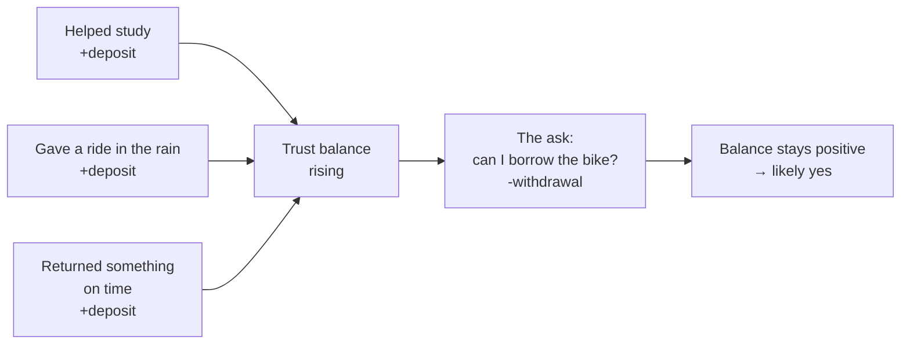

import LevelIntro from "../../../components/LevelIntro.astro";
import Checkpoint from "../../../components/Checkpoint.astro";

L1 showed that Alex and Jordan got different answers to the identical
question, and pinned the difference on something called credibility
built up before the ask. L2 works out the mechanism behind that: why
trust behaves like an account with deposits and withdrawals, rather
than something you simply have or don't.

<LevelIntro
  items={[
    "Trust as a balance, not a switch",
    "Why the size of the ask matters",
    "Why deposits have to be genuine to count",
  ]}
/>

## Trust behaves like a balance, not a switch

**Is trust something you either have or don't, like a light switch?**
No — it behaves more like a balance in an account. Every reliable
action adds a little; every broken promise or inconsistency takes some
away. Nobody's usually keeping an actual ledger, but people act as if
one exists: a request lands differently depending on the balance built
up before it arrived, whether or not either person could name a
number.

A **ledger** is just a record of what was added and subtracted. Nobody
is literally writing one down here; the point is that people remember
patterns.

**Why does it matter whether the balance was built up _before_ the
ask, rather than at the same time?** Because the ask itself is a
withdrawal — it draws down the balance rather than adding to it. If
the balance is at or near zero when the withdrawal happens, there's
nothing to draw from, and the request lands as presumptuous rather
than reasonable, regardless of how politely it's phrased.
Presumptuous means it feels like you are asking for more trust than
you have earned.

<Checkpoint question="A coworker asks you for a significant favor the very first week you meet them, before doing anything to build trust. Using the balance idea, why does the request feel presumptuous even if the coworker is polite and the favor is phrased reasonably?">

Politeness and phrasing don't change what the balance actually holds —
they only affect how the withdrawal is worded, not how much has been
deposited beforehand. With no prior deposits, the balance sits at or
near zero, so any real-sized ask has nothing to draw against. The
request reads as presumptuous because it's asking for more trust than
has been earned so far, independent of how carefully it's asked.

</Checkpoint>

## Why the size of the ask matters

**Does every ask draw the same amount from the balance?** No — a small
ask (borrowing a pencil) barely dents the balance; a big ask
(borrowing a bike for a whole weekend, with real risk if something
goes wrong) draws much more heavily. This is why "I built one trust
deposit, so I'm owed one favor" doesn't hold up: the size of the
favor and the size of the deposit aren't automatically equivalent, and
a big ask usually needs several deposits behind it, not just one.

|                       | Small ask  | Big ask                                                   |
| --------------------- | ---------- | --------------------------------------------------------- |
| Draws from balance    | A little   | A lot                                                     |
| Deposits needed first | Maybe none | Several, or a strong existing relationship                |
| Risk if it goes wrong | Low        | Higher — a bigger draw if trust turns out to be misplaced |

## Deposits have to be genuine to count

**Could Alex have just complimented Maya a lot instead of actually
helping her?** Not really — a deposit only counts if it's backed by
something real: actually showing up, actually following through,
actually noticing something true. An insincere compliment or a
performative gesture is easy to tell apart from a genuine one, and
being caught faking a deposit doesn't just fail to add to the
balance — it can subtract from it, since it reveals the asker was
thinking about the future withdrawal the whole time.

| Looks like a real deposit                        | Looks performative                                      |
| ------------------------------------------------ | ------------------------------------------------------- |
| Helping because you noticed a real need          | Helping loudly only when the future ask is already near |
| Warning early when a promise might slip          | Staying quiet, then apologizing when you need support   |
| Sharing useful context before anyone asks for it | Sharing just enough to make yourself look cooperative   |

<Checkpoint question="Two coworkers both offer to help you on a task the week before they need something from you. One has a pattern of helping people regardless of what's coming up; the other only ever helps right before an ask. If you found out the second coworker's help was timed deliberately, what happens to their balance — does it just fail to rise, or does it actively drop?">

It actively drops, not just fails to rise. A deposit only counts if
it's backed by something genuine; a gesture timed specifically to set
up a future withdrawal is a performative deposit, and being caught
revealing that timing shows the coworker was thinking about the ask
the whole time. That undermines the coworker's credibility more
broadly — it costs more than simply not having helped at all.

</Checkpoint>

## The generalizable lesson

**Is this really about bikes, or does it generalize?** It generalizes
to any situation where someone eventually needs another person's
buy-in, help, or benefit of the doubt — the specific favor doesn't
matter. What matters is the same two questions every time: has enough
been deposited before this moment, and does the size of what's being
asked roughly match what's been built up? Skipping straight to the
ask without ever making a deposit is the single most common way this
goes wrong.

| Personal situation      | Work situation                                                                       |
| ----------------------- | ------------------------------------------------------------------------------------ |
| Asking to borrow a bike | Asking someone to support a proposal or priority change                              |
| Deposits                | Keeping promises, warning early, sharing context, helping without collecting a favor |
| Withdrawal              | Asking for approval, time, risk, reputation, or political support                    |

Zero is not the same as debt. A person with no history may simply ask
too early; a person with broken promises has active damage to repair.
Repairing trust is a different job from building it from zero.

Before a serious ask, add a third question: has the person who needs
to say yes already seen enough evidence to trust me before I need
their support?
