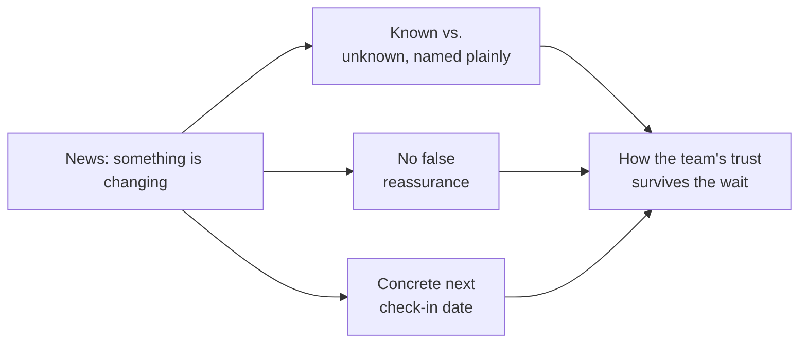

import Scenario from "../../../components/Scenario.astro";
import LevelIntro from "../../../components/LevelIntro.astro";

<Scenario label="The problem">
  <Fragment slot="facts">
    

      

        15 → 10
        combined headcount after the merge, 5 roles cut
      

      

        

      

    

    

      
❓ Priya doesn't know yet *which* 5 people — HR finalizes that in 10 days

      
👀 Two engineers already spotted a leadership calendar invite titled "Org restructuring"

      
🗓️ Nothing scheduled to tell the team anything yet

    

  </Fragment>

Priya Nandakumar manages an 8-person backend team at Fintrail, a payments
startup. Yesterday her director told her, in confidence: Fintrail is
merging Priya's team with another 7-person team into one 10-person team,
as part of a company-wide budget cut. That means 5 of the 15 combined
roles will be eliminated. Which 5, specifically, isn't decided yet — HR
and the directors are still finalizing that, and won't have names for
about 10 days.

This morning, two of Priya's engineers mentioned they noticed a
leadership calendar invite titled "Org restructuring — Eng leadership
only." They asked her, half-joking, half-not, if everything's okay.

**Priya can't share names that don't exist yet, and she was asked to keep
the details confidential until HR finalizes the list. But she also can't
say "everything's fine" — it isn't. What does she actually say, today,
in the next hour?**

</Scenario>

Saying nothing lets the calendar invite become the whole story — and a
rumor mill fills a silence with the worst plausible version, every time.
Saying "don't worry, your job is safe" when Priya genuinely doesn't know
that yet is worse: if it turns out to be false, she's not just delivering
bad news later, she's delivering bad news from someone who lied to
protect a feeling.

<LevelIntro
  items={[
    "Why silence and false reassurance both cost more than the truth",
    "The four moves: known vs. unknown, no false reassurance, a real next date, naming the personal question",
    "Why timing — not just wording — decides whether this lands as respect or as damage control",
  ]}
/>

- **Change management communication**, in this unit's sense, is telling a
  team about a disruptive, not-yet-fully-decided change — a reorg, layoffs,
  a merger, a leadership change — in a way that keeps their trust in you
  intact through the uncertainty, not just in the moment you deliver the
  news.
- **Uncertainty communication** is the specific skill of talking honestly
  about something that isn't fully decided yet, without either
  freezing into silence (which reads as hiding something) or overpromising
  an outcome you don't control (which reads as honest right up until it
  isn't).
- Four moves separate a change conversation people trust from one that
  quietly poisons trust for months:
  1. **Separate what's decided from what isn't** — say plainly which part
     is locked (the merge is happening) and which part is genuinely still
     open (who, exactly), instead of blurring the two into one vague
     "some changes are coming."
  2. **Never promise what you can't guarantee** — "your job is safe" said
     before Priya actually knows that is a promise she has no standing to
     make; if it turns out false, the damage isn't just the layoff, it's
     that her word stopped meaning anything.
  3. **Give a concrete next check-in, not open-ended silence** — "I'll
     know more by Friday the 12th and will tell you that day, whatever it
     is" turns an unbounded wait into a bounded one, which is measurably
     easier for people to sit with.
  4. **Name the question everyone actually has** — "what does this mean
     for me" — even when the honest answer right now is "I don't fully
     know yet." Saying that out loud beats leaving it unspoken and hoping
     no one asks.
- Getting this right doesn't make the news good. Priya can do everything
  below correctly and someone on her team still loses their role in 10
  days — the goal isn't a painless reorg, it's a team that still trusts
  what Priya tells them on the other side of it.

| Term                                      | Simple meaning                                                                                |
| ----------------------------------------- | --------------------------------------------------------------------------------------------- |
| Change management (comms)                 | Telling a team about a disruptive, unfinished change in a way that preserves trust            |
| Uncertainty communication                 | Talking honestly about what isn't decided yet, without silence or false promises              |
| False reassurance                         | A comforting claim made without the standing to guarantee it — costs more than bad news later |
| Known / unknown split                     | Naming plainly what's locked in versus what's still genuinely open                            |
| Concrete next check-in                    | A specific date the team will hear more, replacing an open-ended wait                         |
| The "what does this mean for me" question | The practical/personal impact question every listener has, spoken or not                      |

The same shape — what's known, what isn't, no false promises, a real
next date — is what determines whether a hard conversation builds trust
or burns it, independent of how good or bad the underlying news is:

