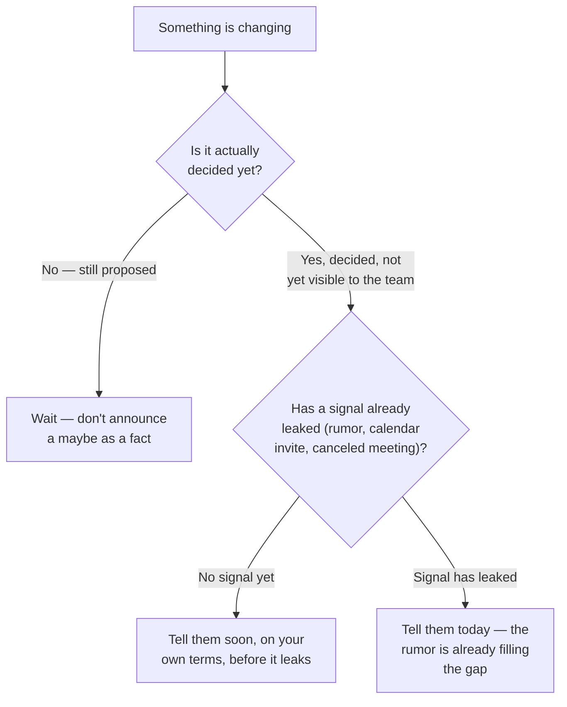

import LevelIntro from "../../../components/LevelIntro.astro";
import Checkpoint from "../../../components/Checkpoint.astro";

L1 showed Priya holding a real, disruptive fact — 5 of 15 combined roles
will be cut, names unknown for 10 more days — with a team that's already
noticed something's off. L2 works out why the same underlying facts can
either hold a team's trust together through the wait or quietly break it,
depending on exactly what Priya says and doesn't say.

<LevelIntro
  items={[
    "Why an unbounded wait feels worse than bad news itself",
    "The four moves, and the specific failure each one prevents",
    "Why timing the first conversation is its own separate decision",
  ]}
/>

## Why not knowing feels worse than knowing something bad

If Priya doesn't have the names yet, isn't the honest thing just to wait
until she does and say nothing until then? **Before reading on: what
actually happens to a team during a silent wait?**

They don't stay neutral — they fill the gap themselves. A team that
notices something (a leadership calendar invite, a canceled all-hands, a
director's closed door) but hears nothing from their manager doesn't
default to "no news, probably fine." People default to rehearsing the
worst plausible version, because an unexplained gap in information reads
as something being hidden, and "something being hidden" is scarier than
almost any specific fact would be. The rumor that fills a silence is
usually worse than the truth — and Priya doesn't get to correct it if she
never said anything to correct it against.

**Uncertainty communication** is the skill of talking honestly into that
gap without pretending it's smaller than it is. It's not about having
answers — Priya genuinely doesn't have the names yet — it's about making
the shape of what's unknown legible, instead of letting silence make it
look like everything is unknown, or like nothing is happening at all.

<Checkpoint question="Priya's team already suspects something from the calendar invite. Why is 'I'll tell you once I actually know something for certain' a worse first move than acknowledging the change today, even though both are technically honest?">

Because both statements are true, but they land completely differently.
"I'll tell you once I know" leaves the team with only the version they
already suspected from the calendar invite — a vague, unconfirmed rumor —
and no signal that Priya is even aware something is happening, which
reads as either not paying attention or actively avoiding the topic.
Acknowledging the change today, even without names or details, replaces
that vacuum with a confirmed, bounded fact: yes, something is happening,
here's what's decided, here's what isn't, here's when you'll know more.
The team still doesn't have the names either way — but one version leaves
them alone with a rumor, and the other gives them a manager who's
visibly on top of it.

</Checkpoint>

## The four moves, and what each one actually prevents

Four separate failure modes are addressed by four separate moves — and
skipping one still causes damage even if the other three are done well:

| Move                                   | What it prevents                                                                                   | What it looks like in practice                                                                                  |
| -------------------------------------- | -------------------------------------------------------------------------------------------------- | --------------------------------------------------------------------------------------------------------------- |
| Separate known from unknown            | The whole situation reading as one big unknown, when part of it is actually settled                | "The merge itself is happening — that's decided. Who ends up where is not decided yet."                         |
| Never promise what you can't guarantee | A specific, catastrophic loss of trust later if the promise turns out false                        | Saying "I don't know if your role is affected" instead of "don't worry, you're fine"                            |
| Give a concrete next check-in          | An open-ended wait, which is measurably harder to sit with than a bounded one                      | "I will know more by Friday the 12th, and I will tell you that day, whatever it is."                            |
| Name the personal-impact question      | People silently wondering "what about me" and concluding Priya either doesn't know or doesn't care | "I know the question on everyone's mind is what this means for your specific role — here's what I can say now." |

None of these four moves make the news better. The headcount number is
the same regardless of how Priya talks about it. What changes is whether
the team spends the next 10 days trusting that Priya will tell them the
truth as she learns it, or spends it assuming she's already hiding
something and simply hasn't been caught yet.

<Checkpoint question="A well-meaning manager tells their team 'I really don't think anyone here is at risk' before roles have actually been decided. If it turns out someone on that team IS affected, what specifically breaks — just the bad news, or something more?">

Something more than the bad news itself breaks. The bad news was always
coming regardless of what the manager said in advance — that part isn't
new damage. What's new is that the manager is now delivering that news as
someone who was previously wrong, on this exact topic, in the reassuring
direction — which reads less like an honest mistake and more like they
either didn't actually know what they were promising, or knew and said it
anyway to make an uncomfortable moment easier. Either read costs trust on
every future hard conversation with that team, not just this one — the
team now has to wonder whether the next reassurance is real.

</Checkpoint>

## Timing is a separate decision from wording

Even with all four moves executed perfectly, one more question remains
open: **when** should Priya say any of this? Too early — before the merge
decision is even finalized at the director level — and she risks
announcing something that changes before it's real, which teaches the
team that "confirmed" from Priya doesn't always mean confirmed. Too
late — after the rumor has already spread and calcified into its own
version of events — and she's now correcting a story instead of telling
one.

Priya's actual situation sits in the rightmost branch: the merge itself
is decided at the director level, and a signal has already leaked (the
calendar invite two engineers noticed). That combination is what makes
"today" the right timing — not a general rule that managers should always
announce changes immediately, but a specific read of where this exact
situation sits on the tree.

| Situation                                | Right timing                | Why                                                                    |
| ---------------------------------------- | --------------------------- | ---------------------------------------------------------------------- |
| Still just a proposal, nothing decided   | Don't announce yet          | Announcing a maybe as a fact teaches the team not to trust "confirmed" |
| Decided, not yet visible, no leak        | Tell them soon, proactively | Hearing it from you first is what keeps you the trusted source         |
| Decided, and a signal has already leaked | Tell them today             | The gap is already being filled by rumor — every hour adds to that     |

The mermaid diagram in L1 and the move table above both describe the
_content_ of the conversation — what to say once you're in it. This
timing tree is the separate decision of _whether it's this conversation's
moment yet at all_, and getting that ordering backwards (perfect wording,
wrong timing) still lands badly.
