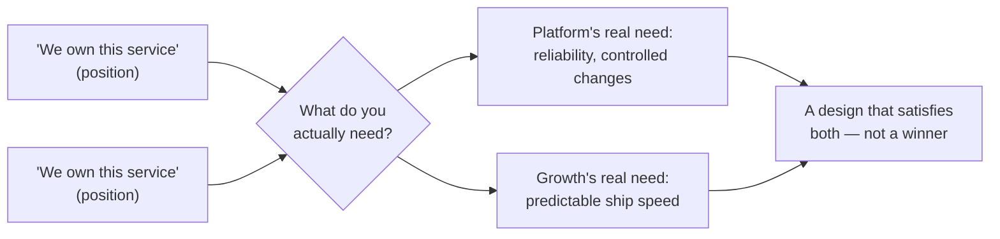

## Why fighting over "who owns it" is usually the wrong fight

**If both teams insist they own the service, is there actually a
real conflict underneath, or is this just a misunderstanding?** There
can be a real conflict, but "who owns it" is almost never the actual
thing at stake — it's a position both teams are defending because the
real interests underneath haven't been named yet:

| Team's position                   | Underlying interest (the real "why")                                                       |
| --------------------------------- | ------------------------------------------------------------------------------------------ |
| "We own this service." (Platform) | Changes need to go through review so reliability and on-call load stay manageable          |
| "We own this service." (Growth)   | Experiments need to ship on a predictable schedule without waiting on another team's queue |

**Do these two interests actually conflict with each other?** Not
necessarily — Platform's interest is _process_ (review before
changes ship), while Growth's interest is _speed_ (not being blocked
on someone else's queue). A solution that gives Growth a fast,
self-service way to ship within guardrails Platform sets in advance
could satisfy both interests without either team "winning" the
ownership argument — but that solution is invisible as long as both
sides keep arguing about the position instead of the interest.

## Turning "who owns it" into a question both sides can actually answer

**If arguing about ownership doesn't work, what question replaces
it?** Instead of "whose service is this," the more useful question is
"what does each team actually need to be true for this to work
long-term" — which shifts the conversation from a zero-sum ownership
claim to a design problem both teams can solve together:

**Does this always produce a solution that fully satisfies both
sides?** Not always — sometimes interests genuinely do conflict, and
a real trade-off has to be made. But even then, knowing the actual
interests makes the trade-off explicit and negotiable, instead of an
unexplained "one team lost" outcome that breeds resentment.

## What makes an escalation path effective, not just an excuse

**If two teams can't resolve something themselves, is escalating to a
manager always the fix?** Only if the escalation path is well-defined
in advance — a specific person or forum with actual authority to
decide, criteria for when it's appropriate to invoke, and an
expectation that both sides present their actual interests, not just
complaints about the other team. An ad hoc "I'll email your manager"
escalation, with no agreed process, tends to feel personal and
adversarial rather than a normal part of how the organization
resolves ambiguity.

## Failure modes at this level

- **Treating ownership as something to win rather than something to
  design.** Arguing until one team "wins" the ownership label leaves
  the losing team's real interest unaddressed, which usually means
  the same conflict resurfaces later.
- **Escalating before actually naming interests to each other.**
  Skipping straight to a manager without first trying to find the
  underlying interests wastes the escalation path on something that
  might have been resolvable directly.
- **Using vague, informal escalation instead of a defined path.**
  Complaining about the other team to your own manager, rather than
  bringing both sides to an agreed forum, tends to produce a
  one-sided, poorly-informed decision and damages the relationship
  between the teams.
