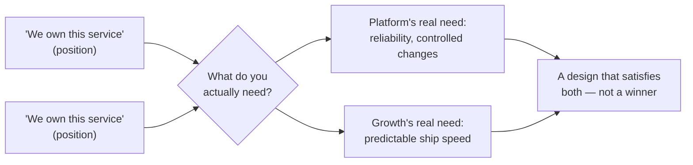

import Checkpoint from "../../../components/Checkpoint.astro";
import LevelIntro from "../../../components/LevelIntro.astro";

L1 introduced the two teams fighting over "who owns it" and named positions,
interests, and escalation paths as the vocabulary for untangling that kind
of conflict. L2 works through why naming interests instead of defending
positions is what actually unlocks a resolution, and what separates a real
escalation path from an excuse to avoid a hard conversation.

<LevelIntro
  items={[
    "Positions vs. underlying interests",
    "Designing a solution instead of picking a winner",
    "What makes an escalation path effective",
  ]}
/>

## Why fighting over "who owns it" is usually the wrong fight

**If both teams insist they own the service, is there actually a
real conflict underneath, or is this just a misunderstanding?** There
can be a real conflict, but "who owns it" is almost never the actual
thing at stake — it's a position both teams are defending because the
real interests underneath haven't been named yet:

| Team's position                   | Underlying interest (the real "why")                                                       |
| --------------------------------- | ------------------------------------------------------------------------------------------ |
| "We own this service." (Platform) | Changes need to go through review so reliability and on-call load stay manageable          |
| "We own this service." (Growth)   | Experiments need to ship on a predictable schedule without waiting on another team's queue |

Quick vocabulary for this table:

| Term         | Plain meaning                                                                   |
| ------------ | ------------------------------------------------------------------------------- |
| Review       | Another person checks a change before it goes live                              |
| On-call load | The burden of being responsible when something breaks, often outside work hours |
| Queue        | Work waiting for a team to process it                                           |
| Self-service | A safe way for another team to do routine work without asking every time        |
| Guardrails   | Pre-agreed limits that make self-service safe                                   |

**Do these two interests actually conflict with each other?** Not
necessarily — Platform's interest is _process_ (review before
changes ship), while Growth's interest is _speed_ (not being blocked
on someone else's queue). A solution that gives Growth a fast,
self-service way to ship within guardrails Platform sets in advance
could satisfy both interests without either team "winning" the
ownership argument — but that solution is invisible as long as both
sides keep arguing about the position instead of the interest.

<Checkpoint question="Platform says 'we own this service' and Growth says 'we own this service.' Does that mean their actual interests are in conflict too?">

Not necessarily. A position is the claim each team is defending out loud,
and two positions can sound directly opposed while the interests behind
them don't actually collide at all. Here, Platform's real interest is
controlling risk through review, and Growth's real interest is not being
stuck in a queue — those are different concerns, not the same claim
stated by two sides. Treating the positions as the real fight is what
makes the disagreement look zero-sum when it may not be.

</Checkpoint>

## Turning "who owns it" into a question both sides can actually answer

**If arguing about ownership doesn't work, what question replaces
it?** Instead of "whose service is this," the more useful question is
"what does each team actually need to be true for this to work
long-term" — which shifts the conversation from a zero-sum ownership
claim to a design problem both teams can solve together:

**Does this always produce a solution that fully satisfies both
sides?** Not always — sometimes interests genuinely do conflict, and
a real trade-off has to be made. But even then, knowing the actual
interests makes the trade-off explicit and negotiable, instead of an
unexplained "one team lost" outcome that breeds resentment.

Reusable question: **what needs to be true for each team to accept the
solution?** For Platform, the answer might be "risky changes are
reviewed." For Growth, it might be "safe routine changes do not wait
two weeks." A good design tries to make both statements true.

## What makes an escalation path effective, not just an excuse

**If two teams can't resolve something themselves, is escalating to a
manager always the fix?** Only if the escalation path is well-defined
in advance — a specific person or forum with actual authority to
decide, criteria for when it's appropriate to invoke, and an
expectation that both sides present their actual interests, not just
complaints about the other team. An ad hoc "I'll email your manager"
escalation, with no agreed process, tends to feel personal and
adversarial rather than a normal part of how the organization
resolves ambiguity.

A useful escalation packet is small and concrete:

| Field          | What to write                                            |
| -------------- | -------------------------------------------------------- |
| Decision-maker | The person or forum with authority to decide             |
| Exact question | The one trade-off that remains unresolved                |
| Interest A     | What one side legitimately needs                         |
| Interest B     | What the other side legitimately needs                   |
| Deadline       | When the decision is needed and what happens if it waits |

For more on naming who decides, connect this with
`decision-making-frameworks`.

<Checkpoint question="A team lead is frustrated and sends a message straight to the other team's manager saying 'your team keeps overstepping.' Is this an escalation path?">

No, and the difference matters for what happens next. A real escalation
path names a specific decision-maker in advance, gives that person a
concrete unresolved question rather than a complaint about the other
team, and states both sides' legitimate interests so the decision-maker
can actually weigh them. An ad hoc message to a manager skips all of
that — it hands over a grievance instead of a decision to make, which
tends to land as personal and adversarial rather than as a normal part
of how the organization resolves ambiguity, and it damages the
relationship between teams that still have to work together afterward.

</Checkpoint>

## Failure modes at this level

- **Treating ownership as something to win rather than something to
  design.** Arguing until one team "wins" the ownership label leaves
  the losing team's real interest unaddressed, which usually means
  the same conflict resurfaces later.
- **Escalating before actually naming interests to each other.**
  Skipping straight to a manager without first trying to find the
  underlying interests wastes the escalation path on something that
  might have been resolvable directly.
- **Using vague, informal escalation instead of a defined path.**
  Complaining about the other team to your own manager, rather than
  bringing both sides to an agreed forum, tends to produce a
  one-sided, poorly-informed decision and damages the relationship
  between the teams.
