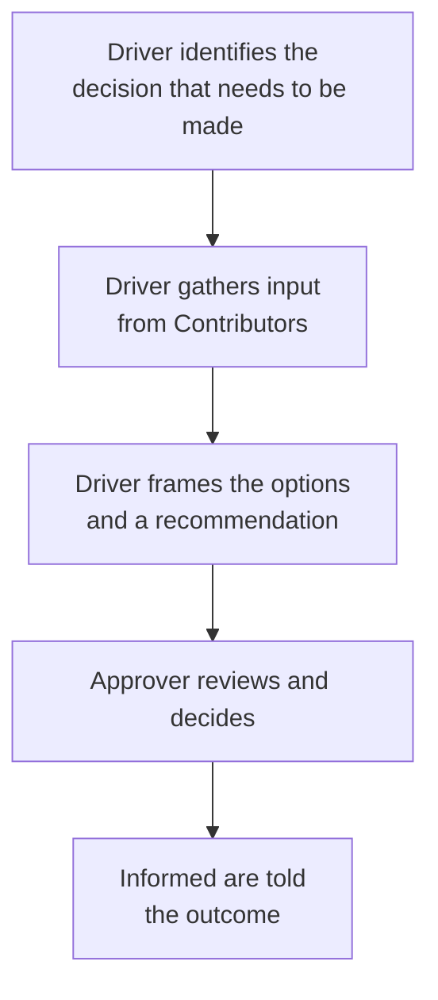

## DACI: four roles for a single decision

**If a decision needs input from many people but a final call from
one, how does DACI actually split that up?**

| Role             | What they do                                                              | What they don't do                                              |
| ---------------- | ------------------------------------------------------------------------- | --------------------------------------------------------------- |
| **D**river       | Runs the process: gathers input, frames the options, drives toward a call | Doesn't have to be the one who decides                          |
| **A**pprover     | The one person who makes the actual decision                              | Doesn't need to personally gather all the input first           |
| **C**ontributors | Give input and expertise before the decision is made                      | Don't get a vote — their input shapes the call, doesn't make it |
| **I**nformed     | Told the outcome once it's made                                           | Don't weigh in beforehand at all                                |

The critical property is that exactly **one** person is the Approver.
Not a committee, not "the group" — one name. That single point of
accountability is what a consensus-seeking meeting is missing by
default.

## RACI: four different roles, for ongoing work

**If DACI is for a single decision, what's RACI actually for?**
Tracking who does what across ongoing work or a project, not one
moment of choosing:

| Role            | What it tracks                                                     |
| --------------- | ------------------------------------------------------------------ |
| **R**esponsible | Who actually does the work                                         |
| **A**ccountable | Who answers for whether it got done correctly (ideally one person) |
| **C**onsulted   | Who's asked for input while the work is happening                  |
| **I**nformed    | Who's kept updated, without needing to weigh in                    |

RACI's "Accountable" and DACI's "Approver" are similar in spirit — a
single named owner — but RACI is built for a matrix of many tasks over
time, while DACI is built for one decision with a clear before/after.
Using RACI to force a single meeting to a conclusion, or DACI to track
a quarter-long project's task ownership, is reaching for the wrong
tool for the job.

## How a decision actually moves under DACI

**If the Approver is the only one who decides, does that mean the
Driver and Contributors are irrelevant until the very end?** No — the
Driver's whole job happens _before_ the Approver ever has to decide:

Notice what's _not_ in this flow: a meeting where all Contributors and
the Approver debate live, together, until something like agreement
emerges. Contributor input is gathered — often individually, often
asynchronously — before the Approver ever has to weigh anything in
real time. This is what makes the actual decision moment fast: by the
time it happens, the hard part (surfacing the trade-offs) is already
done.

## Why "everyone decides together" quietly fails

**If nobody explicitly assigns roles, what does a meeting default
to?** Something close to consensus among everyone in the room — and
consensus among a group with genuinely different priorities takes
real time to reach, or simply doesn't converge in the time available.
When it doesn't converge, "let's take this offline" isn't a decision
mechanism — it's the meeting quietly declining to produce one, and
handing the problem, undiminished, to whoever schedules the next
meeting.
