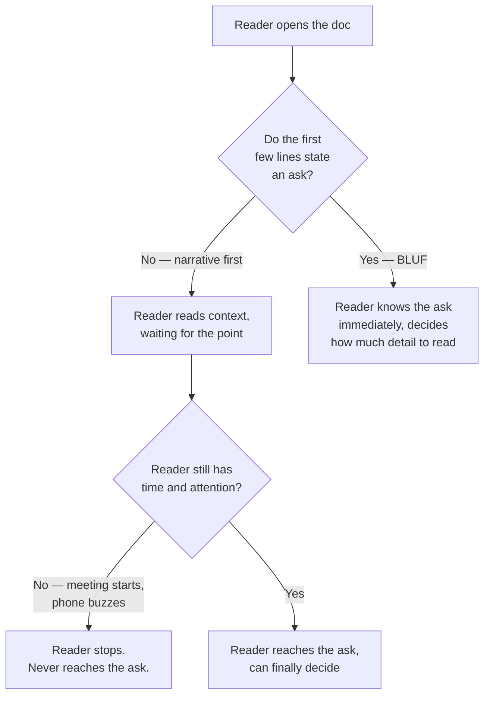
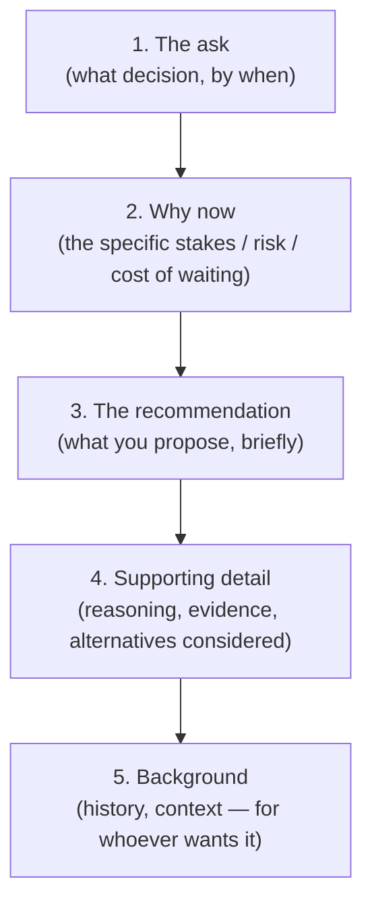

## Why a "correct" document can still fail

**If every sentence in Jordan's doc was accurate, what's actually
broken?** Not the content — the order. A narrative-first document
asks the reader to invest several paragraphs of trust _before_
learning what's actually being asked of them, and a reader who might
stop at any moment can't make that trade:

**Why does this asymmetry favor BLUF even for a reader who has time
to read the whole thing?** Because BLUF doesn't cost anything for
that reader — they still get all the same detail, just after the
ask instead of before it. Narrative order, by contrast, actively
fails any reader who runs out of time _before_ reaching the point,
which is common for anyone reading between meetings. BLUF has no
matching failure mode: reaching the ask first never prevents a reader
from also reading the detail that follows.

## The inverted pyramid: what goes first, second, last

**If the ask goes first, what happens to all the careful reasoning
Jordan already wrote?** It doesn't disappear — it moves, ordered so
that each section is progressively less load-bearing, letting a
reader stop at any point and still walk away with the most important
information they've reached so far:

Notice what moved and what didn't: Jordan's two paragraphs of
history about how the billing service was built didn't get deleted
— they moved from position 1 to position 5, available to a reader
who wants the full picture, but no longer standing between the VP
and the actual decision.

## What actually belongs in the first few lines

**Is "the ask" just a single sentence, or does an executive summary
need more structure than that?** A working executive summary usually
answers four questions in a handful of lines — not because more is
better, but because a reader deciding whether to keep reading needs
enough to actually evaluate the ask, not just notice one exists:

| Question                   | What it answers                                             | Example (Jordan's rewrite)                                                                             |
| -------------------------- | ----------------------------------------------------------- | ------------------------------------------------------------------------------------------------------ |
| What decision do you need? | The concrete ask, with a deadline if there is one           | "Approval to reprioritize 25% of Q3 capacity to the billing migration."                                |
| Why now?                   | The specific cost of waiting, not just "it's important"     | "Current billing service has no maintainer and a known failure mode that's triggered twice this year." |
| What do you recommend?     | The proposed path, briefly — not the full justification yet | "Migrate to the payments team's existing platform over 6 weeks."                                       |
| What's the cost/risk?      | What the reader is actually trading off by saying yes       | "Delays the analytics dashboard project by one sprint."                                                |

**Why include the cost, when it might make the ask harder to
approve?** Because omitting it doesn't make the trade-off disappear
— it just means the reader discovers it later, at a worse moment,
and now also has to wonder what else wasn't mentioned up front. A
summary that only lists benefits reads as advocacy, not analysis,
and loses exactly the credibility BLUF is supposed to build.

## Failure modes at this level

- **Treating BLUF as "just add a TL;DR at the end."** A summary
  placed at the end of a long document has already lost every reader
  who stopped before reaching it — the whole point is that it comes
  _first_.
- **Writing an executive summary that's just a shorter version of
  the narrative, in the same order.** Compressing "here's the
  history, here's the reasoning, here's the ask" into three sentences
  still buries the ask last — BLUF is a reordering, not just a
  shortening.
- **Leaving out the cost or the ask's specificity to make the summary
  sound more positive.** A vague ask ("we should think about
  migrating eventually") gives the reader nothing concrete to
  approve or reject, which usually produces exactly the "let's
  discuss sometime" non-decision from the opening scenario.
