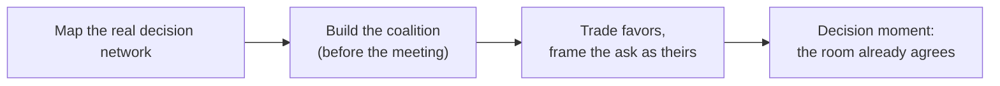

import Scenario from "../../../components/Scenario.astro";
import LevelIntro from "../../../components/LevelIntro.astro";

<Scenario>
  <Fragment slot="facts">
    

      

        0 of 4
        tech-lead allies secured
      

      

        

      

    

    
Decision meeting

    

      
📅 <strong>12 days</strong> away

      
🧑‍💼 Dev has <strong>no formal authority</strong> over anyone in the room

    

    
Who's in the room

    

      
🖋️ VP Farid — signs the decision

      
🧭 4 tech leads — write the recommendation Farid signs

    

  </Fragment>

Dev is a senior engineer on the Platform team at Lattice Freight, a
logistics software company. In twelve days, a steering committee will
decide how to migrate the order-routing service that ships every
package in the company: a **hard cutover** — replace the old system in
one weekend — or a slower, safer **incremental migration** that runs
both systems in parallel for a month. Dev has watched a hard cutover
break a smaller system before, during a normal week. This one hits
during peak shipping season. He's convinced the hard cutover is a
real risk to the business — but Dev doesn't manage anyone in that
room, doesn't own order-routing, and isn't on the steering committee.

**Before reading on: if Dev walks into that meeting on day 12 and simply makes his case out loud for the first time, what are his odds — and is that even the right day to be making his case at all?**

</Scenario>

Both instincts are wrong. Waiting for the meeting to speak up is too
late — and speaking loudly isn't the same as being heard by the people
who actually decide.

<LevelIntro
  items={[
    "Informal authority vs. formal authority",
    "Real decision-makers vs. the nominal one",
    "Coalition-building as a *before*, not a *during*",
  ]}
/>

- **Formal authority** is the power a title gives you: a manager can assign work, a director can approve budget, an owner can say yes or no and it's final. **Informal authority** is influence that doesn't come from a title at all — it comes from trust, credibility, relationships, and being someone whose judgment people already weigh before they decide.
- Every real decision has two maps that don't always match:
  - The **nominal decision-maker** — whoever's name is on the sign-off, the org chart answer to "who decides this?"
  - The **real decision-makers** — whoever's input the nominal decision-maker actually can't say no to, whether or not they hold the title.
- Influencing a decision you don't own starts with figuring out which map you're actually looking at — arguing brilliantly to the nominal decision-maker while the real decision has already been made by someone else in the room is a common, avoidable failure.

In plain words:

| Term                   | Simple meaning                                                                 |
| ---------------------- | ------------------------------------------------------------------------------ |
| Formal authority       | Power that comes from a title — the right to decide, assign, or approve        |
| Informal authority     | Influence earned through trust, credibility, and relationships, not a title    |
| Nominal decision-maker | Whoever's name is officially on the decision                                   |
| Real decision-maker(s) | Whoever's input the nominal decision-maker actually defers to                  |
| Coalition              | A set of people who support your position before the decision moment arrives   |
| Reciprocity            | Trading real help now for support later — a two-way exchange, not a favor bank |
| Credible messenger     | Someone with standing on the topic who can carry your argument for you         |

- A coalition built **before** the meeting changes the meeting itself — by the time Dev speaks, several people in the room already agree with him, and the VP is hearing a shared recommendation, not one engineer's lone objection.
- A coalition built **during** the meeting, in real time, from a standing start, almost never works — people don't change a position they haven't had time to sit with, in front of an audience, on the spot.
- If Dev personally lacks standing on migration risk — he's not on-call for order-routing, he's never owned an incident on it — the fix isn't to argue louder. It's to find someone who does have that standing and get them saying the same thing.

The rest of this unit works out each of those four steps — how to
find the real decision-makers, how and when to approach them, what
makes an ask land as helping them instead of costing them, and when to
hand the argument to someone else entirely.
