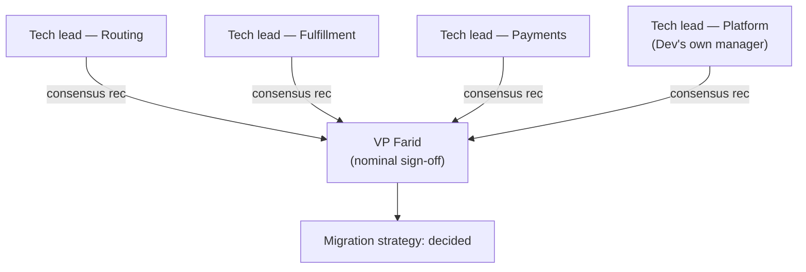
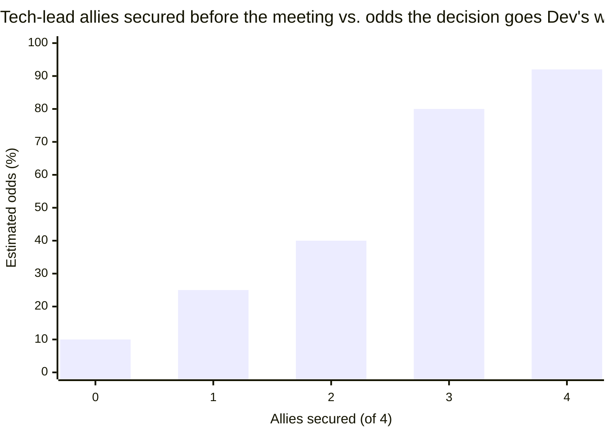

import LevelIntro from "../../../components/LevelIntro.astro";
import Checkpoint from "../../../components/Checkpoint.astro";

L1 left Dev with a plan, not a script: map the real decision network,
build a coalition before the meeting, trade favors and frame the ask
as solving the other side's problem, and use a credible messenger
where his own standing runs out. L2 works out the mechanism behind
each move — starting with the map itself.

<LevelIntro
  items={[
    "Mapping real vs. nominal decision-makers",
    "Why coalition timing is the whole game",
    "Reciprocity, framing, and credible messengers",
  ]}
/>

## Who actually decides?

**If VP Farid's name is on the sign-off, isn't he simply the person to convince?** Not necessarily. A nominal decision-maker often defers to a smaller circle whose judgment they trust more than their own on that specific topic — and if that circle already agrees, the nominal sign-off is close to automatic. Farid has never run a migration himself; he relies on the four tech leads to reach a shared recommendation, and he signs whatever they agree on. Convincing Farid directly, without ever reaching the tech leads, is arguing to the wrong map.

Two questions separate the nominal map from the real one:

1. **Whose name is on the decision?** — the org-chart answer.
2. **Whose objection would actually stop it?** — the real answer. If any one of the four tech leads pushed back hard, would Farid still sign? If the answer is no, that tech lead is a real decision-maker regardless of title.

| Signal                                                          | What it suggests                                 |
| --------------------------------------------------------------- | ------------------------------------------------ |
| The nominal owner asks "what do you all think?" before deciding | They're deferring to a real decision-maker(s)    |
| One person's disagreement has reliably delayed past decisions   | That person holds real veto power                |
| A decision moves fast once one specific person signs off        | That person is a bottleneck worth reaching early |

<Checkpoint question="Dev spends a week building a airtight case and presents it directly to VP Farid, one-on-one, a few days before the meeting. Farid nods, seems convinced — but at the meeting, the four tech leads' consensus recommendation goes the other way, and Farid signs it. What did Dev's plan miss?">

Dev convinced the nominal decision-maker without ever reaching the
real one. Farid's personal agreement didn't matter as much as Dev
assumed, because Farid's actual behavior is to defer to the tech
leads' consensus rather than to override it with his own judgment.
The fix isn't to argue to Farid harder — it's to redirect the same
effort at the four tech leads, whose recommendation is what Farid
actually signs.

</Checkpoint>

## Coalition timing: before, not during

**Does it matter whether Dev talks to the tech leads in the meeting or the week before?** It matters enormously — a coalition built before the decision moment changes what the moment is; a coalition attempted during it almost never forms in time. People don't change a position in front of an audience, on the spot, without time to think. A private conversation days earlier gives someone room to actually reconsider, ask questions, and arrive at the meeting already there — which reads as their own judgment, not a concession made under social pressure.

| Coalition-building attempted...     | What actually happens                                                           |
| ----------------------------------- | ------------------------------------------------------------------------------- |
| During the meeting, cold            | People default to their prior position; changing it live feels like losing face |
| Days before, one-on-one             | Room to genuinely reconsider, ask questions, and arrive already aligned         |
| Weeks before, sequenced by leverage | Early converts become messengers who help win over the harder holdouts          |

The order matters too: approaching the most persuadable tech lead
first — the one whose own team benefits most from the safer
migration — gives Dev a second voice before he approaches the
harder holdouts. Each conversation makes the next one easier, because
"two of your peers already lean this way" changes the frame of the
third conversation entirely.

## Reciprocity: trading favors, not collecting debts

**If Dev has never done anything for the tech leads, why would any of them spend social capital backing his position?** Usually they wouldn't — reciprocity is what makes an ask land as fair instead of one-sided. This isn't a favor bank where you cash in old chips; it's an active, two-way exchange: Dev offers something genuinely useful now (reviewing a risky part of someone's migration plan, sharing routing-service context only he has) in the same conversation where he raises his concern, not as a separate transaction weeks apart.

The size of what's traded should roughly match the size of the ask — a small favor doesn't buy a tech lead's public support on a contested company-wide decision, but it can buy fifteen honest minutes to hear Dev out, which is often the actual bottleneck.

Notice the jump between 2 and 3 allies, not a smooth climb — reaching
a majority of the real decision-makers (3 of 4, here) changes the
room's default from "open question" to "already leaning," which is
worth far more than the same number of allies short of that
threshold.

<Checkpoint question="Dev offers to review Sana's routing-service migration plan for free — genuinely useful, unprompted — a full month before he ever mentions his own concern about the hard cutover. When he finally raises it, why does this land differently than if he'd offered the same review in the same conversation as the ask?">

A month-early, unprompted favor with no ask attached reads as a
genuine deposit rather than a setup — it demonstrates Dev was helpful
regardless of what he might need later, which is exactly what makes
the later ask land as reciprocity rather than a transaction. Offering
the same help in the same breath as the ask makes the timing
obvious, and an obviously-timed favor is easy to read as
transactional rather than genuine — which can cost credibility instead
of building it, the same problem a performative trust deposit creates
in any relationship.

</Checkpoint>

## Framing the ask as solving their problem

**Does "please support the incremental migration because I'm worried about risk" work as an opening line?** It's weaker than it sounds, because it frames the ask around Dev's worry, not the tech lead's own stakes. The stronger version identifies what the incremental migration actually does for that specific person — Sana's team gets a rollback window if something breaks during her own on-call rotation; Miguel's fulfillment team gets to stagger their own dependent changes instead of freezing for a single cutover weekend. Same underlying position, framed around what each listener already cares about.

| Framed around Dev's concern                         | Framed around the listener's stakes                                           |
| --------------------------------------------------- | ----------------------------------------------------------------------------- |
| "I'm worried the hard cutover is risky"             | "This gives your team a rollback window during your own on-call rotation"     |
| Asks the listener to adopt Dev's worry as their own | Shows the listener something they already have a reason to want               |
| Easy to dismiss as one engineer's opinion           | Harder to dismiss because it's their own risk being named, not someone else's |

## Credible messengers, when your own standing runs out

**What if Dev raises this with Farid directly and gets "you're not even on-call for order-routing — why are you worried about this?"** That's a real gap, not a rude dismissal — Dev's standing on migration-risk specifically is genuinely thin. The move isn't to argue past the objection; it's to find someone whose standing on that exact topic isn't in question, and get them saying the same thing. Priya, the SRE lead who has actually run three cutover incidents, can say in one sentence what would take Dev ten minutes to justify — not because her opinion matters more, but because her standing on that specific risk is unquestioned in a way Dev's isn't yet.

A credible messenger doesn't replace the coalition work — they're most effective _after_ Dev has already built agreement with a few tech leads, delivering the risk case with standing Dev doesn't personally have, to the one or two people who remain unconvinced.

The same four moves generalize past this one decision: map who really decides, build agreement before the moment that counts, trade something real instead of asking for something free, and frame the ask around what the other person already wants — not what you're worried about.
