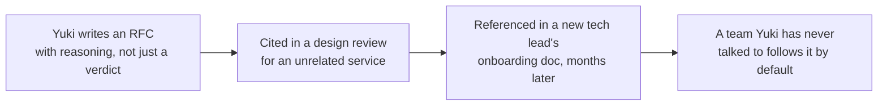
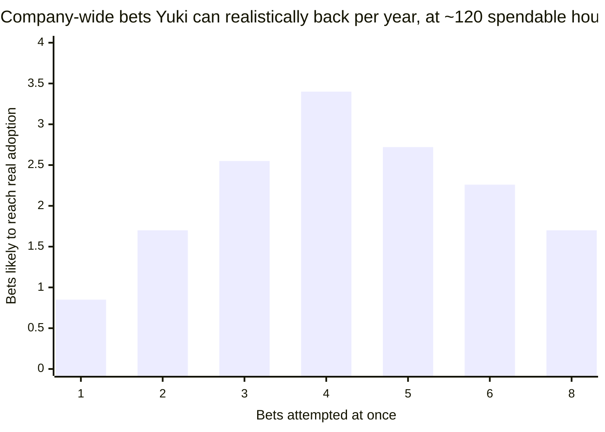

import LevelIntro from "../../../components/LevelIntro.astro";
import Checkpoint from "../../../components/Checkpoint.astro";

L1 named four tools for org-level influence: durable artifacts,
reputation built on track record, seeding ideas early, and a finite
influence budget spent on chosen bets. L2 works out the mechanism
behind each one — starting with what actually makes an artifact
"durable" instead of just written down.

<LevelIntro
  items={[
    "What makes an artifact durable, not just written",
    "How reputation compounds — and gets spent",
    "Seeding ideas early, and picking bets with a finite budget",
  ]}
/>

## Durable artifacts: outliving the conversation

**Yuki could just tell each of the 14 tech leads her opinion in a Slack message. Why would writing an RFC do anything a message wouldn't?** A message lives in one thread, seen once, by whoever happened to be in the channel that week. A durable artifact is built to be found later, by someone who was never part of the original conversation, at the exact moment they need it — that's the entire difference.

| Property                                  | A Slack message or hallway chat                             | A durable artifact (RFC / design doc / ADR)                   |
| ----------------------------------------- | ----------------------------------------------------------- | ------------------------------------------------------------- |
| Findable later?                           | No — buried in scrollback within days                       | Yes — linked, searchable, referenced in onboarding docs       |
| Citable by a stranger?                    | No — "Yuki told me once" carries no weight to a third party | Yes — "see RFC-014" carries weight regardless of who's asking |
| Survives Yuki being unavailable?          | No                                                          | Yes — the reasoning stands on its own                         |
| Shows the reasoning, not just the verdict | Rarely                                                      | Should always — the "why," including rejected alternatives    |

The artifact's job isn't to announce a decision — it's to carry the
**reasoning** far enough that someone who never met Yuki can apply
it correctly to a situation she never anticipated. An RFC that says
"draw service boundaries around business domains" without explaining
why, with what trade-offs, and against what alternatives, gets
followed inconsistently the moment a real case doesn't look exactly
like the example in the doc. One that shows the reasoning — including
the alternatives that were considered and rejected, and why — lets a
tech lead six months later extend it correctly to a case Yuki never
wrote about.

Notice what's missing from that diagram: Yuki, present at any step
after the first. That's the point of a durable artifact — it keeps
doing the work of persuasion without her in the room.

<Checkpoint question="Yuki writes a two-paragraph doc that just states her recommendation — 'new services should own their own data, no shared databases' — with no explanation of why, no examples, and no discussion of when it might not apply. Six months later, a tech lead builds a new service that shares a database with another team's, 'because the doc didn't say we couldn't for this case.' What did the doc fail to do?">

The doc stated a verdict without carrying the reasoning behind it,
so nobody reading it later could correctly extend the rule to a case
it didn't explicitly cover. A verdict without reasoning only works
for situations that look exactly like the example — anything slightly
different gets treated as outside its scope, even when the underlying
principle clearly still applies. The fix isn't a stricter rule; it's
explaining the _why_ well enough that someone who never talked to
Yuki can correctly reason about a case she never wrote about.

</Checkpoint>

## Reputation: compounding, and spending it

**If Yuki is right about the service-boundary problem, shouldn't that be self-evident once people look at the evidence?** Being right isn't the same as being trusted to be right — trust is built from a visible track record, and it takes time no single piece of evidence can shortcut. Every time one of Yuki's past calls turns out, visibly, to have been correct — a warning she raised that later proved accurate, a design she pushed for that held up under load — the next thing she says gets a little more benefit of the doubt before anyone checks it themselves.

This compounds, but it isn't free money — every time Yuki weighs in on something and turns out to be wrong, or weighs in on something outside her actual expertise, some of that trust is spent, not just risked. A staff engineer with genuine standing on distributed-systems trade-offs who starts opining loudly on a marketing tool's UI spends credibility on a topic where they have none, and it's the same reputation account that architecture opinions draw on later.

<Checkpoint question="Yuki has a strong, correct track record on service-boundary and data-ownership questions. A tech lead asks her opinion on which frontend framework their team should adopt — a topic Yuki has never worked in professionally. Should she answer with the same confidence she'd use for a service-boundary question, on the strength of her overall reputation?">

No — reputation is closer to topic-specific credibility than a
general reservoir of authority. Weighing in confidently outside the
area where the track record was actually built risks being wrong in
public, on a topic nobody expected her to have standing on, which
spends down the same trust her service-boundary opinions rely on.
The stronger move is either declining to weigh in with full confidence,
or being explicit that this is outside her track record — both protect
the reputation that actually matters for the bets she's chosen to
spend it on.

</Checkpoint>

## Seeding: introducing an idea before it's needed

**Why not just wait until a tech lead is actively designing a new service, and make the case then?** By the time someone is mid-decision, under time pressure, with a design already half-formed, a brand-new idea reads as a costly detour, not a genuine option — the same coalition-timing problem `informal-authority` covers for a single meeting, but stretched across a year instead of twelve days. Seeding means the idea is already familiar _before_ it's needed: a comment on someone else's design review months earlier, a five-minute mention in a cross-team sync, a line in an RFC that isn't even about this team's work yet. None of these ask for a decision — they just make the idea recognizable, so that when the real decision arrives, it feels like confirming something half-remembered rather than adopting a stranger's agenda on the spot.

| Seeding attempted...                             | What actually happens                                                                                           |
| ------------------------------------------------ | --------------------------------------------------------------------------------------------------------------- |
| The moment a design is already being decided     | Reads as a costly, unplanned detour from a plan already in motion                                               |
| Months earlier, in a low-stakes comment or aside | Familiar by the time it matters — feels like confirming, not adopting                                           |
| Repeated in a few different contexts over time   | Multiple team members recall hearing it independently, which reads as consensus forming, not one person pushing |

## A finite influence budget, spent on chosen bets

**If Yuki has real standing now, why not use it to weigh in on every architecture question that comes up — naming conventions, test frameworks, API style, all of it?** Because attention and credibility are both finite, and spending them everywhere means neither concentrates enough anywhere to actually move a company-wide default. Every RFC written, every review comment given real weight, every cross-team conversation started draws on the same limited pool of hours and the same reputation that took months to build.

The shape matters more than any single number: adding more
simultaneous bets _increases_ the total number that reach real
adoption only up to a point — around four, at Yuki's actual budget —
after which each bet gets too thin a slice of her limited hours to
ever cross the threshold where it becomes a durable, cited default.
Past that point, backing more things at once produces _fewer_ company-
wide wins, not more, because none of the individual bets ever get
enough sustained attention to stick.

This is why picking a **few** company-wide bets — not weighing in on
everything — isn't caution or laziness. It's the only way any of them
actually reach the point where they survive without Yuki actively
pushing.

L3 walks this out end to end: which few bets Yuki actually chooses,
what she deliberately declines to weigh in on, and how durable
artifacts, reputation, and seeding operate together across a real
eighteen months at Solstice Health.
