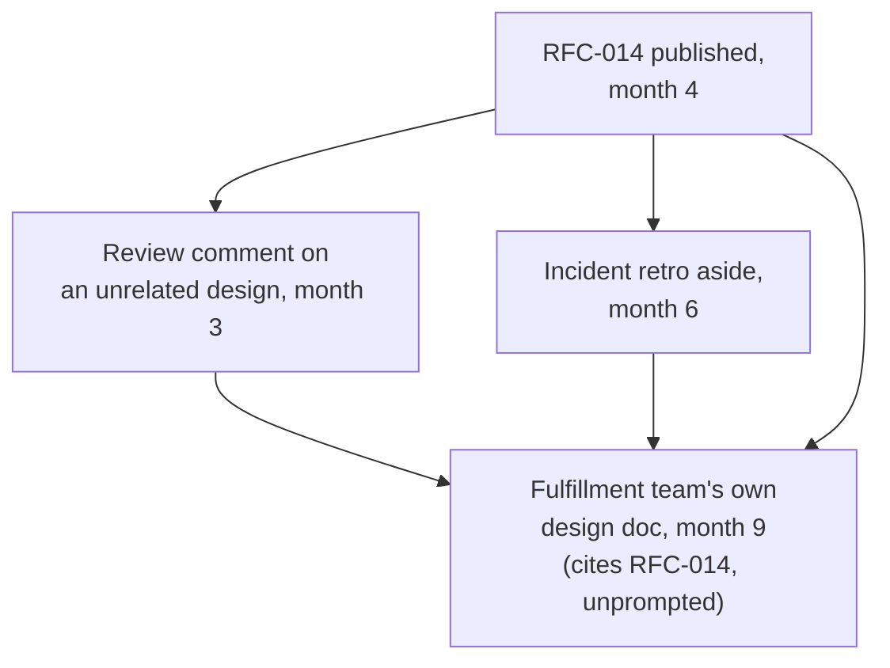

import Scenario from "../../../components/Scenario.astro";
import LevelIntro from "../../../components/LevelIntro.astro";
import Checkpoint from "../../../components/Checkpoint.astro";

<Scenario label="Eighteen months, three chosen bets, no meeting on the calendar">
  <Fragment slot="facts">
    

      
🧩 <strong>14 teams</strong>, each deciding on its own schedule — no shared decision meeting

      
⏳ Yuki's realistic influence budget: <strong>~120 hours/year</strong> outside her actual job

      
📏 A bet needs roughly <strong>30 sustained hours</strong> — writing, revising, seeding, following up — to become a durable, cited default

      
🎯 Chosen bets: <strong>domain-based service boundaries</strong>, <strong>one shared idempotency pattern</strong>, <strong>a lightweight ADR habit</strong>

      
🚫 Deliberately declined: test-framework choice, API naming style, deploy tooling

    

  </Fragment>

L2 laid out four tools in the abstract: durable artifacts, compounding
(and spendable) reputation, seeding ideas early, and a finite budget
spent on chosen bets. This section runs all four through Yuki's actual
eighteen months at Solstice Health.

**Before reading on: with 120 hours a year and roughly 30 hours needed per durable bet, how many company-wide bets can Yuki realistically expect to land — and what should she do with every other architecture opinion she has along the way?**

</Scenario>

<LevelIntro
  items={[
    "The eighteen months, tracked bet by bet",
    "What Yuki writes, seeds, and deliberately declines, and why",
    "Failure modes that would have broken each move",
  ]}
/>

## Months 1–2: choosing the bets, and choosing what to skip

Yuki starts not by writing anything, but by making a list of every
architecture-adjacent opinion she currently holds — eleven items, from
"services should own their own data" down to "we should standardize
on one HTTP client library." She sorts them by two questions:

1. **How much production pain does this actually cause, in incidents or duplicated work, if it stays unfixed?**
2. **How much of her 120-hour budget would it take to make this the org's real default, not just her personal opinion?**

| Candidate                                    | Production pain if unfixed                                                | Estimated hours to land it | Decision |
| -------------------------------------------- | ------------------------------------------------------------------------- | -------------------------- | -------- |
| Domain-based service boundaries              | High — root cause of most cross-team incidents                            | ~35 hrs                    | Bet      |
| One shared idempotency/retry pattern         | High — a repeat cause of duplicate-charge and duplicate-notification bugs | ~30 hrs                    | Bet      |
| A lightweight ADR habit (any team can adopt) | Medium — but multiplies the other two bets' durability                    | ~25 hrs                    | Bet      |
| Standard HTTP client library                 | Low — annoying, not costly                                                | ~15 hrs                    | Skip     |
| Test-framework choice                        | Low — teams already work fine with different ones                         | ~20 hrs                    | Skip     |
| API naming style                             | Low — cosmetic                                                            | ~10 hrs                    | Skip     |

Three bets, roughly 90 of her 120 hours, leaving slack for the
unplanned conversations any real year produces. The other eight
opinions aren't wrong — Yuki just declines to spend real influence
budget defending them, and says so plainly when asked, rather than
letting each one quietly draw down the same credibility the three
real bets depend on.

<Checkpoint question="A tech lead asks Yuki, in a public Slack channel, what she thinks about the team's choice of test framework — one of the eight items she deliberately skipped. What's the move that protects her influence budget: staying silent, giving a confident opinion anyway since she does have one, or something in between?">

Something in between: a brief, honest answer that signals this isn't
one of her chosen bets, rather than either silence or a fully
confident verdict. Something like "I have a mild preference but
haven't looked closely enough to have a strong view — that's your
team's call" spends almost none of her budget, keeps the relationship
warm, and doesn't imply she's staking reputation on an opinion she
hasn't actually invested in. Staying silent can read as aloof or
dismissive; a confident verdict on a topic she skipped risks being
wrong on something she never actually researched, for no real gain.

</Checkpoint>

## Months 2–4: the first durable artifact

Yuki writes an RFC on domain-based service boundaries — not a
one-page mandate, but roughly eight pages including three worked
examples from the company's own recent incidents, two rejected
alternatives (a stricter microservice-per-table model, and a "just
don't change anything" option) with honest reasons each was rejected,
and an explicit "when this doesn't apply" section for cases like
genuinely shared reference data. She spends about three weeks getting
feedback from four tech leads individually before publishing anything
widely — not to build a coalition for a single vote, the way Dev did
in `informal-authority`, but because their pushback catches real gaps
the doc needs to survive contact with cases Yuki didn't anticipate.

The published RFC gets linked from the engineering wiki's
architecture index. Nobody is required to read it. That's
deliberate — a mandate would only bind the meeting where it was
announced; a well-reasoned, discoverable document keeps working every
time someone searches "how should I structure a new service" for the
next two years.

## Months 3–9: seeding, in parallel with the writing

While the RFC is still being drafted, Yuki starts mentioning the idea
in low-stakes places months before any team needs to act on it: a
comment on an unrelated design review ("this is a case where domain
boundaries would have made the ownership question obvious"), a
five-minute aside in a cross-team sync about an incident retro, a
short Slack thread answering someone else's tangential question. None
of these ask anyone to decide anything.

By month 9, when the Fulfillment team starts designing a genuinely
new service, three different people on that team have independently
encountered the idea before — one from the RFC itself, one from
Yuki's review comment months earlier, one secondhand from a teammate
who'd heard it in the incident retro. Their tech lead brings it up
unprompted in the design doc's first draft, citing the RFC directly.
Yuki never attended that team's planning meeting.

<Checkpoint question="By month 9, the Fulfillment team's tech lead cites RFC-014 in their own design doc without Yuki ever raising it with them directly. Using the distinction from L1, is this evidence Yuki 'won' a decision the way Dev won the migration vote in informal-authority — or is it a different kind of outcome?">

A different kind of outcome, and a better sign for org-level
influence specifically. Dev's win was a single room agreeing on a
single day, with him present. Here, a team Yuki never spoke to
directly reached her recommended default on their own, months later,
citing a written artifact rather than a conversation with her — which
is exactly what "becoming the default" looks like at this scale. If
every team's adoption still required Yuki personally in the room, the
approach wouldn't actually be scaling past her — it would just be a
lot of individual single-decision wins, which doesn't survive her
being on vacation, let alone leaving the company.

</Checkpoint>

## Months 5–14: the second bet, and the ADR habit compounding the first two

The idempotency/retry pattern follows the same shape — a shorter RFC
(the domain-boundaries doc already established Yuki's credibility on
architecture writing, so this one needs less convincing prose and
more worked examples) plus seeding in two teams' incident retros where
duplicate-charge bugs had actually happened. The lightweight ADR habit
— a one-page template any team can fill out for a boundary decision,
optional, not mandated — is seeded last and lands fastest, partly
because Yuki's track record on the first two bets is now visible: two
teams who adopted domain boundaries early haven't had a repeat of the
cross-team incident pattern, and that result is more persuasive,
company-wide, than any doc Yuki could write about it.

## Month 18: no single finish line

There's no meeting where this gets declared "done." By month 18, 9 of
14 teams have adopted domain-based boundaries for any new service;
the idempotency pattern is referenced in the standard new-service
checklist a different team maintains, not one Yuki owns; and roughly
half the teams have started writing lightweight ADRs without being
asked. The other 5 teams haven't adopted domain boundaries yet — not
because they disagree, but because they haven't touched the relevant
code recently enough for the question to come up. That's fine; the
RFC will still be there, cited, when they do.

## Extend it: what if the second bet had failed?

**Suppose the idempotency RFC landed badly — a well-known distributed-systems specialist elsewhere in the company publicly disagreed with Yuki's specific pattern, and two teams that had tentatively adopted it quietly reverted. Does this cost Yuki her domain-boundaries win too, since both bets draw on the same reputation?**

Not automatically, but it isn't free either — reputation is
topic-adjacent, not perfectly separable, so a visible miss on one
architecture bet does spend some trust that the other one partly
relies on. The size of the cost depends on how Yuki handles it: publicly
acknowledging the specialist's critique and revising the pattern (or
withdrawing it) protects far more credibility than defending a losing
position past the point the evidence turned. **What would change about
the right response if the disagreement had come from someone with no
particular track record on distributed systems, rather than a
recognized specialist — does the source of the pushback change whether
Yuki should revise the RFC, or just how publicly she needs to respond
to it?**

The source matters for how much weight the objection deserves on the
merits, but not for whether a public, reasoned response is owed — an
RFC that draws public disagreement needs a public answer either way,
the same durability property that makes the artifact valuable also
means unresolved public disagreement about it stays visible. A
critique from someone without relevant standing might warrant a
shorter, less deferential response, and might not require revising
the pattern itself — but silently ignoring it risks reading as
dismissiveness that costs more credibility than a brief, respectful
reply would have.

## Failure modes

| Failure mode                                                                     | What it gets wrong                                                                                              |
| -------------------------------------------------------------------------------- | --------------------------------------------------------------------------------------------------------------- |
| Writing a verdict-only doc with no reasoning or rejected alternatives            | Can't be correctly extended to cases the author didn't anticipate; followed inconsistently or ignored           |
| Waiting until a team is mid-decision to introduce a new idea                     | Reads as a costly detour instead of a familiar, half-remembered option                                          |
| Weighing in with full confidence outside your actual track record                | Spends the same reputation account that the real bets depend on, for no real gain                               |
| Backing every architecture opinion instead of a chosen few                       | Spreads a finite budget too thin for any single bet to cross the threshold into real adoption                   |
| Treating a mandate from a title as a substitute for a durable, reasoned artifact | A mandate only binds the room it was announced in; it doesn't survive the person leaving or the room forgetting |
| Ignoring public disagreement from a credible source rather than responding to it | Unresolved visible disagreement about a durable artifact stays visible, and silence reads as having no answer   |

## The same tools, outside this one company

None of this is specific to service boundaries. The same four tools
apply any time someone needs to shape a direction across a group they
don't manage, over a timeframe with no single decision moment: write
artifacts that carry the reasoning far enough to be applied correctly
by people you'll never talk to; build a track record slowly and spend
it deliberately, not everywhere at once; introduce ideas before
they're needed rather than pitching them cold at the moment of
decision; and choose a small number of bets that a real, finite budget
of time and credibility can actually carry across the threshold into
becoming someone else's default.
