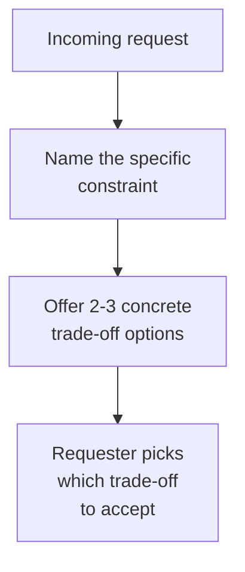

import LevelIntro from "../../../components/LevelIntro.astro";
import Checkpoint from "../../../components/Checkpoint.astro";

L1 named the two failure modes — a flat "no" and a silent "yes" — and
introduced trade-off pushback as the third option. L2 works through why
each failure mode actually damages trust, and what makes a stated
constraint concrete enough to be useful.

<LevelIntro
  items={[
    "Why a flat no and a silent yes both erode trust",
    "The four-step trade-off pushback structure",
    "Why the requester, not the responder, picks the trade-off",
  ]}
/>

## Why a flat "no" damages trust even when it's the right call

**If the sprint genuinely has no room, isn't a direct "no" just being
honest?** It's honest about the conclusion, but not about the reasoning —
the requester has no way to tell whether "no" means "I've checked and
there's genuinely no capacity" or "I don't feel like it." Without the
actual constraint visible, a flat refusal reads as a closed door rather
than a fact the requester could work with — they can't offer to trade
away something else, because they don't know what the real limit even is.

## Why a silent "yes" damages trust even more, just later

**If saying yes keeps the relationship smooth in the moment, why is it
actually worse?** Because the cost doesn't disappear — it just moves to
whoever ends up absorbing it later, without their agreement. If the
Friday feature gets squeezed in silently, something else on the sprint
slips, quality drops, or the person works an unplanned weekend — and the
requester finds out only after the fact, at which point it reads as a
broken commitment rather than a trade-off they never got to weigh in on.

<Checkpoint question="A flat 'no' and a silent 'yes' both end up damaging trust — but through different mechanisms. What's the key difference in when and how the damage shows up?">

A flat "no" damages trust immediately and visibly, because the requester
can't tell whether the refusal is a real constraint or just reluctance —
there's nothing to evaluate, so it reads as a closed door right away. A
silent "yes" damages trust later and less visibly: it feels smooth in the
moment, but the cost doesn't vanish, it just moves onto whoever ends up
absorbing it — a missed deadline, rushed quality, an unplanned weekend —
and only then does the requester discover a cost they never got to weigh
in on, which reads as a broken commitment rather than a trade they agreed
to.

</Checkpoint>

## The trade-off pushback structure

Use this as a practical four-step check before you speak:

1. Verify the real load: what is already promised, and by when?
2. Name the constraint with facts, not mood: "two tasks are already due
   Friday," not just "I'm busy."
3. Offer real options the requester can choose between.
4. Ask for a priority call when the requester owns it, or flag the
   trade-off and state your default plan when the power gap is larger.

**What does "naming the constraint" actually mean, concretely?** Not "I'm
too busy" (a feeling), but something checkable: "the sprint is fully
allocated across three commitments already." **What makes the offered
options genuinely useful?** Each one names a real trade — "I can take this
if X ships Tuesday instead of Friday" or "I can take this if someone else
picks up the deploy pipeline task" — not vague flexibility, but specific
substitutions the requester can actually evaluate and choose between.

| Trade-off type | Example phrase                                                        |
| -------------- | --------------------------------------------------------------------- |
| Time           | "I can do it, but it ships Tuesday instead of Friday."                |
| Scope          | "I can make the demo version by Friday, without the advanced export." |
| Priority       | "I can do it if we move the migration to next week."                  |
| Person         | "I can do it if someone else takes the deploy task."                  |

## Why handing back the decision is the actual mechanism

**Why does the framework end with the requester deciding, rather than the
person being asked just picking the best trade-off themselves?** Because
the requester is usually the only one who knows which trade-off is
actually acceptable from their side — whether Tuesday is fine or whether
Friday is truly a hard deadline for a reason the responder can't see.
Handing back the decision, with the real trade-off visible, keeps the
requester in control of a call that's genuinely theirs to make, instead of
the responder guessing (and either guessing wrong, or defaulting to
absorbing the cost themselves).

If the same words would land differently with another audience, connect
this with `business-communication/audience-awareness`: the trade-off can
stay the same while the framing changes.

## Comparing all three responses to the same request

| Response           | What's communicated                        | What happens to the trade-off                                    |
| ------------------ | ------------------------------------------ | ---------------------------------------------------------------- |
| Flat "no"          | A conclusion, no reasoning                 | Hidden — requester can't evaluate or negotiate it                |
| Silent "yes"       | Full availability                          | Hidden — surfaces later as a missed commitment or unplanned cost |
| Trade-off pushback | The real constraint, plus concrete options | Visible — requester makes an informed choice                     |

<Checkpoint question="Why does trade-off pushback end with the requester deciding which option to take, instead of the responder just picking the trade-off they think is best?">

Because the requester is usually the only one who actually knows which
trade-off is acceptable from their side — whether a Tuesday delivery is
fine, or whether Friday is a hard deadline for a reason the responder
can't see from where they sit. Handing the decision back, with the real
constraint and options visible, keeps that call in the hands of the
person it actually belongs to, instead of the responder guessing at
someone else's priorities and either guessing wrong or defaulting to
absorbing the whole cost themselves.

</Checkpoint>

## The generalizable lesson

**Does this only apply to workload requests, or is something more general
happening?** The underlying move is surfacing a real constraint and a
concrete choice instead of collapsing a request into a binary the
requester can't actually evaluate. Anywhere someone is being asked to
absorb an unstated cost — time, quality, someone else's plans — naming
what the cost actually is and letting the person who owns the priority
decide how to spend it does more for the relationship, long-term, than
either protecting them from the trade-off or refusing to engage with it
at all.
