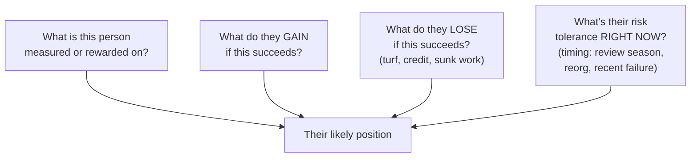

## Four questions, not just one

**If "is this the right call" isn't the question actually being decided, what is?** For
any stakeholder whose approval matters, four questions reveal what's actually shaping
their position:

Plain-language version of the same four questions:

| Map question      | Simpler question to ask yourself                             |
| ----------------- | ------------------------------------------------------------ |
| Measured/rewarded | What makes this person or team look good?                    |
| Gains from yes    | What do they personally get if this succeeds?                |
| Loses from yes    | What could embarrass them, reduce their credit, or add work? |
| Timing risk       | Why might now be an especially good or bad moment for them?  |

Applied to the tool-consolidation incident: the team lead was measured partly on their
team's visible impact; they gained little personally from the merge; they lost a
year-old flagship project's relevance right as it was being evaluated; and their risk
tolerance was low specifically because performance review season made any appearance of
"wasted work" costly _right now_, in a way it wouldn't have been three months earlier or
later. All four factors point the same direction — toward resistance — regardless of the
merge's actual technical merit.

## A stakeholder incentive map, as a real artifact

**Given four questions per stakeholder, what does actually using this look like before a
pitch, not just as an abstract framework?** A simple table, filled in honestly before
walking into the room:

| Stakeholder                          | Measured on                             | Gains from yes                               | Loses from yes                                          | Timing risk right now                                  |
| ------------------------------------ | --------------------------------------- | -------------------------------------------- | ------------------------------------------------------- | ------------------------------------------------------ |
| Team lead (tool owner)               | Team's visible impact, review outcomes  | Reduced maintenance burden (small, indirect) | Their flagship project's relevance, right before review | High — review season                                   |
| Engineering director                 | Overall cost, cross-team friction       | Real cost savings, cleaner architecture      | Almost nothing directly                                 | Low — no personal exposure                             |
| The proposing engineer's own manager | Team execution, proposal follow-through | Credit for a good call                       | Political friction if it fails                          | Moderate — depends on relationship with the other lead |

If you do not know a cell, write `unknown — needs discovery` instead
of pretending. Then ask ethical discovery questions before pitching:

- "What would make this timing hard for your team?"
- "Whose work would this replace or make less visible?"
- "If this went well, what would your team need to get credit for?"

Those questions look for real constraints without assuming the person
is selfish, political, or acting in bad faith.

**The single most useful column is "loses from yes"** — a proposal's supporters usually
already understand the "gains" column; it's the losses, often invisible to anyone outside
that stakeholder's specific position, that predict resistance no pitch deck addresses by
default.

## What changes once the map exists

**If the team lead's real objection is about protecting their team's standing, not the
technical case, does a better technical case change anything?** No — and this is the
map's actual payoff: it redirects the fix away from "make the numbers even more
convincing" (which doesn't touch the actual objection) toward addressing the specific
loss directly. Two concrete options, both aimed at the _right_ row of the map instead of
the case's numbers:

1. **Change the timing** — revisit the proposal after review season, when the same
   decision carries much less personal risk for the team lead.
2. **Change the framing** — position the merge as _that team's_ efficiency initiative
   (their team leads the migration, gets the credit for simplifying the architecture)
   rather than as an external team correcting their prior work.

Honest framing changes what is emphasized while keeping the facts and
ownership truthful. Dishonest framing hides the real consequence or
pretends the proposal helps someone when it actually harms them. The
`corporate-politics/framing` unit goes deeper on that boundary; here,
the rule is simple: if two readers compared notes, the story should
still hold up.

Neither option changes a single fact in the original pitch. Both directly address the row
of the incentive map that was actually driving the rejection — which is precisely why
they have a real chance of changing the outcome, where a stronger version of the original
pitch wouldn't.

## This isn't manipulation — it's accurate modeling

**Does building an incentive map mean exploiting people's self-interest instead of making
an honest case?** No — the technical case in the scenario was already honest and correct;
building the map doesn't change that. What it adds is an accurate model of _why a
correct, honest case still failed_, and that model points toward genuinely addressing a
real, legitimate concern (a person's standing right before a review that affects their
livelihood) rather than dismissing it as irrational resistance to a good idea.
