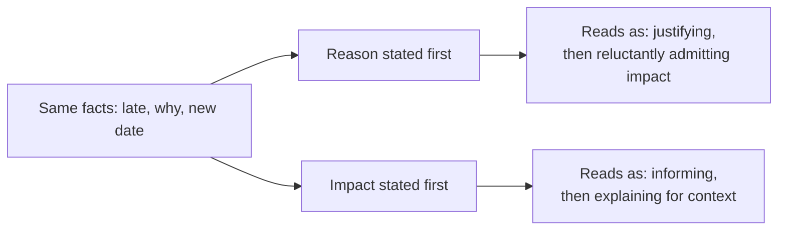

import Scenario from "../../../components/Scenario.astro";

<Scenario>
  <Fragment slot="facts">
    

      

        Day 14
        of 14-day estimate
      

      

        

      

      
Due today. Not shipped.

    

    

      
🔌 A third-party API's rate limiting doesn't match its docs

      
🔁 Retry logic needs a redesign around the real behavior

    

    
Two honest drafts

    

      
🌫️ Draft A — "almost there," no date

      
🎯 Draft B — new date, named reason, explicit ask

    

  </Fragment>

You estimated a feature at two weeks. It's now day 14 — the original due
date — and it's not shipping today, because a third-party API's rate
limiting doesn't behave the way its documentation says, and the retry logic
needs to be redesigned around the real behavior. You have to send today's
status update. Both drafts below are completely honest:

| Draft | What it says                                                                                                                                                                                                                           |
| ----- | -------------------------------------------------------------------------------------------------------------------------------------------------------------------------------------------------------------------------------------- |
| A     | "Almost there — running into some issues with the API, should be wrapped up in the next couple days."                                                                                                                                  |
| B     | "This will miss the original estimate — the API's rate limiting doesn't match its docs, so the retry logic needs a redesign. New estimate: one more week. I'll flag immediately if that changes; no action needed from you right now." |

**Before reading on: both are true today. If next week's estimate also has to move, which draft do you predict is still believed — and which one just spent trust it can't get back?**

</Scenario>

Neither draft lied. What decides which one still gets believed a week from now isn't the facts — it's structure, specificity, and what happens next time.

- A status update has **two jobs at once**: convey accurate information, and manage the reader's _trust_ in your future updates. Getting the facts right but delivering them badly still costs trust — and the reverse, a well-delivered update with fudged facts, costs it even faster once discovered.
- **The instinct that backfires**: when something is late, the natural impulse is to explain _why_ first, then state the impact — which reads as justifying before informing, and makes even a completely legitimate reason sound like an excuse purely because of the order.
- **BLUF applied to bad news**: state the actual status and impact first (what's late, by how much, what it affects), then the reason — the reason is context for someone who wants it, not a toll the reader pays before reaching the information they need.
- A trust-building update reliably contains three things a trust-eroding one usually lacks: a **specific** new estimate (not "soon"), a stated **reason this estimate is more reliable** than the last one (what changed since the miss), and an explicit statement of what, if anything, is needed from the reader.
- **Frequency matters as much as content.** A single big surprise ("it's late") erodes more trust than the same delay surfaced incrementally, earlier, before it became a surprise — predictability is itself part of trust, independent of whether the news is good.
- The failure mode this unit is really about isn't lying — it's **optimism bias reported as fact**: repeatedly saying "should be done Friday" without flagging real uncertainty, and letting Friday quietly become the next Friday. Each individual update might have felt honest when written; the pattern, read back, reads as unreliable.

Structure and content aren't two separate concerns — the same ordering choice shows up as a single fork with two very different outcomes:

| Draft A reads as                                               | Draft B reads as                                                        |
| -------------------------------------------------------------- | ----------------------------------------------------------------------- |
| Vague, no falsifiable claim — can't be checked against later   | A specific, checkable claim — Friday either holds or it doesn't         |
| No stated reason this guess is better than the last one        | Names what changed (redesign done and tested) so the estimate is earned |
| No explicit ask — the reader doesn't know if they should worry | Explicit: no action needed right now, and a promise to flag changes     |
