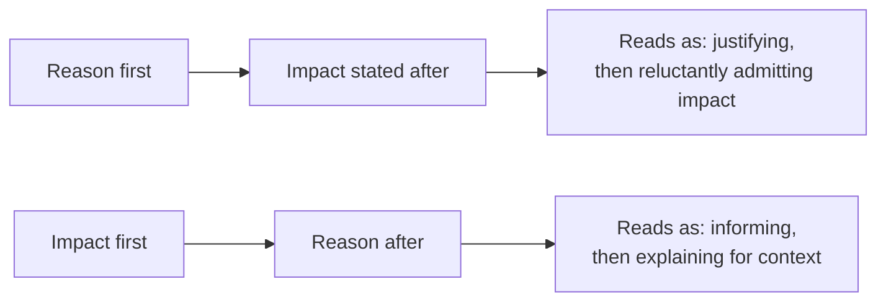

## The same information, two orders

Both paths can carry the exact same facts — same delay, same cause, same new date. What differs is what the reader has to sit through before getting the information they actually need. Leading with the reason forces the reader to evaluate whether the excuse is good enough _before_ they even know what it costs them; leading with the impact lets them immediately assess what matters to them, with the reason available as context rather than as a prerequisite.

## What separates a trust-building update from a trust-eroding one

| Component                          | Trust-eroding version                                    | Trust-building version                                                                              |
| ---------------------------------- | -------------------------------------------------------- | --------------------------------------------------------------------------------------------------- |
| New estimate                       | "Should be done soon" — vague, unfalsifiable             | "Shipping Thursday, based on the remaining two items" — specific, checkable                         |
| Why this estimate is more reliable | Not addressed — same confidence as the last (missed) one | States what changed: "unlike last week, the blocking dependency is now resolved"                    |
| What's needed from the reader      | Left implicit, or absent entirely                        | Explicit: nothing, or a specific decision/input, named directly                                     |
| Track record acknowledgment        | Silent about the previous missed estimate                | Briefly acknowledges it, if relevant — silence about a known miss reads as hoping it goes unnoticed |

The vague-estimate row is the most common failure specifically because it _feels_ honest in the moment (nobody's lying — "soon" really is the best guess) — but a string of "soon"s with no falsifiable content is indistinguishable, from the reader's side, from someone who has no real handle on the situation, whether or not that's true.

## Known vs. estimated: the distinction that keeps updates honest under uncertainty

A status update mixing "what's actually confirmed" with "what's a projection" — without marking which is which — is where optimism bias quietly turns into something that reads as dishonesty later, even when every individual statement was a good-faith guess at the time. Separating the two explicitly is what lets an update be genuinely honest _and_ still convey confidence where confidence is warranted:

- **Known**: "The backend fix is merged and deployed." (verified, not a projection)
- **Estimated**: "Frontend integration should take about two more days, assuming no further API changes." (a projection, with its own assumption named)

Marking the second sentence as an estimate — and naming the assumption it depends on — does two things a flat "should be done in two days" doesn't: it tells the reader how much weight to put on the number, and it gives them (and the future you writing the next update) a specific, checkable reason if the assumption turns out wrong, rather than a vague sense that the estimate was "wrong somehow."

## Frequency as a trust variable, independent of content

The same eventual delay, surfaced in three small updates as the picture became clearer, reads as a team that's on top of the situation. The identical delay, surfaced once as a surprise on the original due date, reads as a team that either didn't see it coming or sat on the information — even if the _facts_ at the end are identical in both cases. This is why "no news" during a period of real uncertainty is itself a trust cost, not a neutral default — silence gets filled in by the reader's own assumptions, which are rarely more generous than the truth.
