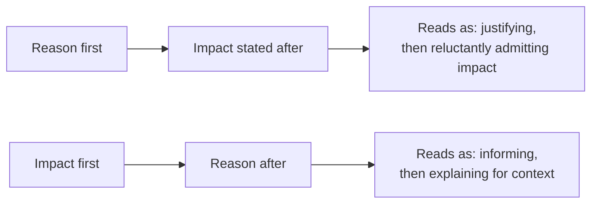
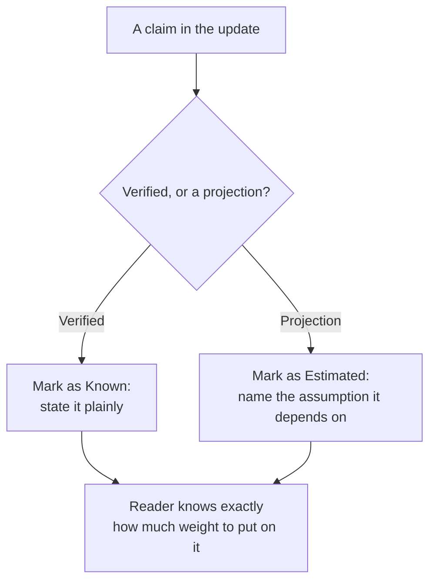
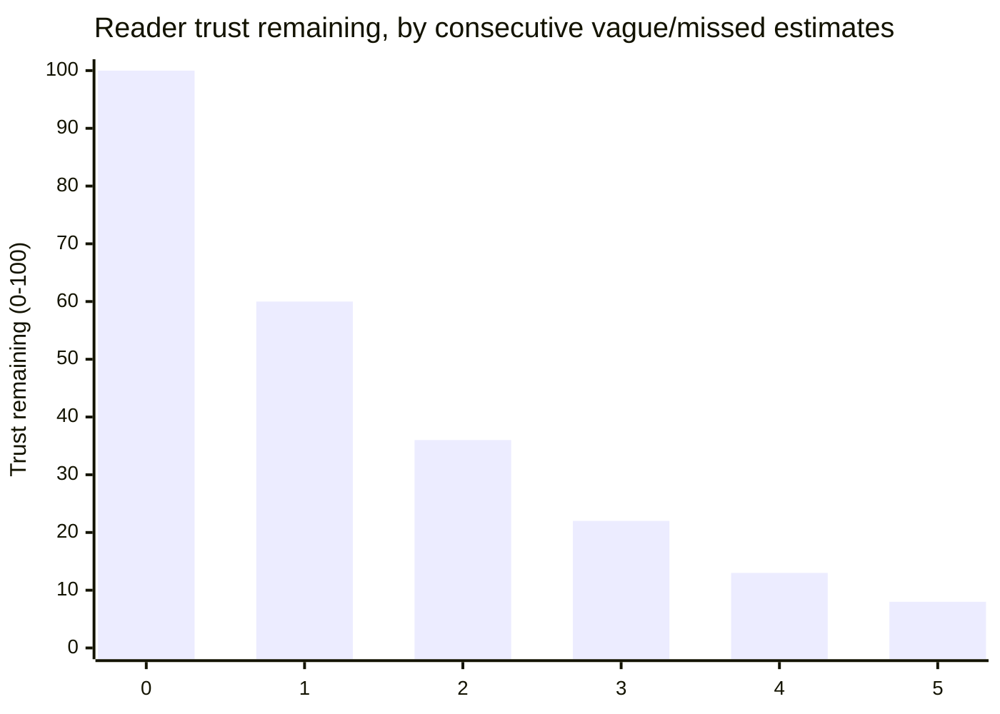

## Same facts, two reading experiences

Before the diagram: if a reader has to sit through your explanation before finding out how late something is, what are they doing with their attention while they wait?

They're not absorbing your reasoning calmly — they're bracing, because they don't yet know how bad the news is. That's the entire mechanism behind why order matters even when nothing else about the message changes:

Both paths can carry the exact same facts — same delay, same cause, same new date. What differs is what the reader has to sit through before getting the information they actually need. Leading with the reason forces the reader to evaluate whether the excuse is good enough _before_ they even know what it costs them; leading with the impact lets them immediately assess what matters to them, with the reason available as context rather than as a prerequisite.

## What separates a trust-building update from a trust-eroding one

Two updates can both be true. What's the actual, checkable difference between the one that keeps a reader's confidence and the one that quietly spends it?

| Component                          | Trust-eroding version                                    | Trust-building version                                                                              |
| ---------------------------------- | -------------------------------------------------------- | --------------------------------------------------------------------------------------------------- |
| New estimate                       | "Should be done soon" — vague, unfalsifiable             | "Shipping Thursday, based on the remaining two items" — specific, checkable                         |
| Why this estimate is more reliable | Not addressed — same confidence as the last (missed) one | States what changed: "unlike last week, the blocking dependency is now resolved"                    |
| What's needed from the reader      | Left implicit, or absent entirely                        | Explicit: nothing, or a specific decision/input, named directly                                     |
| Track record acknowledgment        | Silent about the previous missed estimate                | Briefly acknowledges it, if relevant — silence about a known miss reads as hoping it goes unnoticed |

The vague-estimate row is the most common failure specifically because it _feels_ honest in the moment (nobody's lying — "soon" really is the best guess) — but a string of "soon"s that don't hold up is indistinguishable, from the reader's side, from someone who has no real handle on the situation, whether or not that's true.

## Known vs. estimated: the distinction that keeps updates honest under uncertainty

If every sentence in an update was a good-faith guess at the time, how does a track record still end up reading as unreliable in hindsight? The answer is almost always that "confirmed" and "projected" got blended into one undifferentiated stream of claims:

- **Known**: "The backend fix is merged and deployed." (verified, not a projection)
- **Estimated**: "Frontend integration should take about two more days, assuming no further API changes." (a projection, with its own assumption named)

Marking the second sentence as an estimate — and naming the assumption it depends on — does two things a flat "should be done in two days" doesn't: it tells the reader how much weight to put on the number, and it gives them (and the future you writing the next update) a specific, checkable reason if the assumption turns out wrong, rather than a vague sense that the estimate was "wrong somehow."

## Frequency as a trust variable, independent of content

If the facts at the end are identical either way, why does _how often_ you update change anything? Because the reader isn't grading the final facts alone — they're grading how long they were left to fill in the gap themselves.

The same eventual delay, surfaced in three small updates as the picture became clearer, reads as a team that's on top of the situation. The identical delay, surfaced once as a surprise on the original due date, reads as a team that either didn't see it coming or sat on the information — even though the _facts_ at the end are identical in both cases. This is why "no news" during a period of real uncertainty is itself a trust cost, not a neutral default — silence gets filled in by the reader's own assumptions, which are rarely more generous than the truth.

The cost compounds specifically when vagueness repeats. A single "should be done soon" is a normal hedge; the same phrase reused across several consecutive misses is what actually erodes trust — approximately how fast, if each miss chips away at what's left rather than a fixed amount:

Trust doesn't fall off a cliff at any single miss — it compounds downward, which is exactly why the third "almost there" does more damage than the first: it's not judged in isolation, it's judged against the two before it. (Play with this relationship directly in the interactive demo below.)

## The decision procedure

Given everything above, one question actually decides most of an update's structure before you write a single sentence — which one, and why would that be the one that matters most?

1. **What's actually confirmed, and what's still a projection?** Label each explicitly — this is what keeps optimism from quietly becoming misinformation.
2. **What's the impact, stated first?** Lead with what's late and by how much, before the reason — the reason is context, not a prerequisite to understanding the impact.
3. **What changed since the last estimate that makes this one more reliable?** A repeat guess with the same confidence as a missed one earns no more trust than the miss did.
4. **What, if anything, do I need from the reader?** State it explicitly, even if the answer is "nothing yet" — an implicit ask leaves the reader guessing whether they're supposed to act.
5. **Is this update triggered by genuinely new information, or just a schedule?** An update with nothing new in it trains readers to skim, which costs you the one time there's something they actually need to notice.

This is the checklist behind both paths in L3 — Path A skips questions 1, 3, and 5; Path B answers all five, every time.
