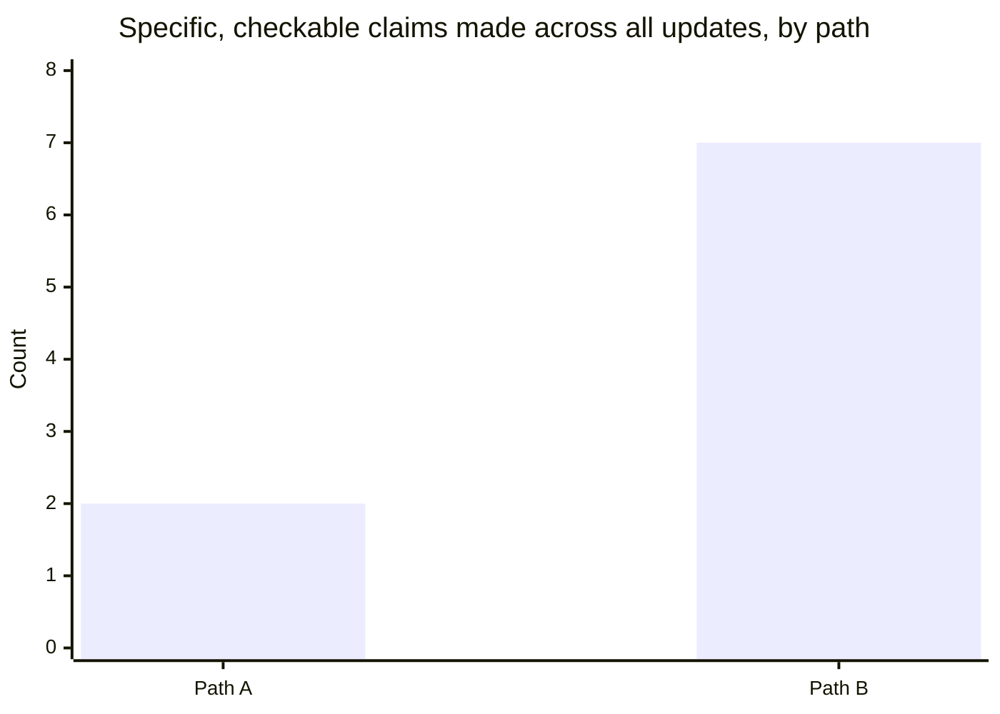

import Scenario from "../../../components/Scenario.astro";

<Scenario label="The scenario">
  <Fragment slot="facts">
    

      
📅 Estimated: 2 weeks

      
⏱️ Actual: shipped week 4 (Path A) / week 3 (Path B)

      
🔌 Cause: third-party API's rate limiting doesn't match its docs

      
🔁 Fix: retry logic redesigned around the real behavior

    

    
Two paths, same root cause

    

      
🌫️ Path A — three consecutive "almost there"s

      
🎯 Path B — one named cause, one specific date, done on schedule

    

  </Fragment>

A feature was estimated at two weeks. It's now week four, still not shipped,
due to an external API integration turning out to be more complex than
scoped — the API's rate limiting doesn't behave the way it's documented,
which means the retry logic has to be redesigned around its real behavior.
Watch how the same underlying situation, reported weekly, produces very
different levels of trust depending on how each update is written — the
facts converge by the end in both paths, but the experience of reading them
doesn't.

</Scenario>

In plain language: the feature depends on an outside service. That
service did not behave the way its instructions promised. The team
had to redesign how their system tries again when the service slows
or rejects requests.

## Path A: trust-eroding (technically honest, badly structured)

**Week 2 (original due date):** "Almost there — running into some issues with the API integration, should be wrapped up in the next couple days."

**Week 3:** "Still working through some edge cases with the API. Hoping to have it done by end of week."

**Week 4:** "This has taken longer than expected because the third-party API's rate limiting behaves differently than documented, which required a different retry strategy than originally planned. Should be done by Friday."

Every individual sentence here is arguably true at the time it was written. But read as a sequence: three consecutive "almost there"s, each one wrong, with the actual explanation only showing up in week 4 — by which point "should be done by Friday" carries the weight of two previous broken promises, whether or not this one is different.

## Path B: trust-building (identical facts, different structure and specificity)

**Week 2 (original due date):** "This will miss the original estimate — the third-party API's rate limiting doesn't match its documentation, and the retry logic needs to be redesigned around that. New estimate: one additional week, through week 3. I'll flag immediately if that changes; no action needed from you right now."

**Week 3, midweek (before the new deadline, since new information arrived):** "Update on the API integration: the redesigned retry logic is done and tested against the real API's actual behavior (not just docs), so I'm more confident in this estimate than last week's — shipping by end of week 3 as planned."

**Week 3 (on schedule):** "Shipped, as estimated last week."

Path B surfaces the same root cause (undocumented API behavior) immediately, gives a specific revised date instead of "should be wrapped up soon," and explicitly distinguishes what's confirmed (the redesign is done and tested) from what's still a projection in the next update. It also arrives on time for its _second_ estimate — not because the situation was actually easier, but because the first estimate accounted for the newly-understood complexity instead of restating optimism.

The first Path B update has five parts:

| Part                        | Text doing that job                                       |
| --------------------------- | --------------------------------------------------------- |
| Impact first                | "This will miss the original estimate"                    |
| Cause                       | "The API's rate limiting doesn't match its documentation" |
| New estimate                | "One additional week, through week 3"                     |
| Why this estimate is earned | The redesign is now scoped around the real behavior       |
| Ask                         | "No action needed from you right now"                     |

## What's identical, what's different

The underlying technical problem and its real difficulty are the same in both paths — this isn't a story about Path B's engineer being magically better at engineering because they wrote better updates. Path A keeps the first missed estimate alive too long, so the delay reaches week 4. Path B names the newly understood complexity at week 2 and makes a larger, more realistic second estimate immediately, so it can finish by week 3. What differs is the update discipline: Path A repeated a vague, unfalsifiable projection three times without ever naming what was actually uncertain; Path B named the real uncertainty once, gave a specific number, and only updated again when there was genuinely new information to report — which is also why Path B needed fewer updates overall to leave the reader feeling informed, not more.

Counting only concrete, checkable claims per path (a specific date, a named cause, a stated "what changed" — not word count, which doesn't track this either: Path A's week-4 update is actually the longest single message in either path):

Path A's total: one specific date (week 4's "Friday") plus one named cause (also week 4) — everything before that was "some issues" and "edge cases," neither of which is checkable against anything. Path B's total: a named cause and a specific date in week 2 (2), an explicit "no action needed" ask (1), a confirmed-vs-projected distinction and a reliability reason in the midweek update (2), plus the specific date reconfirmed twice (2) — every update added something a reader could actually check.

| &nbsp;                            | Path A                                                              | Path B                                                                          |
| --------------------------------- | ------------------------------------------------------------------- | ------------------------------------------------------------------------------- |
| **When the cause is named**       | Week 4 — after two vague updates already spent                      | Week 2 — immediately, on the original due date                                  |
| **First specific date given**     | Week 4 ("Friday")                                                   | Week 2 ("one additional week, through week 3")                                  |
| **Known vs. estimated labeled**   | Never — every claim reads with the same confidence                  | Yes — the midweek update explicitly separates "done and tested" from projection |
| **Updates triggered by**          | A fixed weekly schedule, regardless of new information              | New confirmed information (the midweek update exists because something changed) |
| **Reader's experience by week 4** | Third consecutive miss — this "Friday" inherits two broken promises | On-time delivery of the _second_ estimate, which was itself accurate            |

## Failure modes

- **Treating "I don't want to alarm anyone" as a reason to stay vague.** Vagueness doesn't prevent alarm — it just delays it and compounds it, because the reader eventually gets the real news anyway, now stacked on top of however many previous soft updates didn't hold up.
- **Re-explaining the same root cause every week without new information.** Path B only sent a mid-week update because something genuinely changed (the redesign got done and tested) — an update with no new confirmed fact in it, sent purely on a schedule, trains readers to skim, which defeats the point the next time there's something they actually need to notice.
- **Apologizing at length instead of stating the new plan.** A brief, direct acknowledgment ("this will miss the original estimate") does the accountability work; a long apology before the actual information reads as managing the reader's feelings about the news rather than giving them the news, and delays the part they actually need.
- **Confusing "no news" with "nothing to report."** During real uncertainty, silence is read as either "everything's fine" (setting up a bigger surprise later) or "something's being hidden" — neither is the intended message, and both are avoidable with a short, honest "still investigating, more specific estimate by [date]" update instead of nothing.

## Beyond this example

  🔌 This API delay
  &rarr;
  📊 Any status you own — a migration, a launch, a hiring pipeline

This delay is one case, not the whole territory — a few questions to test whether the discipline actually transferred, not just the specific dates above:

- What would Path B's week-2 update need to add if the news were genuinely worse — say, the redesign meant the feature had to be descoped, not just delayed? Which of the three components (specific estimate, reliability reason, explicit ask) changes shape first when the news is bad enough that there isn't a confident new date yet?
- If the audience for these updates were a whole team instead of one manager, what would change about frequency — would more people reading it argue for updating more often, less often, or does the audience size not actually change the frequency calculus at all?
- Path B's midweek update existed because something genuinely new was confirmed. What's the equivalent "something genuinely new" worth an update in a context you actually report status on — and how would you tell it apart from an update that's really just a scheduled check-in wearing a good excuse? Use `audience-awareness` when deciding how much detail each reader needs; the same delay update should not be identical for a teammate debugging with you and an executive who only needs the launch risk.

Outside software, the same pattern works for a late school report:
"The report will miss today's draft deadline. The interviews took
longer than planned, and two are now confirmed for Wednesday. New
estimate: complete draft Friday evening; no action needed unless you
want me to cut the interview section instead." Impact first, cause
second, new estimate, ask.
