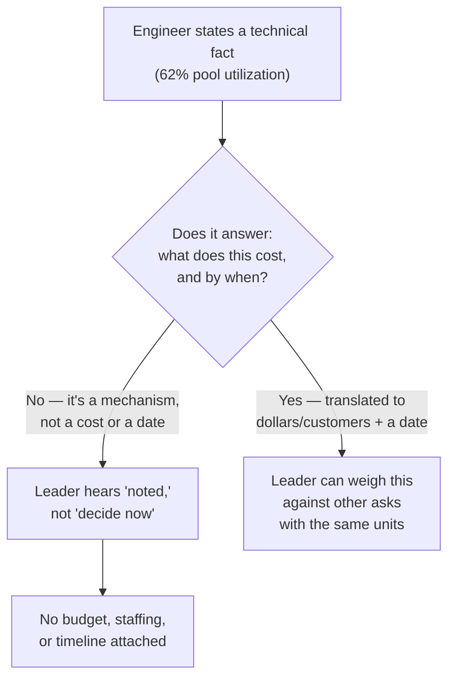
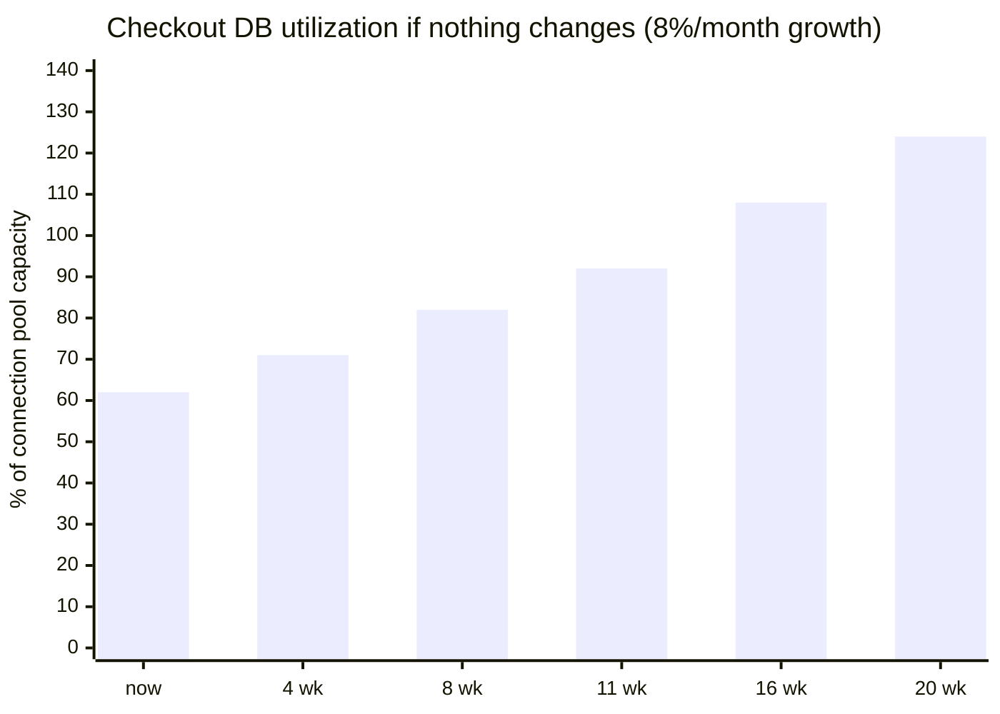

import LevelIntro from "../../../components/LevelIntro.astro";
import Checkpoint from "../../../components/Checkpoint.astro";

L1 named the gap: Marcus's facts were accurate, but Elena couldn't
turn them into a decision. This level works through exactly what a
technical fact is missing when it lands as "keep an eye on it," and
the three-part translation that fixes it.

<LevelIntro
  items={[
    "Why technical severity doesn't transfer as business urgency",
    "The probability × impact × timeline translation",
    "Catastrophizing, minimizing, and the calibrated middle",
  ]}
/>

## Why "62% utilization" doesn't move a decision

**If 62% and "query-plan regression" are both true and both
relevant, why did neither one register as urgent to Elena?** Because
neither statement answers the two questions a business decision
actually runs on: what does this cost, and by when do I need to
decide?

A business leader routinely compares this risk against other asks
competing for the same budget and headcount — a marketing campaign, a
hiring plan, a different team's proposal. Those all arrive already
denominated in dollars, timelines, and headcount. A risk described in
connection-pool percentages simply isn't in a unit Elena can weigh
against the rest of her decisions — not because she doesn't
understand percentages, but because a percentage alone doesn't say
what happens if it's ignored.

<Checkpoint question="A teammate argues Marcus's mistake was using technical vocabulary Elena didn't understand — the fix is defining the terms better ('a connection pool is like...'). Is that the actual fix?">

Not quite. Elena didn't ask "what's a connection pool" — she asked
whether this was like last year's outage, which shows she was
already trying to translate it into a business-risk comparison
herself. The missing piece isn't vocabulary, it's the translation:
what does this cost, and by when. Better definitions would make the
mechanism clearer without making the business case any more
decidable — Marcus could explain connection pools perfectly and
Elena would still have nothing to act on without a cost and a date
attached.

</Checkpoint>

## The translation: probability, impact, and "by when"

**Once you accept that a technical fact needs translating, what
exactly does it get translated into?** Three things, all expressed in
terms the business leader already tracks:

| Technical framing                         | Business framing                                                                                      |
| ----------------------------------------- | ----------------------------------------------------------------------------------------------------- |
| Severity (critical / high / medium / low) | **Probability** — how likely, and how that likelihood is changing as time passes without action       |
| "This could cause an outage"              | **Impact** — what an outage actually costs: lost revenue, affected customers, legal or trust exposure |
| "This is urgent" / "this should be soon"  | **"By when"** — a specific date, milestone, or event after which the risk is no longer hypothetical   |

**Why insist on a specific date instead of "soon" or "urgent"?**
Because "urgent" is a technical judgment call the listener can't
independently verify, while a date is a claim they can check against
their own calendar — a product launch, a seasonal peak, a renewal
deadline — and immediately understand what's actually at stake in
missing it. "If nothing changes, checkout starts failing under normal
load around week 11" is falsifiable and specific. "This is getting
urgent" is neither.

The chart makes "by when" concrete: capacity is projected to cross
100% around week 11 — that's the date a business leader can actually
plan around, not a severity label.

<Checkpoint question="Marcus's original explanation said the issue 'could cause an outage.' The rewrite instead says checkout starts failing under normal load 'around week 11.' What changed, and why does it matter for the decision Elena has to make?">

The claim went from possible-but-unspecified to concrete-and-dated.
"Could cause an outage" is true of almost any unaddressed technical
issue eventually, so it carries no information about timing — Elena
can't tell whether that means next week or next year, so she can't
decide whether to act now or later. "Around week 11" gives her an
actual deadline to plan against: she can compare it to other
commitments on the calendar (a product launch, a budget cycle) and
decide whether resourcing this now or later is the right call. The
date is what turns "sounds important" into something schedulable.

</Checkpoint>

## Avoiding both catastrophizing and minimizing

**If specificity and urgency are good, why not just always frame the
risk as the worst case, to make sure it gets funded?** Because a
leader who's been sold an inflated risk once starts discounting every
future warning from the same source — and a leader who's had a real
risk downplayed once starts over-reacting to every future warning,
which is its own kind of miscalibration. Both failure modes cost
credibility, just in opposite directions:

| Framing         | What it does                                                           | What it costs                                                                          |
| --------------- | ---------------------------------------------------------------------- | -------------------------------------------------------------------------------------- |
| Catastrophizing | States the risk as more certain or severe than the evidence supports   | Leader discounts this and future warnings once the gap between claim and reality shows |
| Minimizing      | States the risk as less certain or severe than the evidence supports   | Leader is under-informed for the decision they're actually making, and finds out later |
| Calibrated      | States what's actually known: current trend, projected date, real cost | Leader can trust the next warning too, whichever direction it points                   |

A calibrated framing doesn't mean hedging every sentence into
mush — it means the probability and impact numbers are the real
ones, not rounded toward drama or toward reassurance. "At current
growth, we cross capacity around week 11" is calibrated. "This could
take down the whole platform any day now" is catastrophizing the same
fact. "It's probably fine, we'll deal with it eventually" is
minimizing it.

## Giving options, not a verdict

**Once probability, impact, and a date are on the table, is the
translation finished?** Not yet — a business leader needs something
to actually decide between, not just a diagnosis. Ending with "this
needs to be fixed" hands back the same kind of unresolved statement
Marcus started with, just better-supported. The translation should
end in **at least two concrete options**, each with its own cost and
how much risk it removes, so the decision is a real trade-off rather
than a single technical recommendation dressed up as the only path.

## Failure modes at this level

- **Translating impact into dollars but leaving probability and
  timeline as vague technical severity.** "This is high severity and
  would cost about $200K if it happens" still doesn't tell the
  listener whether to act this quarter or next year.
- **Picking one extreme framing to guarantee a reaction** — either
  catastrophizing to force urgency or minimizing to avoid an
  uncomfortable conversation. Both erode trust in every future
  warning from the same source.
- **Stopping at the diagnosis.** A translated risk that ends with "so
  this is a real problem" still leaves the leader to invent their own
  options — the translation isn't done until at least two concrete,
  costed paths forward are on the table.
