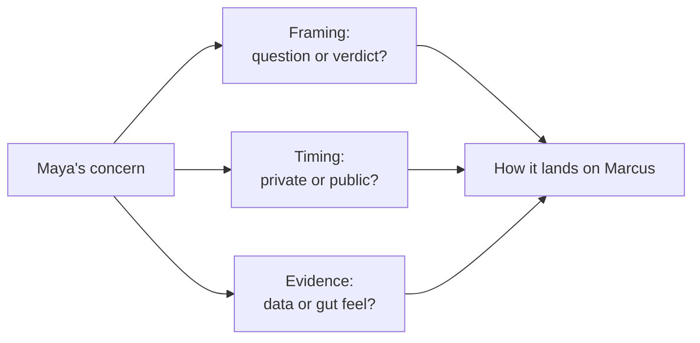

import Scenario from "../../../components/Scenario.astro";
import LevelIntro from "../../../components/LevelIntro.astro";

<Scenario label="The problem">
  <Fragment slot="facts">
    

      

        7,200 TPM
        tested capacity, of 12,000 TPM needed
      

      

        

      

    

    

      
📅 Cutover date already announced to the board — 2 weeks out

      
🚫 Plan is a single "big bang" weekend cutover, no rollback path once it starts

      
📈 Black Friday traffic historically peaks 4x a normal week

    

  </Fragment>

Maya Torres is a senior backend engineer at Ledgerline, a payments
infrastructure company. Her VP of Engineering, Marcus Chen, has committed
to the board that Ledgerline will cut the entire settlement system over to
a new ledger service in one weekend, two weeks from now — right before
Black Friday, the company's highest-traffic weekend of the year.

Maya just finished load-testing the new service. It holds up cleanly at
normal volume. Past roughly 60% of last year's Black Friday peak, p99
latency blows past the payment SLA and settlement requests start timing
out. The cutover plan has no rollback step once it begins — it's the new
system or nothing, starting that weekend.

**Marcus already told the board this date is locked. Maya has the data
that says it will break. What does she actually say to him — and how?**

</Scenario>

Saying nothing protects the relationship today and guarantees a production
incident in two weeks. Saying "this won't work" flatly, in the wrong room,
at the wrong time, can get the message ignored anyway — or get Maya
quietly filed under "not a team player" before anyone even looks at her
data.

<LevelIntro
  items={[
    "Why upward disagreement is a different problem than peer pushback",
    "The four moves: framing, timing, evidence, follow-through",
    "Disagreeing once vs. escalating further",
  ]}
/>

- **Upward disagreement** is telling someone with more authority, status,
  or organizational power than you that their plan, decision, or
  assumption has a problem — as opposed to **lateral pushback**
  (negotiating scope or timing with a peer), which carries much lower
  stakes because there's no power gap and no public record of who was
  right.
- The power gap changes the physics of the conversation. A peer can
  brush off pushback with no cost to either side. A senior person hearing
  "this will fail" in front of others has their judgment, and often a
  public commitment they already made, on the line at the same time —
  which makes a reflexive, defensive "no, it's fine" far more likely,
  regardless of how good the data is.
- **Psychological safety** is what determines whether that reflex fires.
  It's not a vague culture buzzword here — it's a testable question: can
  Maya raise a concern that turns out to be right, or wrong, without it
  costing her standing either way? Where the answer is no, people stop
  raising concerns early, and problems only surface once they're
  expensive.
- Four moves separate a disagreement that gets heard from one that gets
  dismissed or backfires:
  1. **Frame it as a risk to explore, not a verdict** — a question
     invites Marcus to reason alongside Maya; a verdict asks him to admit
     he was wrong, which is a much harder thing to do in front of anyone.
  2. **Raise it privately before any group setting** — a 1:1 lets Marcus
     react, ask questions, and change course without an audience watching
     him do it.
  3. **Bring evidence, not a feeling** — "I'm worried" is easy to set
     aside; a load-test chart with a specific number where it breaks is
     much harder to wave off.
  4. **Know what "done" looks like** — raise it clearly once, with the
     evidence, and if the decision-maker still chooses to proceed, that's
     their call to make with the risk now visible; new evidence, not
     repetition, is what justifies raising it again.
- Getting this right isn't about winning the argument. Maya can do
  everything above correctly and still watch Marcus proceed anyway — the
  goal is making sure he decides with the real risk in front of him, not
  making sure he agrees with her.

| Term                 | Simple meaning                                                                         |
| -------------------- | -------------------------------------------------------------------------------------- |
| Upward disagreement  | Raising a concern with someone who has more organizational power than you              |
| Psychological safety | Whether raising a concern — right or wrong — costs you standing                        |
| Framing as inquiry   | Presenting a concern as a question to reason through, not a conclusion already reached |
| Face                 | A person's standing/credibility in front of others; threatened by public correction    |
| Disagree-and-commit  | Raising your concern once, clearly, then supporting the decision that gets made anyway |
| Escalating further   | Raising the same concern again, usually with new evidence, after being overruled once  |

The same underlying shape — framing, timing, evidence, follow-through — is
what changes between a conversation that lands and one that doesn't, no
matter how technically correct the concern turns out to be:

