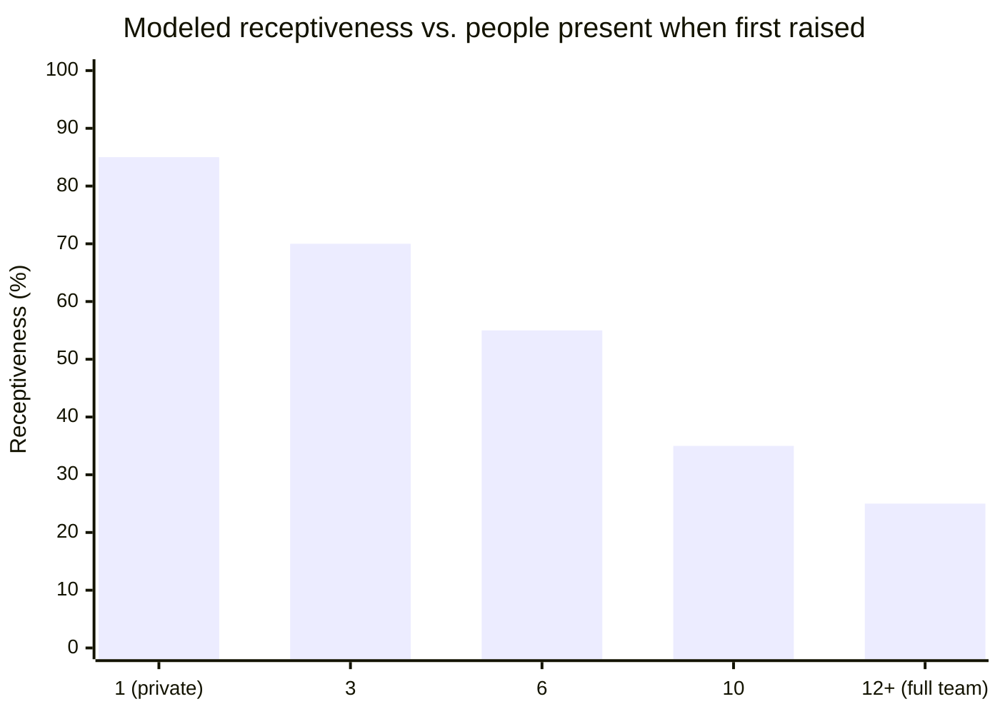
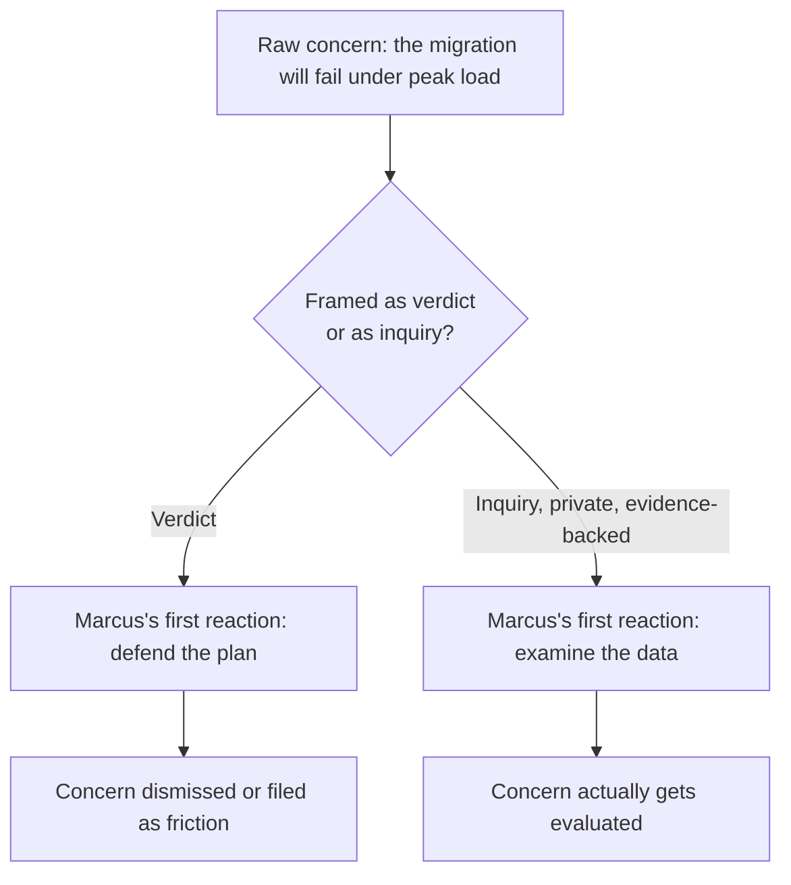
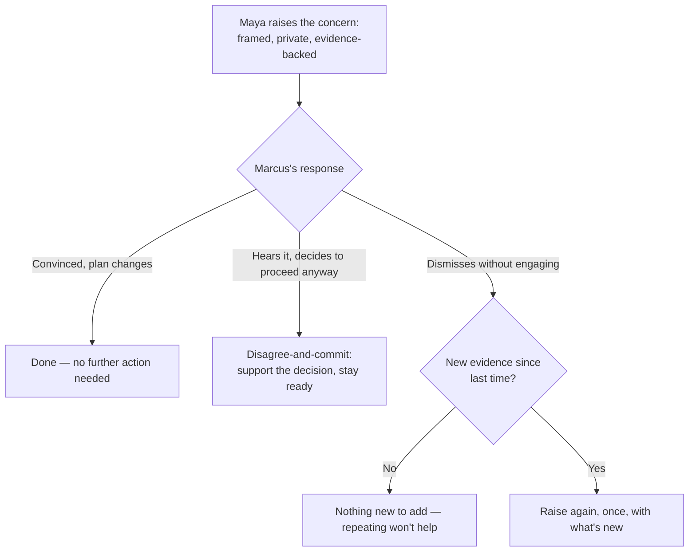

import LevelIntro from "../../../components/LevelIntro.astro";
import Checkpoint from "../../../components/Checkpoint.astro";

L1 showed Maya holding real data — the new ledger service falls over past
60% of last year's Black Friday peak — and a VP who's already told the
board the cutover date is locked. L2 works out why the exact same data can
either open Marcus's thinking or trigger a defensive shutdown, depending on
how, when, and with what it's raised.

<LevelIntro
  items={[
    "Why authority changes the mechanics of hearing bad news",
    "The four moves, and what each one actually prevents",
    "The decision tree: raise once, then commit or escalate",
  ]}
/>

## Why the same words can land as collaboration or as a challenge

If Maya is right about the load test, shouldn't the facts speak for
themselves regardless of how she says them? **Before reading on: why
might a technically correct concern still get dismissed?**

They don't, because Marcus isn't only evaluating the data — he's also
evaluating what accepting it costs him. He already told the board a date.
Reversing it in front of his own team reads as reversing a public
commitment, not just updating a technical plan. Any concern that arrives
sounding like a verdict ("this won't work") forces him to choose between
admitting he was wrong and defending a plan he may already suspect is
shaky — and defending it is usually the path of least immediate pain,
even when it's the worse long-term choice.

**Psychological safety**, concretely, is whether raising a concern that
turns out to be right — or wrong — costs the person raising it. When it's
low, the safe move for anyone is silence, and problems only surface once
they're too expensive to quietly absorb. Maya raising this concern is not
just a technical act; it's a test of whether that safety actually exists
on this team, in both directions — hers and Marcus's.

<Checkpoint question="Marcus told the board a specific date. Why does that fact make Maya's timing choice (private vs. group) matter more than it would for an ordinary technical disagreement?">

Because a public commitment turns "Marcus was wrong about the technical
plan" into "Marcus was wrong in front of people who watched him promise
something." Raised privately, Marcus can absorb new information and
change course without anyone having witnessed him being corrected — the
decision stays his to revise quietly. Raised in a group, the same
information now carries a face cost on top of the technical content,
which makes a defensive reaction far more likely regardless of how good
the data is. The board commitment is exactly what raises the stakes of
getting the timing choice wrong.

</Checkpoint>

## The four moves, and what each one actually prevents

Four separate failure modes are addressed by four separate moves — mixing
them up (good evidence delivered as a public verdict, say) still fails,
just differently. **What specific failure does each move prevent?**

| Move                          | What it prevents                                                                          | What it looks like in practice                                                              |
| ----------------------------- | ----------------------------------------------------------------------------------------- | ------------------------------------------------------------------------------------------- |
| Frame as inquiry, not verdict | Forcing Marcus to publicly admit fault before he's even processed the information         | "Can we look at what happens past 60% of peak together?" instead of "this plan will fail"   |
| Raise privately first         | Turning a technical correction into a face-threatening public one                         | A 1:1 or a written note before any meeting where other people are present                   |
| Bring evidence, not a feeling | Letting the concern get dismissed as opinion, nerves, or resistance to change             | The load-test chart with the actual number where latency breaks the SLA                     |
| Lead with the shared goal     | Making Maya sound like she's against the migration, instead of against this specific plan | "I want this cutover to work as much as you do — that's exactly why I dug into this number" |

None of these four moves change what's true. The load test result is the
same number whether Maya leads with the shared goal or not. What changes
is whether Marcus's first reaction is _defend_ or _think_ — and only one
of those two reactions actually processes the data.

The "raise privately first" move isn't just etiquette — it tracks a real,
roughly-predictable drop-off. As more people are in the room when a
concern is first raised, the face cost of engaging with it honestly goes
up, and a defensive reaction becomes more likely:

This is a model, not a measured fact about Marcus specifically — but the
direction is consistent enough to be worth planning around: the first
attempt at a concern like this should almost always be the smallest room
available, not the next scheduled meeting where it happens to fit the
agenda.

## Leading with the shared goal is not softening the message

**Doesn't "I want this to work as much as you do" water down a serious
warning?** No — it changes what Marcus thinks Maya's conversation is
_for_. A concern that opens with the shared goal signals Maya is trying
to help the migration succeed, not trying to be right or to stop it. A
concern that opens with the failure signals — even unintentionally — that
Maya is against the plan itself. The information conveyed is identical
either way; what differs is whether Marcus hears an ally raising a
solvable problem or an obstacle he now has to get past.

<Checkpoint question="Maya could open with 'this cutover plan has a serious problem' or with 'I want this migration to succeed, and I found something in the load test I want to walk through with you.' Same underlying concern — what's the actual mechanical difference in what each opener does to Marcus's first reaction?">

The first opener puts Marcus immediately on the defensive: it names a
verdict ("serious problem") before he's seen any evidence, so his first
job becomes protecting the plan, not evaluating the data. The second
opener establishes shared intent before introducing the concern, which
reframes what's coming as a collaborative problem to solve together
rather than a challenge to his judgment — so when the data does arrive,
Marcus is more likely to be thinking about the number itself instead of
about how to defend against being wrong. Same facts, same eventual
conversation — but the opener determines which mental mode Marcus is in
when he actually hears them.

</Checkpoint>

## What happens after Maya raises it

Raising the concern well doesn't guarantee Marcus changes the plan — it
guarantees he decides with the real risk visible. What Maya does next
depends entirely on his response:

**Disagree-and-commit** means Maya raised the concern clearly, Marcus
heard it and chose to proceed anyway, and Maya now supports execution of
that decision instead of relitigating it in every subsequent meeting — the
call was legitimately his to make, and he made it with the risk on the
table. This is different from silent compliance: Maya isn't pretending
she agrees, she's accepting that she was heard and overruled, which is
not the same thing as being ignored.

**Escalating further** — raising the same concern again, potentially to
someone above Marcus — is justified by _new evidence_, not by being right
the first time. If nothing has changed since the first conversation,
raising it again reads as not accepting the answer, which erodes the very
trust that made the first conversation work. If something genuinely new
has happened — a second load test confirms the failure at an even lower
threshold, say — that's new information Marcus doesn't yet have, and
raising it again is doing the job, not undermining him.

| Signal                                                | What it means                                | Right move                       |
| ----------------------------------------------------- | -------------------------------------------- | -------------------------------- |
| Marcus engages with the data, changes the plan        | The concern worked                           | Nothing further needed           |
| Marcus engages, decides to proceed anyway             | He was heard; it's now legitimately his call | Disagree-and-commit              |
| Marcus dismisses without engaging, nothing new        | Repetition without new information           | Let it stand, for now            |
| Marcus dismisses, but new evidence has since appeared | He's deciding on outdated information        | Raise once more, with what's new |

The line between "advocating for a real risk" and "being difficult" is
not about how many times you raise a concern — it's about whether each
time you raise it, you're bringing something Marcus didn't already have
in front of him the last time.
