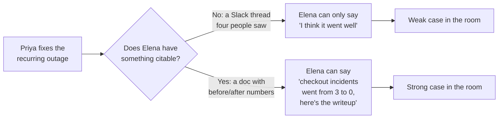

import LevelIntro from "../../../components/LevelIntro.astro";
import Checkpoint from "../../../components/Checkpoint.astro";

L1 showed that Elena, who genuinely respects Priya's work, still made
a weaker case for her than for Marcus — not because the work was
worse, but because she had less to cite. L2 works out the mechanism
behind that gap, and the four tactics that close it without tipping
into self-promotion.

<LevelIntro
  items={[
    "Why a manager can only advocate for what they can cite",
    "The two axes: visibility and how it's perceived",
    "Four tactics that raise visibility without the boastful cost",
  ]}
/>

## The advocate-in-the-room problem

**Why couldn't Elena just say "Priya is great, trust me" and have that
work?** Because calibration isn't a vote of confidence — it's a
negotiation between managers defending a limited number of promotion
slots, and every manager in that room is doing the same thing for
their own reports. A vague, unsupported claim loses to a specific one
almost every time, regardless of whose work was actually better.

An advocate's argument is only as strong as what they can point to
without relying on their own memory or credibility being taken on
faith. This is true whether the room is a calibration meeting, a
hiring committee, or a peer deciding who to loop into a hard project —
the advocate needs something to point to, not just an impression.

<Checkpoint question="Elena genuinely believes Priya did excellent work this quarter. Why isn't Elena's belief, on its own, enough to win the argument in calibration?">

Calibration is a room full of managers each making the same kind of
claim for their own reports, and Elena's sincere belief is
indistinguishable, to the other managers, from every other manager's
sincere belief in their own people. What separates arguments that win
from arguments that don't is whatever each manager can point to that
the others can verify or at least concretely picture — a specific
number, a specific document, a specific outcome. Belief without
something citable is just one more unverifiable claim among many.

</Checkpoint>

## Two axes, not one

**Is the fix just "be more visible"?** Not quite — visibility alone
doesn't distinguish Priya's problem (invisible) from a different
failure mode: a colleague who's plenty visible but reads as
insufferable. There are actually two separate axes: how visible the
work is, and how the visibility is perceived. Raising the first
without managing the second just trades one failure for the other.

|                             | Low visibility                                               | High visibility                                                          |
| --------------------------- | ------------------------------------------------------------ | ------------------------------------------------------------------------ |
| **Reads as self-promotion** | Rare combination — usually just quiet resentment             | The "loud declarer" failure mode: technically known, but socially costly |
| **Reads as evidence**       | Priya's starting point: real work, no record anyone can cite | The target: known, _and_ credited without the boastful cost              |

The goal is the bottom-right cell: visible, but grounded in something
other than the person's own declaration of their own value. That
distinction — declaring your value versus showing evidence of it — is
the hinge the four tactics below turn on.

## Four tactics that raise visibility without the cost

**If declaring your own value is what causes the boastful reading,
what's left?** Making the evidence itself visible, and letting other
mechanisms — documentation, other people, timing — carry the
information instead of your own first-person claims.

1. **Documentation as evidence, not declaration.** A written record of
   what changed (a postmortem, a design doc, a before/after metric)
   states facts a reader can verify, rather than asking the reader to
   take a personal claim on faith. "Checkout incidents: 3 in Q1, 0 in
   Q2" is evidence. "I basically saved checkout this quarter" is a
   declaration — same underlying fact, very different read.
2. **Letting others amplify.** A peer or manager repeating "Priya
   found that" carries more weight than Priya saying it herself,
   because the listener assumes a third party has less self-interested
   reason to say it. This isn't manipulation — it's simply asking a
   collaborator to mention work they already know is real, or making
   it easy for them to find and repeat it.
3. **Sharing credit while staying visible as the driver.** "We shipped
   the fix" hides who actually led it; "I led the investigation, and
   Sam's load-testing caught the regression before it shipped" names
   both the requester's role and a specific collaborator's — and
   research on self-presentation consistently finds this reads as
   _more_ credible, not less, because naming someone else's real
   contribution signals the account is accurate rather than
   self-serving.
4. **Timing around actual decision points.** The same true information
   shared the week before a planning meeting or calibration cycle does
   far more than the identical information shared at a random Tuesday
   with nothing depending on it — not because the information changed,
   but because a decision-maker is actively looking for exactly that
   input at exactly that moment.

<Checkpoint question="Priya's teammate Sam offers to mention her outage fix in the next team-wide demo, unprompted. Which of the four tactics does this represent, and why does it avoid the self-promotion cost that Priya mentioning it herself in the same meeting would carry?">

This is tactic 2, letting others amplify. It avoids the self-promotion
cost because the information is the same either way, but the source
changes who has to be trusted: when Priya says it, the listener has to
take her word that it mattered, and repeated first-person claims about
one's own value are exactly what reads as boastful. When Sam says it
unprompted, the listener assumes Sam has no particular self-interest
in praising Priya, so the claim is read as more credible — the same
fact lands differently purely because of who's carrying it.

</Checkpoint>

## Why "just do good work" isn't a strategy on its own

**Doesn't this whole framework risk turning into constant
self-marketing?** No — none of the four tactics require Priya to say
"look what I did" more often. Documentation, amplification by others,
credit-sharing, and timing are all ways of making the _evidence_
travel, while Priya's own first-person declarations stay exactly as
rare as they were before. The work still has to be genuinely good —
none of this manufactures value that isn't there — but good work that
never reaches a decision-maker's hands, at the moment they need it,
loses to visible-but-lesser work almost every time. That's not a moral
failing in the system; it's just what "decisions get made with
available information" means in practice.

L3 walks through exactly how Priya applied each of these over two real
quarters — the actual documents, the actual conversation with Sam, the
actual timing choice before calibration — plus the failure modes that
turn each tactic back into invisibility or boastfulness when it's
done wrong.
