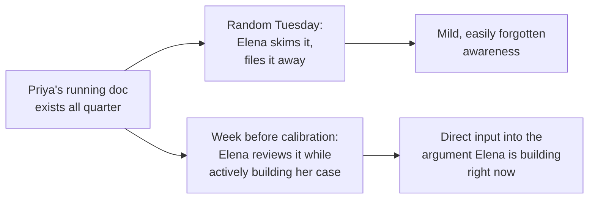

import Scenario from "../../../components/Scenario.astro";
import LevelIntro from "../../../components/LevelIntro.astro";
import Checkpoint from "../../../components/Checkpoint.astro";

<Scenario label="Priya, six weeks after calibration">
  <Fragment slot="facts">
    

      
😳 <strong>What Elena told her</strong> — "I wanted to say more about your outage work, but I didn't have much to point to"

      
🙅 <strong>What Priya doesn't want</strong> — to become the person who announces everything she does

      
🎯 <strong>What Priya actually wants</strong> — the next calibration to go differently, without becoming Marcus

    

  </Fragment>

Priya asks Elena directly what happened in the room. Elena is honest:
she wanted to make a stronger case, but when another manager asked
"what specifically did she do," Elena had a Slack thread and her own
fading memory of a good quarter — nothing she could actually put in
front of the room. Priya's reaction is the same one most people have
at this point: "I don't want to become the person who talks about
themselves in every meeting." **Is there a way to fix Elena's problem
without Priya becoming that person?**

</Scenario>

<LevelIntro
  items={[
    "The four tactics applied to Priya's actual next two quarters",
    "A worked evidence-ratio model showing what changed the reading",
    "Failure modes for each tactic, and what they cost when triggered",
  ]}
/>

## Quarter one: documentation as evidence

**What's the smallest change Priya can make that doesn't feel like
bragging at all?** Writing down what she already does, in a place
built for facts rather than personal narrative — a postmortem doc, not
a Slack message about herself.

Priya starts a single practice: any time she finishes something worth
noting, she writes two or three lines in a running doc, in the same
factual voice a postmortem uses.

| Before (what happened)                                        | After (what she wrote)                                                                                                        |
| ------------------------------------------------------------- | ----------------------------------------------------------------------------------------------------------------------------- |
| Fixed the outage, told four people in a Slack thread          | "Checkout incident rate: 3/quarter → 0/quarter after root-causing the connection-pool exhaustion bug. Writeup: [link]."       |
| Reviewed a risky migration plan, caught a data-loss edge case | "Caught an unhandled null-migration path in the Q3 billing migration plan before it reached staging. Prevented a rollback."   |
| Mentored a new hire through their first on-call rotation      | "Paired with [new hire] through their first on-call week; they resolved their first solo page unassisted the following week." |

Notice what's absent from the right column: no "I," no "I'm proud
of," no adjective describing how good the work was. Every line is a
fact a reader could, in principle, go verify. That's what makes it
evidence rather than a declaration — the difference isn't length or
detail, it's whether the sentence is making a checkable claim about
the world or a claim about Priya's own value.

<Checkpoint question="Compare 'Checkout incident rate: 3/quarter → 0/quarter after root-causing the connection-pool exhaustion bug' with 'I'm really proud of how I fixed the checkout outages this quarter.' Both describe the same underlying accomplishment. Why does only the first count as evidence-based visibility?">

The first sentence makes a claim about the world — a specific,
checkable number that changed — and leaves the reader to draw their
own conclusion about how good that is. The second sentence makes a
claim about Priya's own feelings and value ("I'm proud," "really"),
which asks the reader to accept her self-assessment rather than look
at a fact. Same underlying accomplishment, but only the first gives a
skeptical reader (or a manager repeating it secondhand) something they
can verify or cite without just taking Priya's word for her own
worth.

</Checkpoint>

## Quarter one: letting Sam amplify

Priya mentions, in passing, that she's been keeping a running doc of
what she's worked on — not asking Sam to say anything, just making the
fact available. Weeks later, in a team demo, Sam volunteers: "worth
saying, Priya's the reason checkout hasn't paged anyone since the
connection-pool fix — it's been rock solid." Priya says thanks and
moves on.

The mechanism worth noticing: Priya did nothing in that meeting except
exist and have done good work. The visibility came from Sam's
unprompted sentence, not from Priya's. A doc that's easy to find and
genuinely factual makes this kind of unprompted mention _more_ likely
— Sam didn't have to remember details from memory, he'd seen the
writeup and could speak specifically.

## Quarter one: sharing credit without disappearing

When Elena asks Priya to give a two-minute update at the team
all-hands, Priya has a choice between two true sentences:

| Weak version (either extreme)                                             | Strong version (credit-sharing)                                                                                                                                 |
| ------------------------------------------------------------------------- | --------------------------------------------------------------------------------------------------------------------------------------------------------------- |
| "We fixed the checkout issue this quarter." _(erases who led it)_         | "I led the root-cause investigation on the checkout outages, and Sam's load-testing setup is what caught the fix held under real traffic before we shipped it." |
| "I fixed the checkout outages, basically single-handedly." _(erases Sam)_ | Same as above                                                                                                                                                   |

The strong version does two things the weak versions each fail at
separately: it names Priya's own role specifically enough that it
doesn't get lost in a vague "we," and it names Sam's specific
contribution, which is what makes the whole statement read as an
accurate account rather than a self-serving one. Listeners are
sensitive to over-claiming; a report that includes someone else's real
contribution is trusted more, not less, including the parts about the
speaker themselves.

## Quarter two: timing it around the actual decision point

**Does it matter when any of this happens, if the documentation and
the demo mention already happened?** Yes — a lot. The same running doc
that existed quietly all quarter does far more work in the two weeks
before the next calibration cycle than it did sitting untouched in
month one.

A week before the next calibration cycle, Priya sends Elena a short
note: "pulled together a one-pager of what shipped this quarter in
case it's useful for calibration — no need to reply, just wanted you
to have it before the meeting." Nothing in that note is new
information; Elena had access to the running doc the whole time. What
changed is that it arrived at the exact moment Elena was building an
argument that needed exactly this kind of input.

<Checkpoint question="Priya's running doc existed the entire quarter, but she waited until the week before calibration to send Elena a one-pager pulled from it. If the information was already available the whole time, why does the timing of that one-pager matter?">

Information sitting in a doc that nobody is actively looking for does
much less work than the same information arriving right when someone
is actively forming a judgment it's relevant to. Elena wasn't
building her calibration case in month one — she was in month three,
under time pressure, trying to remember specifics. The one-pager
arriving during that exact window turns background information into
direct input on the argument she's actively constructing, which is a
completely different kind of usefulness than the same content sitting
unread earlier in the quarter.

</Checkpoint>

## What actually changed, in the room

At the next calibration, Elena has three things she didn't have
before: a doc with dated, specific outcomes, a secondhand story from
Sam's demo comment that she can repeat as "even her own teammates
point to this," and a one-pager delivered right when she needed it.
None of it required Priya to say "I did great work" more than she ever
had. The visibility came from documentation, amplification, credit
framing, and timing — not from louder self-declaration.

## Failure modes

| Failure mode                                                    | What goes wrong                                                                                                                                                                    |
| --------------------------------------------------------------- | ---------------------------------------------------------------------------------------------------------------------------------------------------------------------------------- |
| Writing the doc, but never letting anyone know it exists        | Documentation with zero distribution is barely better than no documentation — someone still has to know to look for it                                                             |
| Asking Sam directly to praise you in the meeting                | Solicited amplification is usually detectable and reads as staged, which can cost more credibility than saying it yourself                                                         |
| Saying "we" when you led, or "I" when you didn't                | Either erases your own role (invisible again) or erases a collaborator's (reads as taking credit, which damages trust badly)                                                       |
| Sending the one-pager the day after the decision, not before    | The same information delivered too late is a historical footnote instead of an input into the decision — timing is not optional                                                    |
| Turning documentation itself into a first-person highlight reel | A doc full of "I'm proud of," "I'm the reason," and adjectives about your own performance stops reading as evidence and starts reading as a declaration wearing a doc's formatting |

## Extend it: what if the audience were much bigger than one manager?

Priya's case only had to convince Elena, who already trusted her
personally. **What would have to change about these same four tactics
if Priya were instead trying to be visible to a skip-level director
who has never met her, across a department of two hundred engineers —
would documentation, amplification, credit-sharing, and timing still
work the same way, or would something about the scale change which
tactic carries the most weight?** Consider, in particular, whether
"letting others amplify" gets _more_ or _less_ powerful as the
audience gets larger and more distant — and whether a doc that was
enough for one manager's memory is still enough when nobody skimming
it has any prior context on Priya at all.
