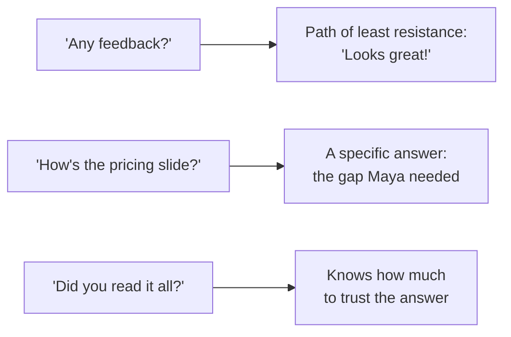

import Scenario from "../../../components/Scenario.astro";

<Scenario>
  <Fragment slot="facts">
    

      
🗣️ "Any feedback?" &rarr; 🤷 "Looks great!"

      
🎯 "How's the pricing slide?" &rarr; 💡 real gap found

      
🔍 "Did you read it all?" &rarr; 📏 knows how much to trust it

    

    
Readers

    

      
🙋 Jordan — built the deck with her

      
👩‍💼 Priya — accountable for winning the client

      
🧑‍💼 Tom — only cares if it's ready

    

  </Fragment>

Maya is finishing a client pitch deck due Friday. She asks three coworkers
for feedback on it, the same day, phrasing the ask differently each time —
same deck, same reviewers' actual opinions available to be extracted, if
she asks for them correctly.

| Ask                                                 | What she gets back                                                                |
| --------------------------------------------------- | --------------------------------------------------------------------------------- |
| "Could you take a look, any feedback?"              | "Looks great!" — two days later                                                   |
| "How's the pricing slide specifically?"             | "The pricing's solid, but there's no competitor comparison — is that on purpose?" |
| "Did you read the whole thing, or just that slide?" | "Just that slide, honestly — didn't get to the rest yet"                          |

**Before reading on: all three coworkers had roughly the same amount of time and the same real opinions available — so why did only two of the three questions actually produce one?**

</Scenario>

It wasn't that Jordan, Priya, and Tom had different amounts to say. It was
the shape of the question that decided how much of what they actually
thought made it back to Maya.

- "Any feedback?" is a question most people answer with the path of least resistance: "looks good!" — not because there's nothing to say, but because a vague, open-ended question makes it socially easy to give a vague, low-effort answer. **The question's shape determines the answer's usefulness more than the asker's actual need for it.**
- **Specific, narrow questions produce specific, useful answers.** "How's the pricing slide?" gets a real answer; "any feedback?" gets "looks good." The narrower question isn't limiting the feedback — it's making it _possible_ for the other person to give a concrete answer instead of a polite default.
- **Calibration** is the separate skill of knowing how much weight to put on any given piece of feedback — the same "looks good" from someone who read every slide carefully and someone who skimmed means very different things, and asking a follow-up ("did you read the whole thing?") is how you tell the two apart.
- Feedback quality also depends on **psychological safety** — someone who believes candid criticism will be held against them gives safer, vaguer answers regardless of how the question is phrased; this is a property of the relationship and the environment, not just the individual question.
- **Asking about something specific and finished** (a slide, a decision, a draft) tends to produce more useful answers than asking about something broad and ongoing ("how am I doing") — the same principle as narrow questions, applied to scope instead of phrasing.
- A common trap: treating feedback-seeking as a one-time event ("my annual review") rather than an ongoing practice — waiting for a scheduled moment means going long stretches making the same avoidable mistake, purely because nobody asked a specific question sooner.
- The practical skill this unit builds: replacing "any feedback?" with a specific, answerable question, aimed at a concrete, recent piece of work, asked of someone whose answer you have reason to weight — repeated as a habit, not a scheduled event.

The three requests above aren't three different amounts of honesty from
Jordan, Priya, and Tom — they're the same amount of real signal, filtered
through three different-shaped questions:

| Question shape         | What it changes                                        |
| ---------------------- | ------------------------------------------------------ |
| Vague, open scope      | Makes a low-effort, generic answer the easy option     |
| Specific, narrow scope | Makes a generic answer implausible — forces a real one |
| Calibration follow-up  | Reveals how much of the work was actually reviewed     |
