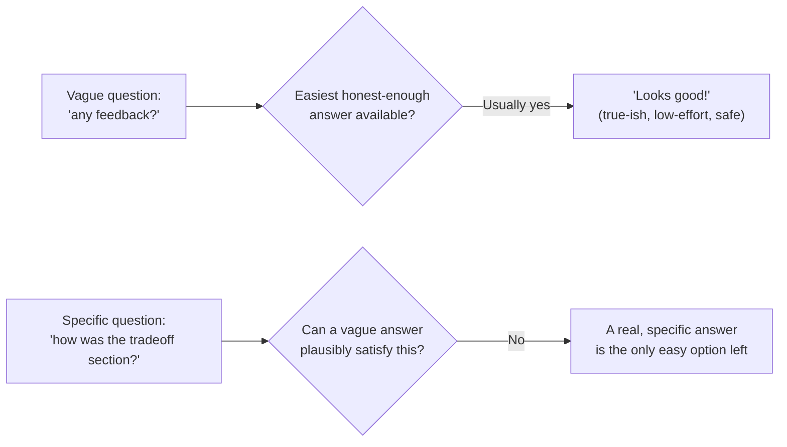

## The default path of least resistance

"Looks good!" isn't necessarily a lie — it's the natural equilibrium a vague, open-ended question settles into, because giving a vague answer to a vague question requires no real effort and carries no social risk. A specific question closes off that easy exit: "how was the tradeoff section" can't be plausibly answered with "looks good" without it reading as having skipped the section entirely, which itself creates a small social cost to answering vaguely — so a real answer becomes the path of least resistance instead.

## Calibration: knowing how much to weight an answer

| Signal to watch for                                                  | What it suggests about how to weight this feedback                                                                   |
| -------------------------------------------------------------------- | -------------------------------------------------------------------------------------------------------------------- |
| Specific references to actual content ("the retry logic on line 40") | High engagement — likely read carefully, weight accordingly                                                          |
| Fast turnaround with generic language                                | Possibly skimmed — worth a specific follow-up before weighting heavily                                               |
| Consistent track record of catching real issues before               | Higher prior trust in this person's calibration specifically                                                         |
| Feedback that only ever repeats what you already believed            | Worth checking whether this person tends to agree by default, or genuinely independently reached the same conclusion |

Calibration isn't about distrusting people — it's recognizing that the same words ("looks good") carry different information depending on who said them and how they engaged, the same way a senior reviewer's silence on a section can mean either "no issues" or "didn't get to it," and only a follow-up question distinguishes the two.

## Psychological safety as a precondition, not a nice-to-have

A specific question still gets a safe, vague answer if the person asked doesn't believe candor is welcome — "how was the tradeoff section" from someone known to react defensively to criticism still often gets "looks fine" regardless of phrasing. This means the skill in this unit has two parts that work together: asking a better-shaped question, _and_ visibly, consistently rewarding candid answers (not reacting defensively, thanking people for specific critical feedback) so the safety exists for the better-shaped question to actually work.

## Scope: specific and finished beats broad and ongoing

"How am I doing overall?" invites the same vague-default problem as "any feedback?" for a different reason — it's too broad to answer from any single recent memory, so it collapses into a general impression instead of concrete evidence. "How did the incident response go on Tuesday" is scoped to one specific, recent, checkable thing — the person answering has an actual event to reference, not an aggregate impression to summarize on the spot.
