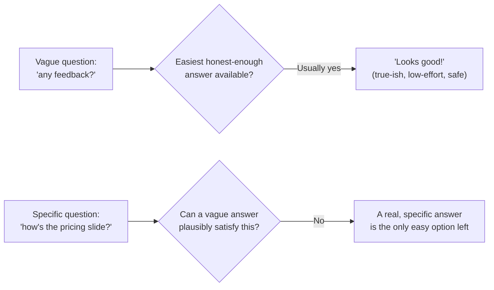
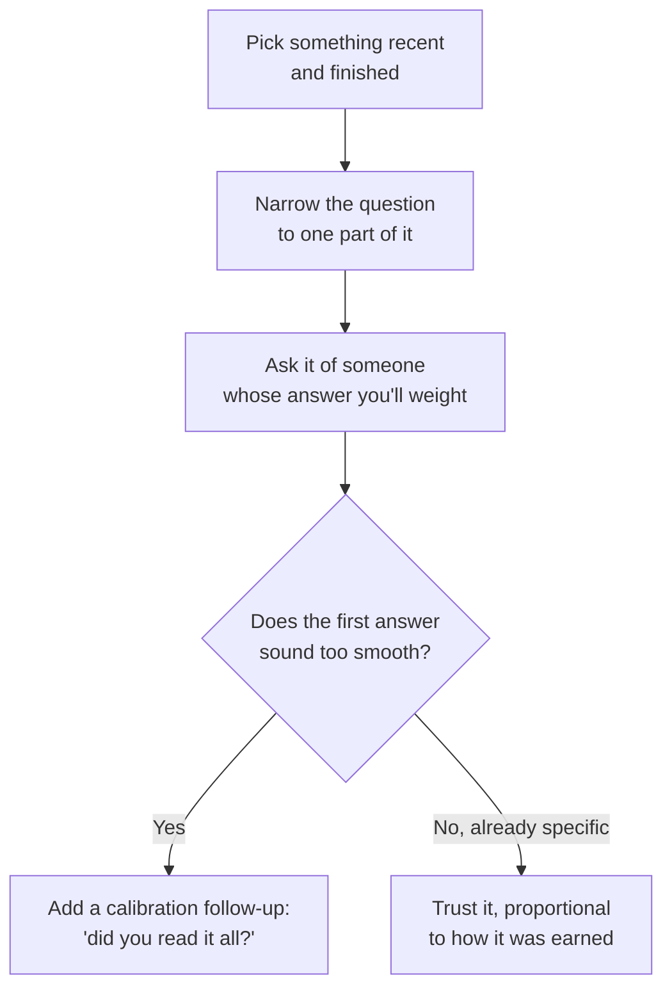

import LevelIntro from "../../../components/LevelIntro.astro";
import Checkpoint from "../../../components/Checkpoint.astro";

L1 showed three differently-phrased requests producing three very
different answers from the same people about the same deck. L2 works out
_why_ that happens — what a vague question actually costs to answer
honestly, versus what a specific one costs, and what has to be true around
the question for either to work at all.

<LevelIntro
  items={[
    "Why vague questions default to safe answers",
    "Calibration: weighting an answer, not just reading it",
    "Psychological safety as a precondition, not an add-on",
  ]}
/>

## The default path of least resistance

Before the diagram: if Maya's coworker Jordan genuinely thought the pricing
slide was confusing, what would it actually cost Jordan to say "looks
great!" instead — and what would it cost to say something real?

"Looks good!" isn't necessarily a lie — it's the natural equilibrium a
vague, open-ended question settles into, because giving a vague answer to a
vague question requires no real effort and carries no social risk. A
specific question closes off that easy exit: "how's the pricing slide"
can't be plausibly answered with "looks good" without it reading as having
skipped the slide entirely, which itself creates a small social cost to
answering vaguely — so a real answer becomes the path of least resistance
instead.

<Checkpoint question="A coworker answers 'looks good!' to a vague 'any feedback?' Does that tell you they had no real concerns about the work?">

No. "Looks good!" to a vague question is the path of least resistance
whether or not real concerns exist — it costs nothing and carries no
social risk, so it's the default answer regardless of what the person
actually thinks. The vague question never gave them a reason to surface
anything more specific, so the absence of a concrete comment tells you
about the question, not about the work.

</Checkpoint>

## Calibration: knowing how much to weight an answer

Jordan's "looks great!" and Priya's "looks great!" could mean very
different things even if both said the exact same three words — what's the
one follow-up question that would tell Maya which is which?

Reading feedback is not just reading the words. You also ask: how much did
this person review, what concrete thing did they mention, and does this
person usually catch real issues in this kind of work? These are clues, not
proofs — a fast answer can still be careful, and a specific answer can
still be wrong. Calibration is how you decide what to do next with the
answer you received.

| Signal to watch for                                                | What it suggests about how to weight this feedback                                                                   |
| ------------------------------------------------------------------ | -------------------------------------------------------------------------------------------------------------------- |
| Specific references to actual content ("the pricing slide's math") | High engagement — likely reviewed carefully, weight accordingly                                                      |
| Fast turnaround with generic language                              | Possibly skimmed — worth a specific follow-up before weighting heavily                                               |
| Consistent track record of catching real issues before             | Higher prior trust in this person's calibration specifically                                                         |
| Feedback that only ever repeats what you already believed          | Worth checking whether this person tends to agree by default, or genuinely independently reached the same conclusion |

Calibration isn't about distrusting people — it's recognizing that the same
words ("looks good") carry different information depending on who said
them and how they engaged, the same way a manager's silence on a section
can mean either "no issues" or "didn't get to it," and only a follow-up
question distinguishes the two.

## Psychological safety as a precondition, not a nice-to-have

A specific question still gets a safe, vague answer if the person asked
doesn't believe candor is welcome — "how's the pricing slide" from someone
known to react defensively to criticism still often gets "looks fine"
regardless of phrasing. This means the skill in this unit has two parts
that work together: asking a better-shaped question, _and_ visibly,
consistently rewarding candid answers (not reacting defensively, thanking
people for specific critical feedback) so the safety exists for the
better-shaped question to actually work.

Two everyday versions: if someone once corrected your draft and you argued
with them for ten minutes, next time they may choose the safe "looks fine."
If you thanked them, used the useful part, and explained what you changed,
next time the honest answer feels less risky to give.

<Checkpoint question="You ask a perfectly narrow, well-scoped question, but the last time this person gave you honest criticism, you argued with them for ten minutes. Will the narrow phrasing get you a candid answer this time?">

Probably not. A well-shaped question only removes the excuse for a vague
answer — it doesn't remove the fear of one. If the person still expects an
honest answer to cost them an argument, they'll find a way to stay safely
vague regardless of how narrow the question is, because the risk that's
actually stopping them was never about the question's phrasing in the
first place.

</Checkpoint>

## Scope: specific and finished beats broad and ongoing

"How am I doing overall?" invites the same vague-default problem as "any
feedback?" for a different reason — it's too broad to answer from any
single recent memory, so it collapses into a general impression instead of
concrete evidence. "How did the client call go on Tuesday" is scoped to
one specific, recent, checkable thing — the person answering has an actual
event to reference, not an aggregate impression to summarize on the spot.

| Ask                                   | What it forces the answer to be                                 |
| ------------------------------------- | --------------------------------------------------------------- |
| "How am I doing overall?"             | A general impression, assembled on the spot, easy to keep vague |
| "How did the client call go Tuesday?" | One checkable event, hard to answer without a real memory of it |

## Putting the three pieces together

Given the four questions below, one produces most of the difference
between a useful ask and a wasted one — which would you guess matters
most, before reading the arrows?

None of these four steps rescues a question asked in an environment with
no psychological safety — that precondition sits underneath all four, not
as a fifth step but as the ground they all depend on. A perfectly scoped,
perfectly narrow, perfectly calibrated question asked of someone who
doesn't trust you with their honest opinion still gets the safe answer.
