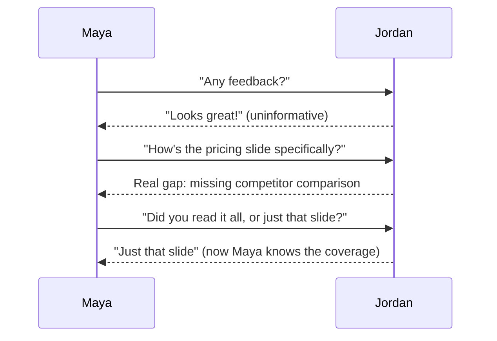
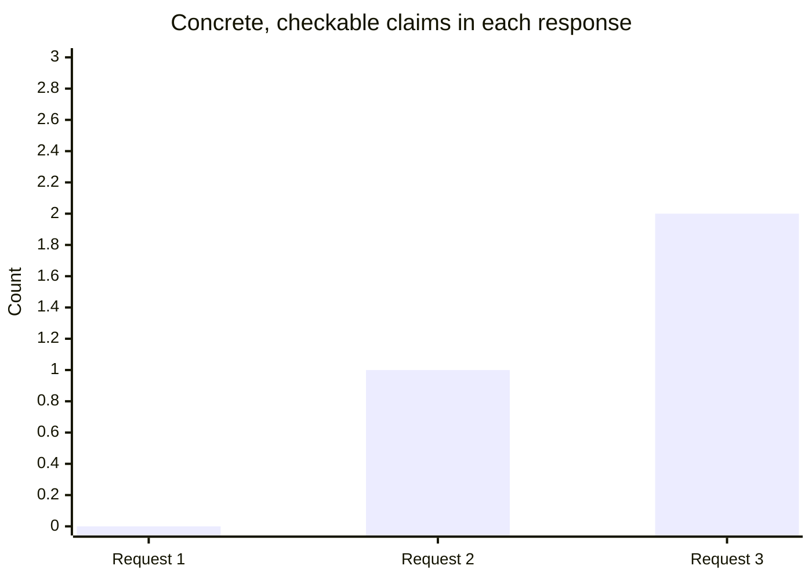

import Scenario from "../../../components/Scenario.astro";

Quick context for the office words: a **peer** is a coworker at a similar
level, a **client meeting** is a meeting with the people Maya is trying to
convince, a **vendor** is another company the client might pay instead,
and a **background section** is the part of the deck explaining who the
client is and what matters to them.

<Scenario label="The scenario">
  <Fragment slot="facts">
    

      
📊 Client pitch deck, due Friday

      
🗓️ All three asks happen the same day

      
🔁 Same deck, same facts available to every reviewer

    

    
Reviewers

    

      
🙋 Jordan — helped build the deck

      
👩‍💼 Priya — accountable for winning the client

    

  </Fragment>

Maya just finished a pitch deck for a client meeting on Friday and wants
real feedback before it goes out. She asks Jordan, a peer who helped
research the deck, phrasing the ask differently each time — same deck,
same day, same person's actual opinion available to be extracted, if
asked for correctly.

</Scenario>

## Request 1: the default

**Message:** "Hey, could you take a look at this when you get a chance? Any feedback welcome."

**Response, two days later:** "Looks great, nice work!"

Before reading the next request: does this response mean Jordan had no
concerns, or that the question gave Jordan no reason to surface one?
There's no way to tell from the answer alone — that's exactly the problem.
This is a plausible, low-cost, safe answer to a question with no specific
target — it neither confirms the deck was read carefully nor reveals
whether there were real concerns worth raising. It's not dishonest; it's
just uninformative, because the question gave no signal about what kind of
engagement was actually being requested.

## Request 2: scoped, but still open-ended

**Message:** "Could you take another look, specifically at the pricing slide? I want to make sure the numbers actually make our case."

**Response, next day:** "The pricing itself looks right, but I noticed we
never show how we compare to what they're probably already paying their
current vendor — is that intentional, or worth adding?"

What changed between Request 1 and Request 2 wasn't Jordan's honesty or
effort — Jordan had the same amount of time both times. Scoping to a
specific slide, with a specific worry named ("make our case"), produced a
specific, substantive answer — including a real gap the general request
never surfaced. Jordan didn't have to invent a comment from nothing; the
question gave a concrete lens to actually apply attention through.

## Request 3: scoped, and calibration-checked

**Message, after the pricing feedback above:** "Good catch, I'll add the comparison. Quick question — did you look at the whole deck, or mainly the pricing slide? I want to know if I should expect other gaps elsewhere too."

**Response:** "Mainly the pricing slide, since that's what you asked about — I skimmed the rest but didn't read the client-background section closely."

This follow-up is the calibration step from L2, made concrete: it tells
Maya exactly how much confidence to place in "the rest of the deck is
fine" (none — it wasn't actually reviewed closely) versus the pricing
feedback (high — that slide was genuinely read). Without this question,
"looks great" from Request 1 and "the rest looks fine, since I only
closely read the pricing slide" from Request 3 would be indistinguishable
in Maya's mind, even though they carry very different amounts of real
signal.

## What changed across the three requests, counted

This isn't a vague impression of "the later requests were better" — it's
countable directly from what each response actually contained. Counting
concrete, checkable claims (a named gap, a named section reviewed, an
explicit coverage statement — not word count, which doesn't track this at
all: Request 3's response is the shortest of the three, at 19 words,
because by then there was nothing left to pad):

A checkable claim is something Maya can verify or use to decide her next
move: "competitor comparison is missing" can be checked on the slide;
"I only read the pricing slide" tells her what still needs review.

Request 1 (0): no named section, no named gap, no coverage statement —
"looks great" is unfalsifiable. Request 2 (1): one named, specific gap
(the missing competitor comparison). Request 3 (2): the same gap, plus an
explicit coverage statement ("just that slide") that tells Maya exactly
what wasn't reviewed.

## At a glance, before the full breakdown

| &nbsp;                  | Request 1: "any feedback?"   | Request 2: scoped to a slide                    | Request 3: scoped + calibration-checked                            |
| ----------------------- | ---------------------------- | ----------------------------------------------- | ------------------------------------------------------------------ |
| **What Maya learns**    | Nothing checkable            | One real, actionable gap                        | The gap, plus how much of the rest to trust                        |
| **What it cost Jordan** | Zero effort, zero risk       | A few minutes of focused attention on one slide | The same, plus one honest sentence about coverage                  |
| **What Maya does next** | Nothing — no new information | Adds the competitor comparison                  | Adds the comparison, and re-reviews the rest herself before Friday |

## What stayed constant across all three requests

  

    ✅
    
      <strong>Jordan's actual opinion never changed.</strong> The same person,
      the same deck, the same amount of attention available each time — only the
      question's shape changed what got extracted.
    
  

  

    ✅
    
      <strong>No request pressured Jordan into inventing criticism.</strong>
      Request 2 and 3 didn't manufacture a problem — they made it easier for a
      real one to surface if it existed.
    
  

## Failure modes

| Failure                                                       | What it looks like                                                                                       | The fix                                                                                                    |
| ------------------------------------------------------------- | -------------------------------------------------------------------------------------------------------- | ---------------------------------------------------------------------------------------------------------- |
| Treating a specific question as an interrogation              | "Why didn't you catch the pricing gap, don't you usually review carefully?"                              | Keep the ask about the work, not the reviewer's diligence — that's what kept Request 2 low-friction        |
| Only asking for feedback on finished work, never on direction | Waiting until the deck is fully built to ask anything, missing the chance to catch a bad structure early | Scope to "specific and answerable," not always "complete" — an early direction check can be just as narrow |
| Not acting visibly on candid feedback once received           | Jordan's gap gets acknowledged but never actually added to the deck                                      | Visibly act on it — it's what makes Jordan's next answer worth the effort again                            |
| Asking the calibration question defensively                   | "Did you read it all?" said in a tone implying "you should have"                                         | Frame it as Maya's own information need ("so I know what to expect"), not an audit of Jordan               |

## Beyond this example

Jordan and the pitch deck are one case, not the whole territory — a few
questions to test whether the model actually transferred:

- What changes if the feedback Maya needed was about something more
  personal than a slide — say, how she comes across presenting to the
  client in person? Does "specific and finished" still work the same way,
  or does psychological safety start to matter more than question
  phrasing?
- What if Jordan's answer to Request 2 had been bad news — a gap serious
  enough to blow the Friday deadline? Would the same three-request
  sequence still be the right approach, or would something about the
  scope or the calibration follow-up need to change?
- Who in your own week plays "Jordan" — someone close enough to the work
  to give a specific answer if asked a specific question, but who
  currently only ever gets "any feedback?" from you?

How to think about those transfer questions: when feedback is personal,
safety matters more and the question should be narrower and kinder; when
bad news changes a deadline, calibrate coverage quickly so you know what
else might be wrong; when choosing your own "Jordan," look for someone
close enough to the work to notice a concrete gap, not just someone senior
or friendly.
