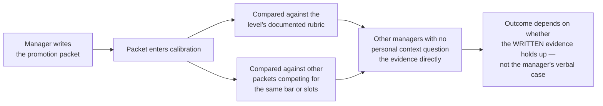

## What determines the outcome, and what doesn't

**If the manager genuinely wanted to promote the Scenario's engineer,
why didn't that settle it?** Because the manager isn't the only
decision-maker in the room, and their spoken confidence in the 1:1
never actually enters calibration — only the written packet does.

| Determines the outcome                                                          | Doesn't determine the outcome                                        |
| ------------------------------------------------------------------------------- | -------------------------------------------------------------------- |
| The packet's written evidence, read cold by managers with no personal context   | How enthusiastically the manager spoke about the person in a 1:1     |
| Whether that evidence clearly clears the level's documented rubric              | How much the engineer personally believes they deserve the promotion |
| How the case compares against other packets competing for the same bar or slots | The manager's private intent or good faith, however genuine          |

**Does this mean the manager was wrong to say what they said?** Not
necessarily — the manager's statement described their own intent
accurately. The mistake, if there is one, is in what the engineer (or
the manager) inferred from it: intent to advocate is not the same
thing as a guaranteed outcome, because advocacy still has to survive
a room the manager doesn't fully control.

## What happens to the packet inside the room

**Once a manager writes the case, what does "calibration" actually do
to it?**

The managers in the room weren't in the engineer's 1:1s, don't know
their day-to-day work, and have no reason to simply trust another
manager's characterization. That's the entire function of
calibration — it exists specifically so one manager's personal
opinion of their own report isn't the only check on a promotion
decision.

## Why "doing well" doesn't survive the room

**If the manager's opinion doesn't travel into the room, what does?**
Only what's written down and can be independently verified or
reasoned about by someone unfamiliar with the person — specific,
checkable claims rather than a manager's general impression.
"Doing well" or "ready for the next level" are exactly the kind of
claims that collapse the moment a manager unfamiliar with the person
asks a direct follow-up question, because there's no specific
evidence behind them to answer with.

## Slot constraints: a second, separate reason a strong case can still fail

**Suppose the packet actually was strong and cleared the rubric —
does that guarantee the promotion happens?** Not always. Some cycles
cap how many promotions a level or org can approve regardless of how
many individual cases clear the bar — which means a packet can be
genuinely strong and still not result in a promotion that specific
cycle, for a reason that has nothing to do with the quality of the
case itself.

## Failure modes at this level

- **Treating a manager's verbal support as equivalent to a
  calibration outcome.** Advocacy is the starting point of a case, not
  the case itself — the room only sees what's written.
- **Writing (or accepting) a packet full of impressions instead of
  checkable evidence.** Claims a stranger to the person's work can't
  independently verify tend not to survive being questioned.
- **Assuming any promotion that didn't happen means the case wasn't
  strong enough.** A slot constraint can produce the identical outcome
  as a weak case, for an entirely different reason — L3 covers how to
  tell the two apart.
