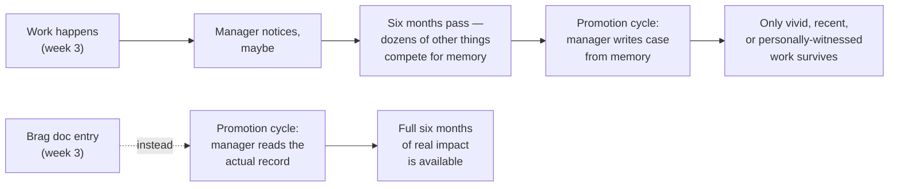

## Why "the work should speak for itself" quietly fails

**If a manager genuinely wants to advocate for their reports, why
doesn't good work reliably make it into the promotion packet on its
own?** Because "the work speaks for itself" requires someone to be
listening at the exact moment the work happened, and remembering it
clearly months later — a standard almost nothing meets:

Here, **reports** means the people a manager is responsible for, not
written reports. **Advocate** means the manager tries to make a strong
case for them.

The gap isn't dishonesty or bad management — it's that unaided
memory is a genuinely bad archive, and nothing about "doing good
work" changes that. A brag doc doesn't replace the work; it replaces
the manager's memory as the record of the work.

## The actual tension: visibility without feeling like bragging

**If self-promotion feels uncomfortable, is the discomfort about the
facts themselves, or about how they're usually stated?** Almost
always the latter — the discomfort tracks subjective self-assessment
("I did a great job"), not objective description of what happened:

Simple version: subjective means "believe me, I was good." Objective
means "this happened, and this changed." The second version gives the
reader something to evaluate.

|                                     | Subjective self-assessment                    | Objective framing                                                                      |
| ----------------------------------- | --------------------------------------------- | -------------------------------------------------------------------------------------- |
| Example                             | "I did a great job leading the migration."    | "Led the database migration; cut query latency from 400ms to 60ms with zero downtime." |
| What it claims                      | A judgment about the writer's own quality     | A fact about what happened and what changed                                            |
| How it reads                        | Advocacy — asking the reader to agree         | Analysis — giving the reader something to evaluate                                     |
| Why it feels uncomfortable to write | Because it's asking for a verdict on yourself | It shouldn't feel uncomfortable — it's a factual report                                |

In the technical example, **latency** means how long a system takes to
respond, and **zero downtime** means the service did not have to be
turned off while the change happened.

**Why does objective framing resolve the discomfort rather than just
disguising the same claim?** Because it genuinely is a different
claim. "I did a great job" asks the reader to take the writer's word
for their own quality. "Cut query latency from 400ms to 60ms" states
a fact the reader can independently judge as significant or not — the
writer isn't grading themselves, they're reporting what happened and
trusting the reader (or the eventual promotion committee) to draw the
conclusion.

## What actually belongs in a brag doc entry

**Beyond "what happened," what makes an entry actually useful six
months later, when the writer has forgotten the details themselves?**
Three things, consistently, not just a title:

A usable entry can follow this simple shape: "I did X; before, Y was
happening; afterward, Z changed; the hard part was W."

- **What changed** — the concrete before/after, with a number where
  one genuinely exists (latency, incident count, review turnaround
  time) — not vague ("improved reliability") but not padded with a
  fabricated statistic either.
- **Why it mattered** — the actual stakes, briefly: who was affected,
  what would have happened without the fix, what it unblocked.
- **What was hard about it** — the part that made it worth
  documenting at all; routine work usually isn't brag-doc material,
  but the judgment calls, the ambiguity navigated, or the cross-team
  coordination usually are.

A **judgment call** is a decision where there was no obvious answer and
the person had to choose with care.

## Failure modes at this level

- **Writing brag doc entries only at review time.** By then, most of
  the specific numbers and context are already gone — the entire
  point of a running log is capturing detail while it's still fresh,
  not reconstructing it from memory just as badly as the manager
  would.
- **Padding entries with vague superlatives instead of facts.**
  "Made a huge impact on the team" is still a subjective
  self-assessment even if it's phrased confidently — it doesn't give
  a reader anything concrete to evaluate.
- **Only logging the dramatic wins.** The quiet, competent work
  (the bug fix nobody saw, the mentoring conversation that unblocked
  a teammate) is exactly what unaided memory forgets first — it's
  also usually the most representative evidence of consistent,
  senior-level judgment.
