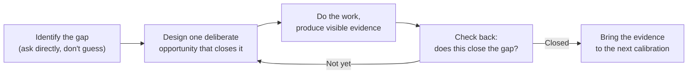

## Why effort and evidence aren't the same thing

**If Jordan worked just as hard as Alex, why did only Alex get
promoted?** Because a promotion decision isn't measuring effort — it's
checking whether specific evidence exists that a person can already
operate at the next level. Working overtime on tasks that don't touch
the thing being evaluated produces real output, but none of it
answers the actual question the committee is asking. Alex's plan was
built backward from that question; Jordan's wasn't built from it at
all.

## The growth-plan loop

The loop starts with naming the gap explicitly, not with picking a
task and hoping it's relevant. It also has a checkpoint — "does this
actually close the gap" — which is what keeps effort pointed at the
right target instead of drifting into busywork that merely looks
productive.

## Effort-based plan vs. gap-based plan

|                           | Effort-based plan ("work harder")                       | Gap-based plan (skill gap analysis)                      |
| ------------------------- | ------------------------------------------------------- | -------------------------------------------------------- |
| Starting point            | A general intention to do more                          | A specific, named gap from a direct conversation         |
| What "success" looks like | More hours, more visible activity                       | Visible evidence that closes exactly the named gap       |
| Risk                      | Effort spent on things that don't map to the actual bar | None, as long as the identified gap was the right one    |
| What the evaluator sees   | Generic busyness, hard to map to specific expectations  | A direct answer to the question they were already asking |

## Why guessing at the gap doesn't work as well as asking

**Could Jordan have done a skill gap analysis alone, without asking
anyone?** In principle yes, but guessing at what the next level
actually requires is far less reliable than asking the person who
evaluates it — expectations at a given level are often not fully
written down anywhere, and the same title can mean different specific
things on different teams. A direct calibration conversation collapses
that uncertainty into a concrete, nameable target instead of a guess.

## The generalizable lesson

**Does this only apply to promotions?** No — the same shape applies to
any goal evaluated by someone else against a bar that isn't fully
under your control: landing a new type of project, being trusted with
a new responsibility, closing a specific skill gap a manager has
flagged in a review. The pattern is the same each time: find out
specifically what's missing, design one deliberate way to produce
visible evidence of it, and check back rather than assuming more
effort in a general direction will eventually add up to the same
thing.
