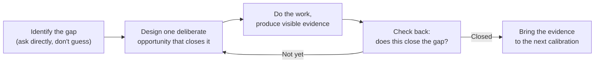

import LevelIntro from "../../../components/LevelIntro.astro";
import Checkpoint from "../../../components/Checkpoint.astro";

L1 showed Jordan and Alex ending up in different places despite similar effort. This level turns that observation into a repeatable loop — the actual mechanics of finding a gap, closing it on purpose, and proving it's closed.

<LevelIntro
  items={[
    "Why effort and evidence diverge",
    "The four-step growth-plan loop",
    "Why asking beats guessing at the gap",
  ]}
/>

## Why effort and evidence aren't the same thing

**If Jordan worked just as hard as Alex, why did only Alex get
promoted?** Because a promotion decision isn't measuring effort — it's
checking whether specific evidence exists that a person can already
operate at the next level. Working overtime on tasks that don't touch
the thing being evaluated produces real output, but none of it
answers the actual question the committee is asking. Alex's plan was
built backward from that question; Jordan's wasn't built from it at
all.

<Checkpoint question="Jordan and Alex both put in real hours over the six months. Why did only one of them end up with something the promotion committee could act on?">

Effort and evidence aren't the same currency. The committee isn't scoring hours worked or how busy someone looked — it's checking whether specific proof exists that the person can already do the next-level thing. Jordan's overtime was real, but none of it was aimed at the particular gap being evaluated, so it produced no evidence the committee could point to. Alex's hours, spent on a deliberately chosen opportunity, did produce that evidence. Same amount of work, different target, different outcome.

</Checkpoint>

## The growth-plan loop

The loop starts with naming the gap explicitly, not with picking a
task and hoping it's relevant. It also has a checkpoint — "does this
actually close the gap" — which is what keeps effort pointed at the
right target instead of drifting into busywork that merely looks
productive.

A **gap** is the missing proof between where you are now and what the
goal requires. An **evaluator** is whoever decides whether the goal is
met. The **bar** is the standard they use to decide. If the goal is
judged by another person, the safest first step is asking that person
what proof they would need to see.

## Effort-based plan vs. gap-based plan

|                           | Effort-based plan ("work harder")                       | Gap-based plan (skill gap analysis)                                                          |
| ------------------------- | ------------------------------------------------------- | -------------------------------------------------------------------------------------------- |
| Starting point            | A general intention to do more                          | A specific, named gap from a direct conversation                                             |
| What "success" looks like | More hours, more visible activity                       | Visible evidence that closes exactly the named gap                                           |
| Risk                      | Effort spent on things that don't map to the actual bar | Lower risk, because the effort targets the named gap; still needs confirmation and check-ins |
| What the evaluator sees   | Generic busyness, hard to map to specific expectations  | A direct answer to the question they were already asking                                     |

## Why guessing at the gap doesn't work as well as asking

**Could Jordan have done a skill gap analysis alone, without asking
anyone?** In principle yes, but guessing at what the next level
actually requires is far less reliable than asking the person who
evaluates it — expectations at a given level are often not fully
written down anywhere, and the same title can mean different specific
things on different teams. A direct calibration conversation collapses
that uncertainty into a concrete, nameable target instead of a guess.

<Checkpoint question="Why is a direct calibration conversation more reliable than doing a solo skill gap analysis, even for someone who's honest with themselves about their weaknesses?">

Because the bar being self-assessed against often only exists clearly in the evaluator's head — expectations at a given level are rarely written down in full, and the same title can mean different things on different teams. A person can be scrupulously honest about their own weaknesses and still guess wrong about which of them is the one actually blocking the decision. Asking the evaluator directly collapses that uncertainty into a specific, nameable target instead of a best guess.

</Checkpoint>

## The generalizable lesson

**Does this only apply to promotions?** No — the same shape applies to
any goal evaluated by someone else against a bar that isn't fully
under your control: landing a new type of project, being trusted with
a new responsibility, closing a specific skill gap a manager has
flagged in a review. The pattern is the same each time: find out
specifically what's missing, design one deliberate way to produce
visible evidence of it, and check back rather than assuming more
effort in a general direction will eventually add up to the same
thing.

If there is no clear manager or evaluator, the same pattern still
works: identify the most credible source of the standard, such as a
rubric, a senior peer, a hiring manager, a teacher, or the person who
will approve the next responsibility. The weaker the evaluator signal,
the more important the check-back step becomes.
