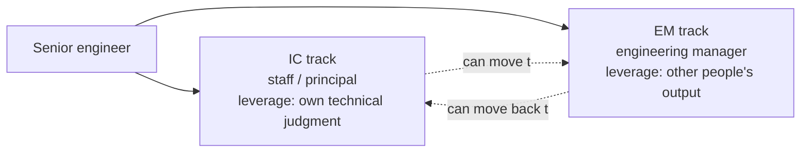

import Scenario from "../../../components/Scenario.astro";
import LevelIntro from "../../../components/LevelIntro.astro";

<Scenario>
  <Fragment slot="facts">
    

      
🧑‍💻 Priya: informally reviews every architecture doc on the team, unasked

      
😩 Priya: dreads the one recurring meeting she already has to run

      
📈 Sam: wants the manager title mainly for the pay band

      
🙈 Sam: has never run a 1:1 or given a teammate hard feedback

    

    

      

        Priya — time she'd keep if she became EM tomorrow
      

      

        

      

      
~15% of her week would stay deep technical work

    

  </Fragment>

Priya and Sam are both senior engineers, both up for a track decision this quarter: stay an individual contributor (IC) at a higher level, or move into engineering management (EM). Priya already spends unpaid, unscheduled time reading other people's designs and pushing back on them — but the one meeting she currently owns, a 30-minute weekly sync, is the part of her week she dreads most. Sam wants the manager title because the pay band is better and "IC has a ceiling" — but has never run a 1:1, and flinches at the idea of telling a teammate their work isn't good enough.

**Before reading on: both of them could probably get the EM offer if they wanted it. So what should actually decide who takes it — and is either of them making that decision for the right reason?**

</Scenario>

<LevelIntro
  items={[
    "IC and EM as two tracks, not one ladder",
    "What each role actually does day to day",
    "Self-assessment: energy, aptitude, and org need",
  ]}
/>

Plain-language map before the acronyms pile up:

| Term                     | Read it as                                                                                                                                          |
| ------------------------ | --------------------------------------------------------------------------------------------------------------------------------------------------- |
| IC                       | Individual contributor — someone whose primary output is their own technical work                                                                   |
| EM                       | Engineering manager — someone whose primary output is other people's work, multiplied                                                               |
| Dual ladder / dual track | A leveling system where senior IC roles (staff, principal) pay and rank the same as manager roles, instead of manager being "above" senior engineer |
| Tech lead                | An IC role with some coordination responsibility, but no formal authority over people                                                               |
| Span of control          | How many people report directly to a manager                                                                                                        |
| Individual output        | Work you personally produce                                                                                                                         |
| Multiplied output        | Work other people produce, better or faster, because of what you did                                                                                |

- **IC and EM are two different jobs that happen to share a starting point**, not two rungs of the same ladder. Above the senior-engineer level, most well-run organizations run a **dual ladder**: staff/principal engineer (IC) and engineering manager (EM) are parallel tracks, similar in pay and prestige, different in the actual daily work.
- **The two jobs optimize for different kinds of output.** An IC's leverage comes from their own technical judgment, applied directly or through code, design docs, and review. An EM's leverage comes from other people's work — hiring, coaching, unblocking, prioritizing, and making organizational decisions that let a team of engineers produce more than they would alone.
- **"Management is the natural next step" is the most common wrong reason to switch.** It survives mostly because, in badly designed org charts, management genuinely is the only path to more pay or more say — not because managing people is actually a more advanced or more valuable skill than deep technical work.
- A working self-assessment has three separate questions, not one:
  1. **Energy** — does the actual daily content of EM work (meetings, conflict, prioritization, other people's problems) recharge you or drain you, independent of title or pay?
  2. **Aptitude** — is there real evidence, not aspiration, that you're already good at people-facing work — do teammates already come to you, informally, for the things a manager does?
  3. **Org need** — does this specific organization actually need you in this role, or is "EM" just the label attached to the only visible path upward here?
- **The decision is reversible more often than people fear, but not free to reverse.** A track switch usually costs months of ramp-up in either direction and can affect how peers perceive you — treat it as a real choice, not a coin flip, but not a life sentence either.

Priya and Sam's stories aren't finished — nothing above says either of them has the wrong instinct yet. It says the question they should each be answering is narrower than "which one is the promotion": it's "which kind of daily work do I actually want more of, and is there real evidence I'd be good at it."
