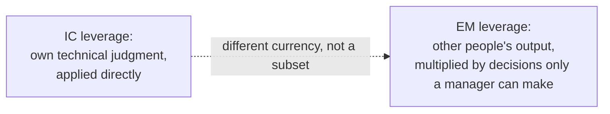
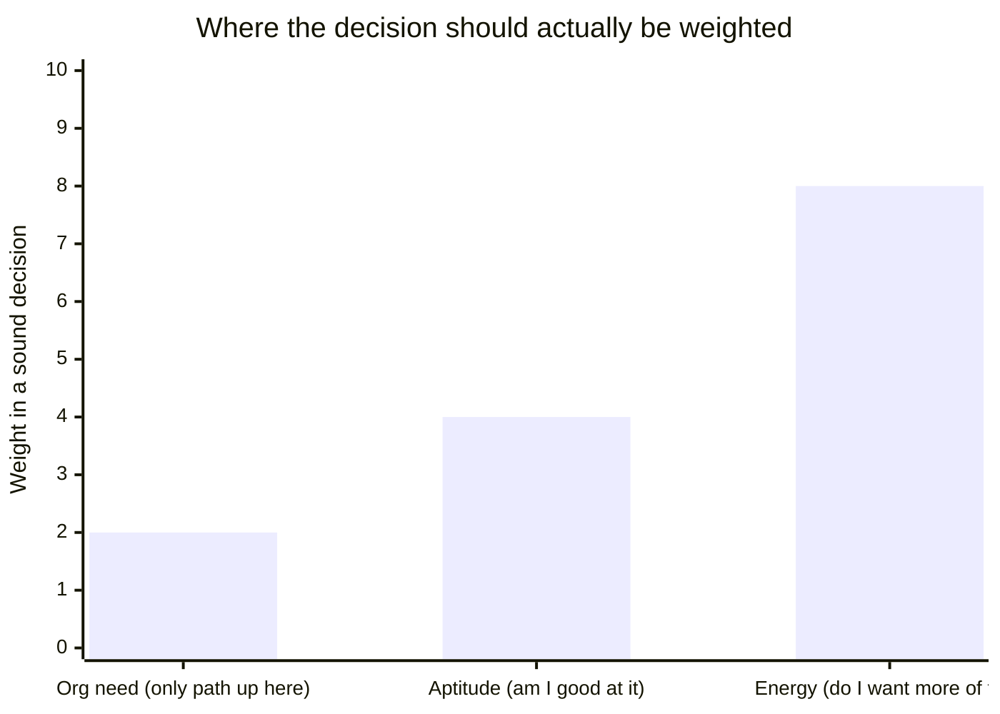

import LevelIntro from "../../../components/LevelIntro.astro";
import Checkpoint from "../../../components/Checkpoint.astro";

L1 named the trap: treating EM as "the next level up" from senior IC instead of a genuinely different job. This level makes that concrete — what does each role's week actually contain, and what's a self-assessment that isn't just "which one sounds more prestigious this year"?

<LevelIntro
  items={[
    "A week of EM work vs. a week of IC work",
    "Three self-assessment axes: energy, aptitude, org need",
    "Low-cost ways to trial before committing",
  ]}
/>

## What the job actually contains, hour by hour

If someone has never done either job, how would they know which one they'd actually enjoy — not the idea of it, the Tuesday-afternoon reality of it?

Shorthand used in this section:

| Phrase                  | Means in simpler language                                                      |
| ----------------------- | ------------------------------------------------------------------------------ |
| Headcount planning      | Deciding how many people a team needs and getting budget approved for it       |
| Performance calibration | A meeting where managers compare notes to keep ratings fair across the org     |
| Roadmap prioritization  | Deciding which projects a team works on, and in what order                     |
| Architecture review     | A meeting where a technical design gets scrutinized before it's built          |
| Design partner          | Someone another engineer brings a half-formed idea to before writing it down   |
| Escalation              | A problem serious enough that it gets raised above the person who first hit it |

| A senior IC's week (staff/principal)                                   | An EM's week                                                                       |
| ---------------------------------------------------------------------- | ---------------------------------------------------------------------------------- |
| Deep work block: designing or reviewing a system's architecture        | Back-to-back 1:1s with 6-8 direct reports                                          |
| Writes or reviews a technical design doc, pushes back on trade-offs    | Performance calibration meeting, deciding how ratings compare across the team      |
| Pairs with an engineer stuck on a hard bug                             | Headcount planning: building the case for one more hire next quarter               |
| Is the escalation point when a technical decision is contested         | Is the escalation point when two engineers on the team are in conflict             |
| Ships something themselves, or reviews code that ships                 | Runs roadmap prioritization with product, then explains the trade-offs to the team |
| Mentors by example — the design doc or the code review is the teaching | Mentors by conversation — a 1:1 about a specific moment of feedback                |

Notice what's absent from the EM column: writing code, or being the person who personally solves a hard technical problem. That's not a side effect of being busy — it's the actual shape of the job. An EM who is still trying to be the best individual technical contributor on their own team is usually doing so at the expense of the things only they can do: the headcount case, the calibration, the 1:1 where someone finally says what's actually wrong.

<Checkpoint question="An EM spends a chunk of their week still writing production code, because they miss it and they're good at it. Per this section, what's the likely cost of that choice, even if the code itself is high quality?">

The code being good isn't the issue — the cost is opportunity cost. Time
spent writing code is time not spent on the things only an EM can do:
running calibration fairly, building the headcount case, having the 1:1
where a struggling teammate finally says what's wrong. Those don't get
picked up by someone else by default the way a missed pull request would;
they're specifically the manager's job, and an EM who keeps doing IC work
is quietly underinvesting in the actual role.

</Checkpoint>

## Three axes, not one gut feeling

"Which one sounds more appealing" is a weak question because it's easy to answer from the idea of a role instead of its reality — so what does a self-assessment look like that can't be faked by picturing the job wrong?

| Axis     | The real question                                                                                               | Weak evidence                               | Strong evidence                                                                                   |
| -------- | --------------------------------------------------------------------------------------------------------------- | ------------------------------------------- | ------------------------------------------------------------------------------------------------- |
| Energy   | Does a week that looks like the EM column above sound draining or energizing, honestly?                         | "I could probably handle it"                | You already look forward to the parts of your current job that resemble it                        |
| Aptitude | Is there evidence you're good at this, not just willing to try?                                                 | "I'm smart, I'll figure it out"             | Teammates already informally bring you conflicts, career questions, or design disputes to referee |
| Org need | Does this organization need you in this specific role, right now — or is EM just the only visible path up here? | "There's no other way to get promoted here" | A real gap exists: no one is doing the people-management work well, and you'd be filling it       |

The order matters: **org need should be the last filter, not the first.** Reasoning backward from "this is the only path to more pay or scope here" produces exactly Sam's mistake from L1 — taking the role because of what the org's ladder happens to look like this year, not because of aptitude or energy for the work itself. A narrow ladder is a real, fixable problem — advocating for a dual-track ladder is a legitimate response to it. Taking a job you don't want because the ladder is broken just relocates the problem onto you and, eventually, onto everyone who reports to you.

<Checkpoint question="Someone says: 'I want to be an EM because there's literally no other way to get promoted past senior engineer at my company.' Using the three axes above, what's the problem with using that as the deciding reason?">

That statement is entirely about org need, and org need is meant to be the
last filter, not the first — it says nothing about whether the person has
aptitude for people work or would find a week of 1:1s, calibration, and
conflict energizing rather than draining. Reasoning from a narrow ladder
produces a manager who took the role for the ladder's sake, not the job's —
and a broken, single-track ladder is a real problem worth raising directly,
not one that gets fixed by putting the wrong person into management.

</Checkpoint>

## Sampling before committing

Both tracks are real jobs with real costs to switching — so is there a way to get evidence on energy and aptitude before making an irreversible-feeling choice?

Most organizations offer at least one low-cost trial, whether or not it's labeled that way:

- **Tech lead** — an IC role with some coordination responsibility (planning, unblocking, being a point of contact for a small group) but no formal hiring/firing/performance authority. It surfaces whether coordinating others' work is energizing without the full stakes of managing headcount.
- **Interim manager for one person** — covering a single direct report during a manager's leave, or mentoring one junior engineer with explicit career-conversation responsibility, is a much smaller sample than owning a team of eight.
- **Running a cross-team initiative** — requires influencing people who don't report to you, which is close to the EM skill of getting outcomes without direct authority, without actually becoming a manager.
- **Deliberately auditing an EM's actual calendar for a week** — sitting in on the 1:1s, the calibration meeting, the headcount conversation, as an observer, is the cheapest way to correct a fantasy version of the job before opting in.

None of these fully substitute for the real role — a two-week trial doesn't reproduce a stressful calibration cycle or a layoff conversation. But each one produces real evidence on the energy and aptitude axes, which is strictly better than guessing from the outside.
