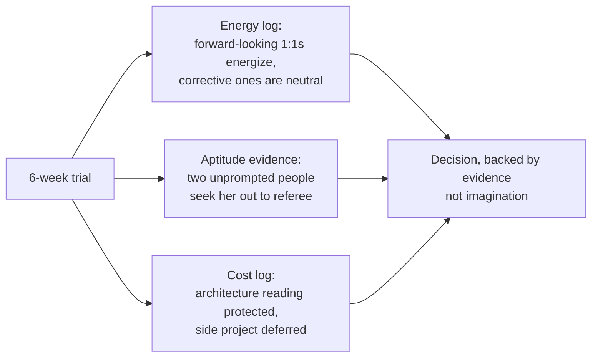

import Scenario from "../../../components/Scenario.astro";
import LevelIntro from "../../../components/LevelIntro.astro";
import Checkpoint from "../../../components/Checkpoint.astro";

L1 introduced Priya and Sam. L2 gave the three-axis framework (energy, aptitude, org need) and the low-cost trials that generate real evidence instead of guesses. This level walks both of their decisions through in enough detail to show what "gathering evidence" actually looks like in practice — and where it goes wrong when someone skips it.

<Scenario label="The trial">
  <Fragment slot="facts">
    

      
🗓️ 6-week trial: Priya becomes interim manager for one intern

      
📊 Sam takes the EM role directly, no trial, full team of seven

      
🔁 Both decisions get revisited at the one-year mark

    

  </Fragment>

Priya's manager offers her a deal instead of an immediate answer: spend six weeks as interim manager for a single intern (career conversations, feedback, unblocking, real but small), while staying primarily in her IC role. Sam, on a different team, takes the full EM opening directly — seven direct reports, starting the following Monday, no trial period, because the org's only visible path past senior engineer is the manager track.

**Before reading on: same underlying question for both of them — "should I be a manager" — but very different amounts of evidence behind the answer they'll each land on. What do you expect that gap in evidence to produce a year later?**

</Scenario>

<LevelIntro
  items={[
    "Priya's six-week trial, in detail",
    "Sam's unassessed jump, and where it breaks",
    "A decision worksheet, and where the framework runs out",
  ]}
/>

## Priya's trial: what six weeks of real evidence looks like

A trial is only useful if it produces evidence Priya can't get by imagining the job — so what, specifically, does she track during those six weeks?

Priya keeps three things during the trial, matched to L2's three axes:

**Energy log.** After every intern 1:1, every piece of feedback she has to deliver, and every moment she has to say "that's not ready yet" instead of just fixing it herself, she jots one line: energized, neutral, or drained, and why. By week four, a pattern is visible: 1:1s that are forward-looking ("here's what to try next") consistently read as energizing; 1:1s that are corrective ("this didn't land well, here's why") read as neutral, not draining — a meaningfully different signal than she expected going in, since she'd assumed all people-conversations would feel like the one recurring sync she already dreads.

**Aptitude evidence.** Two unprompted signals arrive during the trial: the intern's peer buddy asks Priya, not their actual manager, for advice on a stalled project — and a separate mid-level engineer, not on the trial at all, starts routing a design disagreement through Priya to referee. Neither was staged. Both are exactly the "unofficial EM-shaped work sought out" signal from L2's aptitude row — not "I think I'd be good at this," but "people are already treating me as if I already were."

**Cost log.** The trial isn't free — Priya tracks what she stopped doing to make room for it. Answer: the unpaid architecture-review reading she does for fun didn't shrink, but a side project she'd meant to start stayed unstarted. That's useful data too: the parts of IC work she'd protect even during a management trial are the parts most load-bearing to her identity as an engineer, which matters for deciding whether a full EM role would feel like a loss.

At the end of six weeks, Priya's evidence points toward EM being a real fit — not a certainty, but a defensible one, and specifically because the corrective conversations she feared turned out neutral rather than draining. Note what she does **not** have evidence on yet: performance calibration across a full team, a headcount fight during a hiring freeze, or a genuinely high-stakes conflict between two direct reports. A six-week trial with one intern samples the job; it doesn't reproduce all of it.

<Checkpoint question="Priya's energy log shows corrective feedback reads as 'neutral,' not 'energizing.' Per this section, is that a warning sign she should stay IC?">

No — the section explicitly frames it as a meaningfully positive signal
relative to her starting fear, not a red flag. She expected all
people-conversations to feel like the recurring sync she dreads; instead,
only one sub-type (corrective feedback) reads as neutral, while
forward-looking conversations energize her. Neutral is a perfectly workable
baseline for a recurring part of the job — the actual warning sign would be
if corrective conversations read as draining, the same as the meeting she
already avoids.

</Checkpoint>

## Sam's jump: where skipping the trial breaks

Sam took the EM role for org-need reasons — the ladder — without evidence on energy or aptitude. Three months in, what actually goes wrong, and does it look like the failure Sam expected?

The failure isn't dramatic, which is part of why it's dangerous. Sam is competent enough to run the mechanics: 1:1s happen, the roadmap gets prioritized, nothing catches fire. What erodes is subtler:

- **Delegation collapses back through Sam.** When an engineer brings Sam a half-formed design, Sam's instinct — still an IC's instinct — is to solve it directly rather than coach the engineer toward their own answer. This feels efficient in the moment and is corrosive over months: the team stops developing judgment of its own, and Sam becomes a bottleneck exactly where an EM's multiplied leverage was supposed to appear.
- **Corrective conversations get avoided, not just disliked.** Sam schedules 1:1s reliably but slow-walks the actual hard feedback — a report's missed deadlines go unaddressed for two cycles longer than they should, because the conversation itself, not just the prep for it, is the part Sam has no evidence of being good at.
- **The energy deficit shows up as fatigue that Sam attributes to the wrong cause.** Sam assumes the exhaustion is "just the learning curve of any new role" — a reasonable-sounding explanation that happens to be wrong, and wrong in a way that delays the real diagnosis. A trial would have surfaced, in six weeks at low stakes, the pattern that instead took three months to become visible at full stakes, with a team of seven depending on it.

None of this makes Sam a bad engineer or a bad person — it's the predictable result of skipping evidence-gathering on a decision that L2 said needs all three axes, not just org need. The fix at this point isn't necessarily "quit and go back to IC" — it's naming the actual gap (delegation, corrective feedback) and treating it as a skill to build deliberately, with the same seriousness Priya's trial gave her before she committed. Some people in Sam's position build the missing skill and grow into the role; others confirm, with real evidence now instead of none, that it isn't the right track — both are legitimate outcomes of doing the assessment late rather than never.

<Checkpoint question="Sam's team stops developing judgment of its own because Sam keeps solving half-formed designs directly instead of coaching engineers toward their own answers. Connect this back to L2's distinction between IC and EM leverage — what's actually going wrong in terms of that distinction?">

L2 defined EM leverage as other people's output, multiplied by decisions
only a manager can make — not Sam's own technical output redirected at the
team's problems. By solving designs directly, Sam is still operating on the
IC leverage model (their own judgment, applied directly) while holding an
EM role. The team's collective output isn't being multiplied; it's being
routed through Sam's personal bandwidth, which is a bottleneck, not
leverage — the exact failure mode L2 warned an EM who keeps doing IC work
would produce.

</Checkpoint>

## A decision worksheet

Priya's and Sam's evidence is specific to them — so what does the same worksheet look like filled in for someone in a genuinely different situation, say a quieter team with no dramatic conflicts at all?

| Question                                                                     | Priya's answer                                               | Sam's answer (in hindsight)                                        |
| ---------------------------------------------------------------------------- | ------------------------------------------------------------ | ------------------------------------------------------------------ |
| Do forward-looking people conversations energize me?                         | Yes, observed directly during the trial                      | Unknown at the time of the decision                                |
| Do corrective conversations drain me specifically, not just make me nervous? | No — neutral, a workable baseline                            | Unknown; turned out to be a real gap, discovered under full stakes |
| Has anyone sought me out, unprompted, for people-manager-shaped help?        | Yes — twice, unstaged, during the trial                      | No prior evidence either way                                       |
| Am I choosing this because the org's ladder leaves no other path up?         | No — org need was the last filter, after energy and aptitude | Yes — this was close to the whole reason                           |
| What would I have to give up, and does giving it up feel like a loss?        | Some IC identity, but architecture reading stayed protected  | Full technical depth, discovered to feel like a loss mid-role      |

**This worked example is one case, not the whole territory.** A quieter team with no dramatic conflicts wouldn't surface Sam's specific failure mode (avoided corrective conversations) as fast — the same wrong decision could look fine for a year before a real conflict finally tests it. And someone deciding under worse conditions than either of these two — say, a hiring freeze that makes a "trial" period impossible to offer, or an org with no dual-ladder at all so staying IC caps their pay outright — is working with genuinely less room to maneuver than Priya had. What would you actually do with the three-axis framework if a real trial period wasn't an option, and the only evidence available was self-reported energy with no chance to test aptitude against real people first?
