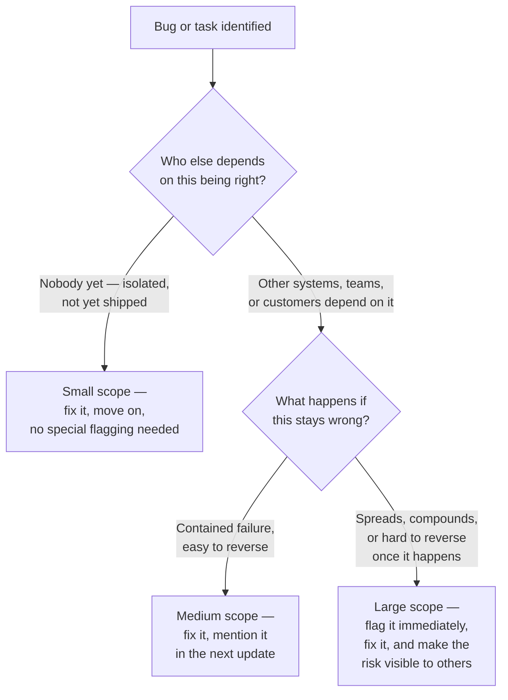

import LevelIntro from "../../../components/LevelIntro.astro";
import Checkpoint from "../../../components/Checkpoint.astro";

L1 showed that Priya and Sam were both completely correct, yet only
one review became a promotion case — the difference wasn't skill. L2
digs into why correctness and scope are separate variables, and how
to spot scope early instead of only after something breaks.

<LevelIntro
  items={[
    "Two independent axes: correctness and scope",
    "Estimating scope before the work is finished",
    "Difficulty vs. scope aren't the same thing",
  ]}
/>

## Two axes, not one

**If Priya and Sam were both correct, what actually separated their
reviews?** Correctness and scope aren't the same axis — you can be
right about something with almost no consequence, or right about
something enormous. Plotting a few real examples on both axes at once
makes the gap visible:

| Example                                                                  | Correct? | Scope                                                                         |
| ------------------------------------------------------------------------ | -------- | ----------------------------------------------------------------------------- |
| Fixing a typo in an internal wiki page                                   | Yes      | Tiny — a handful of readers, no downstream effect                             |
| Correcting the date on a school invitation sent to 3 people              | Yes      | Tiny — easy to tell those 3 people and resend                                 |
| Correcting the same wrong date after the invitation went to 3,000 people | Yes      | Large — many people may arrive at the wrong time                              |
| Priya's debug-log off-by-one fix                                         | Yes      | Small — 2 internal engineers, no customer or revenue impact                   |
| Renegotiating a cross-team API contract that three other teams build on  | Yes      | Large — every team downstream inherits the new contract's guarantees or flaws |
| Sam's billing bug catch                                                  | Yes      | Large — 3,100 customers, $186,000 in prevented erroneous charges              |
| A beautifully refactored function nobody was going to touch again        | Yes      | Tiny — correctness and craft, but no one downstream was waiting on it         |

Notice every row in that table is marked "Yes" under correctness —
that column does no work at distinguishing the rows from each other.
**Scope is the only column that actually explains why some of these
read as more senior than others.** This is the core reason "being
right" isn't a differentiator on its own: it's necessary, but it
doesn't vary across the rows that matter most.

For the API example: an **API contract** is an agreement about how two
systems talk to each other. **Downstream** means the teams or systems
that depend on that output, the way later students in a relay depend on
the first student's handoff being correct.

## Estimating scope before the work is finished, not after

**If scope is what matters, when do you actually find out how big a
given bug or task is?** Not always at the end — often the scope
question can be asked as soon as the problem is spotted, before a
single line of the fix is written:

Simple reading of the flowchart: first ask, "Who cares if this is
wrong?" Then ask, "If it stays wrong, how hard would the damage be to
undo?" Small scope can be fixed quietly. Larger scope should be made
visible early, because other people may need to plan around the risk.

Sam's bug read as senior partly because Sam asked "what happens if
this stays wrong" _before_ the batch job ran, not after a real
customer complaint forced the question. Priya's fix never needed to
ask this question at all — the debug-log path had no other consumers
— no other systems or people relying on that result — and no
compounding failure mode, so "small scope" was the correct read of the
situation, not a failure on Priya's part.

<Checkpoint question="You spot a bug in a shared internal tool. Two other teams depend on its output, but if it stays wrong for a while, the damage is easy to reverse once someone notices. Per the flowchart, do you fix it silently, fix it and mention it in the next update, or flag it immediately as a major risk?">

Fix it and mention it in the next update — that's medium scope, not
small and not large. It's not silent, because other teams do depend
on the result, so staying quiet risks someone building on the wrong
output without knowing. But it's also not an "flag immediately"
situation, because the failure is contained and reversible if it does
surface. Treating every scope level the same — either staying silent
on everything or escalating everything — throws away exactly the
information the flowchart is meant to surface: how much attention a
given risk actually deserves.

</Checkpoint>

## Why difficulty of the fix isn't the same thing as scope either

**Doesn't a "harder" bug automatically matter more?** Not necessarily
— difficulty measures how much skill the fix required; scope measures
how much the outcome mattered. Sam's fix, in this scenario, was a
single conditional check added to the batch job before it queried
customer records — not a hard fix at all. What made it senior-level
wasn't the difficulty of writing the fix; it was the judgment to look
at a batch job most people treated as routine and ask what its
blast radius actually was before it ran. A genuinely hard fix to a
tiny-scope problem still reads as tiny-scope; a trivial fix to a
large-scope problem still reads as large-scope, once someone actually
does the work of tracing out the consequences.

An **incident** is a problem that reaches users, customers, or a team
that has to respond visibly. Prevention matters because the useful work
may be exactly that the incident never happened.

<Checkpoint question="Sam's fix was a single conditional check — about as easy as a fix gets. Did that low difficulty mean the catch mattered less than a technically harder fix would have?">

No. Difficulty and scope are different measurements, and this scenario
is exactly the case where they pull apart: the fix took minutes to
write, but the consequence it prevented — 3,100 customers double-charged,
$186,000 in erroneous charges — was large regardless of how little
effort the fix required. Judging the catch by how hard the fix was
would mean rewarding effort instead of consequence, which is precisely
the mistake this unit is arguing against. What made the catch senior
wasn't the keystrokes; it was noticing, before the job ran, that a
routine-looking batch job had a large blast radius.

</Checkpoint>

## Failure modes at this level

- **Assuming difficulty and scope move together.** They don't — some
  of the highest-scope catches are single-line fixes, and some of the
  most technically impressive work touches nothing that matters.
- **Waiting until impact is realized to describe it.** Scope can
  often be estimated _before_ something breaks (as in Sam's case) —
  waiting for an actual incident to happen before describing the risk
  wastes the chance to get credit for prevention rather than cleanup.
- **Treating "small scope" work as wasted effort.** Priya's fix was
  still worth doing — cleaner debug logs help future debugging. Small
  scope doesn't mean the work was pointless, only that it isn't the
  work to lead a promotion case with.
