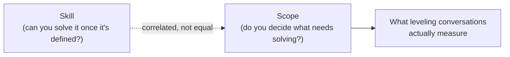

import Scenario from "../../../components/Scenario.astro";
import LevelIntro from "../../../components/LevelIntro.astro";

<Scenario>
  <Fragment slot="facts">
    

      

        3 of 4
        dimensions wide — Jordan
      

      

        

      

      

        1 of 4
        dimensions wide — Alex
      

      

        

      

    

    

      
🐛 Alex: best debugger on the team, tightest fixes

      
🧭 Jordan: picked up an unowned problem nobody assigned

      
📅 Both: same start date, two years ago

    

  </Fragment>

Alex and Jordan started on the same team the same week, two years ago. Alex
is, hands-down, the best debugger anyone here has seen — elegant fixes,
first try, every time. Jordan's code works, but nothing special. This
quarter Jordan gets floated for promotion. Alex doesn't. Alex corners you
afterward: "My code is better than Jordan's. How is this not about who's
better at the job?"

| Dimension           | Alex                                      | Jordan                                                          |
| ------------------- | ----------------------------------------- | --------------------------------------------------------------- |
| Ambiguity tolerance | Waits for a ticket, executes it precisely | Noticed nobody owned a flaky-deploy investigation, picked it up |
| Blast radius        | Fixes stay inside the file they touch     | A convention Jordan proposed is now used by two other teams     |
| Time horizon        | This week's tickets                       | Set up monitoring that will matter a year from now              |
| Influence radius    | Own pull requests                         | Two teams outside Jordan's own adopted the fix, unprompted      |

**Before reading on: Alex and Jordan have the same tenure and, by most people's judgment, comparable raw skill. So what is the promotion committee actually measuring, if not "who writes better code"?**

</Scenario>

<LevelIntro
  items={[
    "Scope vs. skill as separate axes",
    "The four dimensions of scope",
    "Why title lags actual scope",
  ]}
/>

Skill matters — Alex's debugging is valuable. But leveling is not
measuring skill alone. It is measuring the size and shape of the problems
each person treated as theirs to solve without being told to.

Plain-language map before the career words start doing too much work:

| Term                | Read it as                                                                                  |
| ------------------- | ------------------------------------------------------------------------------------------- |
| Tenure              | How long someone has been in the role or company                                            |
| Promotion committee | The group that decides whether someone's level/title changes                                |
| Scope               | The size of problem someone can handle responsibly                                          |
| Ambiguity           | How unclear the problem is before someone has to make sense of it                           |
| Blast radius        | If the decision is wrong, how far the damage spreads — one file, one team, or many teams    |
| Influence radius    | Who changes behavior because of your work: only you, your team, or people outside your team |

- Leveling is not primarily about **skill** — it's about **scope**: how much ambiguity you can resolve on your own, how large a blast radius your decisions have, and how far your influence extends beyond code you personally wrote.
- A junior engineer's scope is a well-defined task; a senior's is a project with unclear edges; a staff engineer's is a problem that doesn't have an owner yet and might span multiple teams.
- **Skill and scope are correlated but not identical.** A brilliant individual contributor who only ever works on tightly-scoped, well-defined tasks handed to them is not automatically "senior" by tenure — and someone earlier in their skill development can be operating at a wider scope than their title suggests, if they're the one resolving the ambiguity nobody else touched.
- Four scope dimensions that tend to expand together as level increases:

| Dimension               | The question it answers                                                                           |
| ----------------------- | ------------------------------------------------------------------------------------------------- |
| **Ambiguity tolerance** | How undefined can the problem be when it reaches you?                                             |
| **Blast radius**        | What breaks, and how widely, if your decision is wrong?                                           |
| **Time horizon**        | Are you solving this week's problem, this quarter's, or a problem that won't manifest for a year? |
| **Influence radius**    | Do your decisions affect your own code, your team, or teams who've never met you?                 |

- **Title is a lagging indicator, not the definition.** Titles get assigned (sometimes late, sometimes early, sometimes inconsistently across companies) to reflect scope someone is already operating at — they don't create that scope by being handed out.
- The practical use of this framework: instead of asking "am I senior yet," ask "what's the largest, most ambiguous, most consequential piece of ambiguity I've resolved without being told exactly how" — that answer, not the org chart, is what leveling conversations are actually trying to measure.

Alex's story isn't over — nothing above says Alex is stuck. It says the promotion conversation this quarter is scoring a different axis than the one Alex assumed was being scored.
