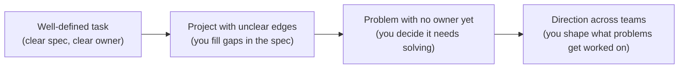
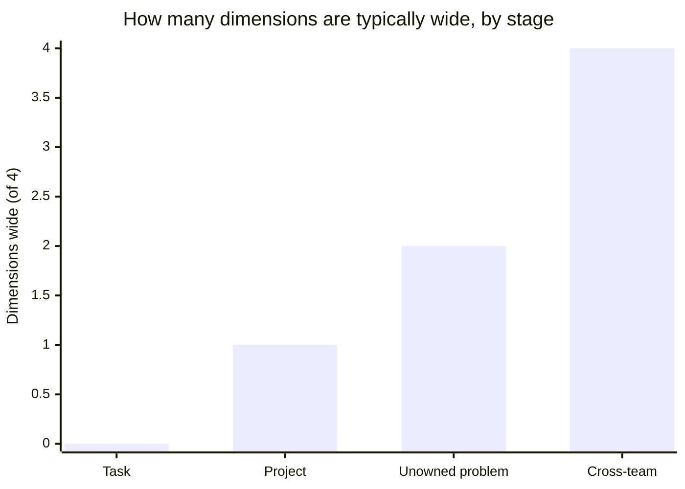

import LevelIntro from "../../../components/LevelIntro.astro";
import Checkpoint from "../../../components/Checkpoint.astro";

L1 named four dimensions — ambiguity tolerance, blast radius, time horizon, influence radius — and claimed they matter more than raw skill. This level makes that concrete: what does it actually look like to move from narrow to wide on each one, and why does skill alone not get you there?

<LevelIntro
  items={[
    "Four stages of scope, A through D",
    "Narrow vs. wide, dimension by dimension",
    "Why skill and scope diverge",
  ]}
/>

## Scope expanding outward, not just "getting better at coding"

Jordan and Alex, from L1, both know how to fix a bug. So if the skill is the same, what's actually different about the _size_ of problem each of them is trusted to touch without asking first?

Professional shorthand in this section:

| Phrase                 | Means in simpler language                                               |
| ---------------------- | ----------------------------------------------------------------------- |
| Clear spec             | Someone already wrote what "done" means                                 |
| Owner                  | The person or team responsible for making sure the problem gets handled |
| Unowned problem        | A real problem that nobody has been assigned yet                        |
| Direction across teams | Helping multiple groups choose the same future path                     |
| Performance review     | A scheduled moment where work is evaluated                              |
| Lateral hire           | Someone hired into a level from outside the company                     |
| Retention              | Keeping someone from leaving, often through pay/title changes           |

Each stage doesn't retire the previous skill — someone operating at stage D still writes code, still solves well-defined tasks sometimes. What changes is what's _expected by default_: at stage A, someone else has already resolved the ambiguity before it reaches you; at stage D, resolving ambiguity nobody assigned is the actual job.
This is not a moral ladder where "task work" is bad and "cross-team work"
is good. A clear task can be the right scope for a real need. The level
question is narrower: what scope does this person reliably handle by
default, across many situations?

<Checkpoint question="Someone on your team fixes exactly the ticket they were assigned, every time, without ever touching anything outside its stated scope. On the A-through-D scale above, which stage are they operating at by default, and is that a problem on its own?">

Stage A — well-defined task scope. And no, it isn't a problem on its own: L1
and this section both say explicitly that a clear task can be the right
scope for a real need, and staying at stage A isn't a moral failing. It only
becomes relevant to a leveling conversation if the person is being compared
against expectations for a stage they aren't actually operating at — the
scale describes what's typical by default, not a judgment of worth.

</Checkpoint>

## The four dimensions, applied concretely

Before the table: pick any one of the four dimensions from L1 and ask yourself which column — narrow or wide — describes how you're currently trusted to operate on it. Most people can answer instantly for at least one dimension and hesitate on another — that unevenness is itself informative, not a sign you did the exercise wrong.

| Dimension           | Narrow scope example                                             | Wide scope example                                                                |
| ------------------- | ---------------------------------------------------------------- | --------------------------------------------------------------------------------- |
| Ambiguity tolerance | "Fix this failing test" — the correct outcome is already defined | "Users are churning and we don't know why" — you have to define the problem first |
| Blast radius        | A bug affects one feature, caught in code review                 | A design decision affects every team building on top of this service for years    |
| Time horizon        | This sprint's ticket                                             | A migration that won't fully pay off for 18 months                                |
| Influence radius    | Your own pull requests                                           | Setting a convention three other teams adopt without being told to                |

Nobody jumps from the left column to the right column on day one of a promotion — scope typically expands one dimension at a time, and it's common to be wide on one axis (deep technical blast-radius judgment) while still narrow on another (limited cross-team influence), rather than uniformly "senior" across all four at once.

This isn't a rule with no exceptions — it's a typical pattern, and the "Project" stage in L1's table is exactly Jordan: wide on ambiguity tolerance and time horizon (the monitoring work), still narrow on influence radius until the other two teams adopted it on their own.

## Why skill and scope diverge

If skill were the whole story, the more technically capable person would always be seen as operating at wider scope — so why doesn't Alex's superior debugging automatically translate into a wider-scope reputation?

**Skill** asks: given a well-defined hard problem, can this person solve it? **Scope** asks a different question entirely: what's the largest piece of ambiguity this person has resolved without being asked to? The two are correlated — skill makes it possible to handle wider scope competently — but they're not the same axis: a highly skilled person kept on narrowly-scoped tasks doesn't automatically read as operating at wide scope, and someone still growing technically can be exactly the person who noticed and started fixing a cross-team problem nobody assigned them. Leveling conversations are really asking about scope, using skill only as one input to it.

This is why "I write better code than most seniors on my team" doesn't, by itself, settle a leveling question — it's evidence for the `skill` term, and leveling is asking about `scope`: has that skill been applied to problems nobody defined for you, with consequences beyond your own output?

<Checkpoint question="A colleague says: 'I'm clearly more skilled than the senior on my team, so I should already be senior too.' Using the skill/scope distinction from this section, what's the gap in that reasoning?">

Skill and scope are correlated but not the same measurement, and the
colleague's statement only speaks to skill. Being more skilled makes wider
scope possible, but it doesn't establish that the colleague has actually
been handed — or has actually taken on — ambiguity nobody assigned them,
decisions with a wide blast radius, or influence that reaches beyond their
own output. Leveling asks about scope; superior skill on well-defined
problems is evidence for a different axis entirely.

</Checkpoint>

## Title as lagging indicator

If someone's actual day-to-day scope has already widened, why doesn't their title catch up the same week?

Titles are assigned in a process (performance review, promotion committee) that happens on a cadence — quarterly, annually. Actual scope expansion happens continuously and unevenly. This produces the two most common sources of leveling friction: someone already operating at wider scope than their title reflects (the title hasn't caught up), or someone whose title outran their current actual scope (a lateral hire, a title inflated for retention). Neither case means the framework is wrong — it means title, as a lagging indicator, is expected to occasionally disagree with the scope someone is really operating at.
Think of a title like a grade posted after an exam period: the work happened
first, the official label arrives later. Sometimes the posted grade is late,
sometimes it is noisy, and sometimes a different school uses the same label
for a slightly different standard. The label matters, but it is not the
underlying work itself.
