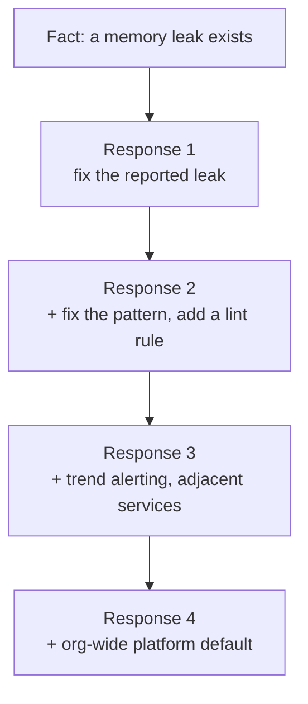
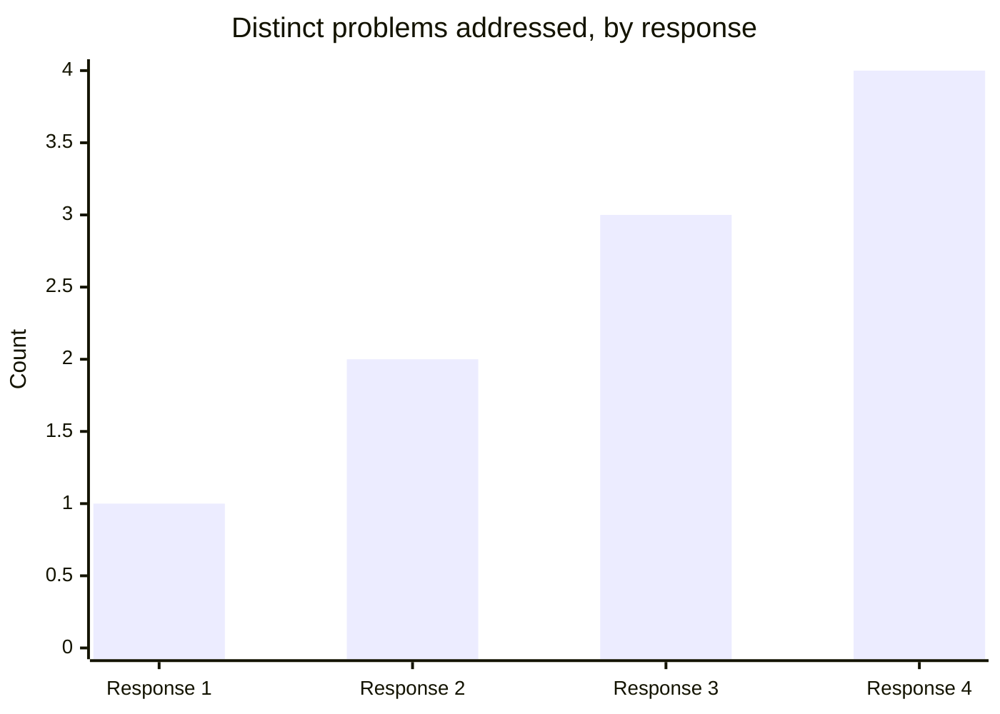

import Scenario from "../../../components/Scenario.astro";
import LevelIntro from "../../../components/LevelIntro.astro";
import Checkpoint from "../../../components/Checkpoint.astro";

Before the scenario, you do not need to master the technical words. Read
them like this:

| Term                       | Simple reading                                                        |
| -------------------------- | --------------------------------------------------------------------- |
| Event listener             | Code that waits for a signal, like "a request arrived"                |
| Memory leak                | The program keeps holding memory it should have released              |
| OOM                        | "Out of memory": the program runs out of memory and dies              |
| Orchestrator               | A system that restarts services when they crash                       |
| Profiler / load test       | Tools for checking what the program uses while it runs under pressure |
| Lint rule                  | An automatic rule that warns when code matches a risky pattern        |
| Platform default / rollout | A shared setting adopted by many teams, then introduced gradually     |

<Scenario label="The scenario">
  <Fragment slot="facts">
    

      
🐛 Root cause: event listener added per request, never removed

      
🔁 Orchestrator auto-restarts every few days before it OOMs

      
👀 Nobody investigated — the auto-restart made it a non-emergency

    

    
Four responses to the same fact

    

      
1️⃣ Fix the leak, ship it

      
2️⃣ + fix the same pattern elsewhere, add a lint rule

      
3️⃣ + add trend alerting, across adjacent services too

      
4️⃣ + propose it as an org-wide platform default

    

  </Fragment>

A production service has been slowly leaking memory for months, restarted
automatically by the orchestrator every few days before it OOMs. Nobody's
investigated because the auto-restart makes it a non-emergency. You're asked
to look into it.

**Before reading on: the technical fact is identical in every version below — a leaked event listener. If skill were the whole story, shouldn't every competent engineer's response look basically the same?**

</Scenario>

<LevelIntro
  items={[
    "One bug, four scoped responses",
    "What expands (and what doesn't) at each stage",
    "Failure modes: scope creep vs. real expansion",
  ]}
/>

Watch how the _same underlying fact_ produces genuinely different bodies of work, depending on the scope someone brings to it.

## Response 1: well-defined task scope

Find the leak, patch it, verify memory is stable, ship the fix. Done in two days: a profiler run shows an event listener being added on every request without being removed; the fix removes it in the corresponding cleanup path. Verified with a load test showing flat memory over an hour where it previously climbed steadily.

**What's in scope:** exactly the reported symptom. **What's out of scope, by design:** why nobody noticed for months, whether the same pattern exists elsewhere, whether this class of bug is preventable going forward. This is complete, correct work for the ambiguity level of "fix this leak" — nothing here is wrong, it's scoped to a well-defined task.
The dimension mostly exercised here is **task execution**: the problem was
already defined, and the engineer solved exactly that problem well.

## Response 2: project scope

Same fix, plus: while investigating, notices the leaked listener pattern (subscribing without a matching cleanup) appears in three other files in the same service, not yet leaking only because those code paths are triggered less often. Fixes all three, and adds a lint rule that flags an event-listener subscription with no corresponding removal in the same function scope, so this specific pattern can't silently reappear in this service.

**What's in scope now:** not just the reported instance, but the _pattern_ behind it, bounded to this project. The person filled in an edge the ticket didn't specify ("just fix the one leak") because the evidence in front of them implied a wider, still-bounded problem.
The dimension that grew is **blast radius inside the project**: the fix now
prevents the same pattern from hurting nearby files in the same service.

## Response 3: unowned-problem scope

Same fix and lint rule, plus: notices this service has no memory-usage alerting at all — the only reason this leak was caught is a human happened to look, and the auto-restart was silently masking the underlying growth curve for months. Proposes and implements a memory-trend alert (not just a hard OOM crash-loop alert) for this service, then checks two adjacent services owned by the same team and finds neither has one either — adds it there too, and writes up why crash-loop auto-restart is a dangerous signal to treat as "handled."

**What's in scope now:** a problem nobody had assigned to anyone — "we have no visibility into slow resource leaks until they crash-loop" — identified, scoped, and closed without waiting to be asked, because the evidence made the gap visible to someone looking for it.
The dimensions that grew are **ambiguity tolerance** and **time horizon**:
the engineer named an unowned monitoring problem and prevented a future
repeat, not just today's leak.

<Checkpoint question="Each response so far has added a layer to the previous one — Response 2 kept Response 1's fix and extended it; Response 3 kept Response 2's and extended it further. Following that pattern, what would you expect Response 4 to add, and what dimension would it most likely grow?">

Following the pattern, Response 4 should keep everything Response 3 did
(the fix, the lint rule, the alerting) and extend the underlying insight
even further outward — past this team entirely, toward other teams or the
organization as a whole. Since Responses 1 through 3 already grew ambiguity
tolerance, blast radius, and time horizon in turn, the dimension most
likely to grow next is influence radius — getting other people, who never
asked for input, to change how they operate because of this work.

</Checkpoint>

## Response 4: cross-team direction scope

Same investigation, plus: recognizes that "auto-restart on crash masks the underlying problem" isn't unique to this team — it's a property of how the whole organization's orchestration platform is configured by default. Writes a short document proposing a platform-level default (alert on the trend, not just the crash) that would apply to every team, works with the platform team to get it adopted as the new default rather than a fix each team has to remember to add, and mentors two engineers on other teams through applying the same pattern to their own services during the rollout.

**What's in scope now:** an org-wide default nobody was individually responsible for, requiring influence across teams that never asked for input, with a time horizon (platform defaults, mentoring others through adoption) well beyond "this leak" or even "this team."
The dimension that grew most is **influence radius**: other teams change how
they operate because the engineer turned one team's lesson into a shared
default.

## What grows, response by response

The technical difficulty of the fix itself barely changes — what expands is the count of distinct problems the person treated as theirs to close, unprompted.

## What's the same across all four

Every response starts from the identical technical fact (a leaked event listener) and the identical technical skill (reading a memory profile, understanding the JS event-listener lifecycle). None of the later responses are "better engineering" in a narrow technical sense than Response 1 — the leak-fixing code itself doesn't get more sophisticated. What expands is the **boundary of what the person treated as their problem to solve**, unprompted, at each stage.

<Checkpoint question="A manager says Response 4's engineer is 'just a better programmer' than Response 1's. Based on what stays constant across all four responses, is that the right read of the difference between them?">

No — the section just above spells out why: the technical fact, and the
technical skill required to find and fix the leak itself, are identical
across all four responses. None of the later responses involve harder code.
What actually differs is how far each person let the boundary of "my
problem to solve" extend beyond the literal ticket, unprompted — a scope
difference, not a programming-skill difference. Calling it "better
programming" misattributes the gap to the wrong axis entirely.

</Checkpoint>

## Failure modes

| Failure                                            | What it looks like                                                                                          | Why it fails                                                                                                 |
| -------------------------------------------------- | ----------------------------------------------------------------------------------------------------------- | ------------------------------------------------------------------------------------------------------------ |
| Mistaking scope creep for scope expansion          | Bolting on speculative extra work with no evidence the wider problem is real                                | Response 4 works because each addition is directly evidenced by what was actually found — not a guess        |
| Staying at Response 1 forever, calling it humility | Deliberately declining to flag a pattern you've clearly seen repeat, to "stay in your lane"                 | It's withholding information that would help the team, not modesty — a common way skilled people plateau     |
| Attempting Response 4 without earned trust         | Proposing an org-wide platform default with no track record of shipping smaller-scoped work reliably        | Cross-team influence depends on credibility built through consistent Response-2/3-level delivery first       |
| Judging level from a single incident               | Treating one Response-3 bug fix as proof of consistent wide scope, or one Response-1 fix as a permanent cap | Leveling conversations look at a pattern across many situations, not a single data point in either direction |

## Beyond this example

  🐛 This memory leak
  &rarr;
  
    🧑‍💼 Whatever unowned problem is sitting in your own backlog right now
  

The leak is one case, not the whole territory — a few questions to test whether the model actually transferred, not just the specific bug above:

- What would change if the underlying fact were worse — say, the leak had already caused a customer-facing outage before anyone looked? Which response would you expect from someone at each scope level, and does the "evidence, not speculation" rule from the failure modes above still hold, or does urgency change what counts as justified scope expansion?
- Think of a real, currently-unowned rough edge in something you work on — not a leak, just something nobody's assigned. Which of the four responses would you realistically attempt this month, and what's the one piece of evidence you'd need in hand before attempting the next response up?
- If Response 4's engineer had proposed the platform-wide default _before_ ever shipping a Response 2 or 3-level fix, per the third failure mode, what specifically would the platform team be reasonably skeptical of — the idea, or the proposer? Does that distinction change how you'd sequence building your own track record?
