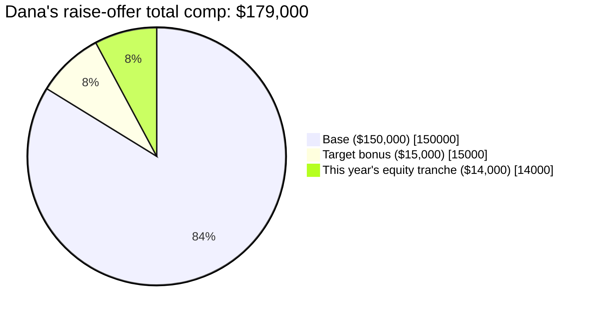

import Scenario from "../../../components/Scenario.astro";
import LevelIntro from "../../../components/LevelIntro.astro";

<Scenario>
  <Fragment slot="facts">
    

      
💰 Current base $142,000 → raise offer $150,000 (+5.6%)

      
📈 This year's RSU tranche: $14,000 — but it's the <em>last</em> tranche of a 4-year grant with no refresher offered

      
🏙️ Competing offer: Anchorline Systems, public company, higher cost-of-living city

    

    

      

        Dana's total comp with the raise, vs. the market band for her role
      

      

        

      

      
$179,000 lands just above the P50 mark ($175,000) of a $150k–$230k band — for one more year

    

  </Fragment>

Dana Okafor is a senior backend engineer at Fernbank Robotics, a private Series C startup. Her manager just offered her an $8,000 raise — base going from $142,000 to $150,000 — and framed it as a strong outcome: "that's a 5.6% bump, one of the bigger ones on the team this cycle." Dana also has a standing interview loop with Anchorline Systems, a public company, that's about to produce a real offer.

The raise letter doesn't mention her equity at all. Dana's original grant — 4,000 RSUs, vesting 1,000/year over four years — is about to finish vesting. This year's tranche is worth $14,000 at the company's current internal valuation. Next year's tranche, without a new grant, is worth exactly $0.

**Before reading on: is "5.6% raise, one of the bigger ones on the team" actually the number that tells Dana whether she's being paid fairly — or is it the number that's easiest for her manager to say out loud?**

</Scenario>

The raise looks generous next to last year's base alone. It looks different next to the fact that her total pay is one year away from a cliff nobody mentioned.

<LevelIntro
  items={[
    "The three pieces of total comp, and why base-only comparisons mislead",
    "Where real market data comes from, and what a percentile actually means",
    "Reading a number in context: cost of living, vesting cliffs, multi-year trend",
  ]}
/>

Plain-language map before the terms pile up:

| Term                        | Read it as                                                                                        |
| --------------------------- | ------------------------------------------------------------------------------------------------- |
| Total comp                  | Base + bonus + equity, added together for one year — not base alone                               |
| Market band                 | A range (P25–P90) of what people in a comparable role/level/location actually get paid            |
| Percentile within band      | Where your number falls in that range — not just whether it's a "big number" in isolation         |
| Vesting schedule            | The calendar that turns a stock grant into actual, tranche-by-tranche pay over several years      |
| Refresher grant             | A new equity grant issued before the old one fully vests, so total comp doesn't cliff down to $0  |
| Current vs. grant valuation | What your equity is worth today (409A/market price) vs. what it was priced at when it was granted |

- **A raise percentage measured against base salary alone hides the other two-thirds of the picture.** Dana's offer is +5.6% on base — but her total comp, including a vesting tranche that's about to disappear, is barely moving and about to fall off a cliff.
- **"Is this fair" is a market-data question, not a gut-feeling question.** It requires a real band — from comp surveys, aggregated self-reported data, or a recruiter's stated range — for the specific role, level, and location, not a personal sense of "that sounds like a lot."
- **A dollar figure means nothing without knowing where it falls in that band.** $179,000 sounds large in isolation; it means something different once you know the market band for the role runs $150,000–$230,000 and $179,000 sits just above the middle.
- **A single year's snapshot hides a multi-year trend.** Dana's total comp this year looks fine. Next year, absent a refresher, it drops by $14,000 — the kind of thing only a multi-year view catches.
- **Equity has two different valuations that answer two different questions**: what it's worth right now on paper (current 409A/market price) versus what it was worth when granted — and for a private company, "worth right now" is illiquid and can move a lot before it's ever cashed out.

Nothing above means the raise is a bad offer — it might be a fair one. It means "fair" isn't answerable from the raise letter alone; it needs the market band, the full comp picture, and the year after this one.
